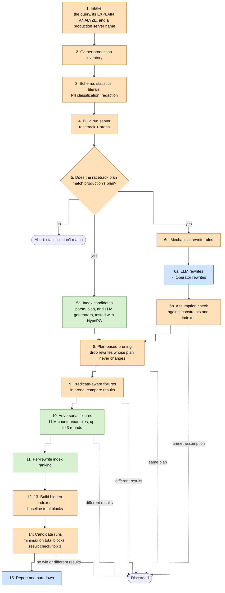

# QUAACK: Query Upgrade Automation Assisted by Chaos and Knowledge

QUAACK takes a slow production query and works through it in stages. It proposes rewrites and indexes, throws out any rewrite that changes the query's results, and then ranks the rest by how many buffers they touch on a restored clone of production.

## Overview.

The driver on the engineer's laptop talks to the LLM. The enclave script on the jump server touches the databases and every real value. Only shapes cross the line between them.


Each run works through the steps below. Orange steps run in the production data enclave, blue steps run on an external workstation, and green steps are split between them.



## Trust boundary.

QUAACK splits data into two classes. The code enforces the line between them. It doesn't rely on people following a convention.

**Values never leave the production enclave.** These values never reach an engineer's workstation:

- Literals from the query.
- `most_common_vals` and `histogram_bounds`.
- Fixture contents.
- Result rows.

**Shapes may leave.** These can leave the enclave and go to the engineer's machine and from there to an LLM:

- Relation and column names.
- Types.
- Constraint and index definitions.
- Plan structure, with literals stripped out.
- Derived scalars: `n_distinct`, `null_frac`, `correlation`, and MCV frequencies (without the values they belong to).
- MCV values for low-cardinality columns only, as defined in 3f. These are the one exception to "values never leave," and they exist so the LLM can write partial index predicates.

For version 1, we assume the schema dump and partial index predicates contain no PII, and we treat them as shape data. A schema-only dump can still hold literals in `CHECK` constraints, column defaults, comments, and function bodies. Revisit this assumption before using QUAACK on a schema where that isn't true. Partial index predicates are safer, because QUAACK only allows them on low-cardinality columns (see 5a-3).

Everything that leaves the enclave goes through one egress function, and that function only accepts fields on a whitelist. If a field isn't on the whitelist, it isn't sent at all. We don't scrub it and send it anyway. Adding a field to the whitelist is the single place where this policy gets reviewed.

A step whose upstream store entry is missing, because the step that writes it hasn't run, refuses with the rule `missing_<entry>`, such as `missing_statistics`. Entry names are fixed words in the code, never data, so the rule is shape.

### Where QUAACK runs.

QUAACK has two parts:

- **The driver** runs on a engineer's laptop, outside the production enclave. It runs the steps in order, makes every LLM call, and builds the report. It never holds a production value.
- **The enclave script** runs on the production enclave's jump server. It's a stateless command-line script, not a long-running service. It does everything that touches a database or a real value, and it only runs when and how the driver calls it.

The driver calls the enclave script over ssh, passing a subcommand for the step to run plus its arguments. The script reads what it needs from the governed store, does the work, writes any new state back to the store, and prints its result. Nothing stays in memory between calls.

The driver finds the jump server with `jump_command` in its config file on the laptop, `~/.quaack/driver.json`. It's a one-line shell command in which every `{server}` becomes the production server name, as one shell word. `/bin/sh` runs it with no stdin, its stderr thrown away, and a 30-second timeout, and it must print one ssh host name and nothing else. If the file is unreadable, not JSON, not a JSON object, missing `jump_command`, or has a `jump_command` that isn't one non-blank line, `quaack start` and `quaack run` refuse with `bad_driver_config: <path>: <problem>`. A JSON syntax error names only the line and column, never the parser's message or file contents. `quaack start` runs it, then runs `quaacks intake` on that host (step 1), and records which jump server holds the run in `~/.quaack/runs/<run ID>.json`, so later commands, such as `quaack run --run <ID>`, take only the run ID.

`quaack setup --run <ID>` then runs steps 2 to 4a: `quaacks inventory`, `run-server`, `qualify`, `schema-dump`, `statistics`, `volatility`, `classify`, `redact`, `literals`, `anchor`, and `racetrack-setup`, in that order, each over ssh. It takes `--host`, `--port`, `--racetrack-db`, and `--arena-db`, and passes only those given to `quaacks run-server`, which takes the rest from `run_server_command` (step 4). It resumes the way `quaack run` does: `quaacks status` says which of these steps' outputs the store holds, each step's last-written entry, and those steps are skipped, run-server's flags with it. It prints the same numbered progress lines as `quaack run`, one per step with a plain-English description, and then `<run ID> set up`. A step that fails stops it with only its rule, as `quaack setup failed: <rule>`, and keeps the run, so the operator can fix the problem and run it again. `quaack run` takes the same four flags, and when the store says the run hasn't had all of steps 2 to 4a, it runs them first, the same way, counting their eleven steps before its own in its progress. There, a failing setup step fails the run, which is torn down unless `--keep`, as for any step of `quaack run`. `quaack start` does no setup.

The driver talks to the LLM through one provider-neutral client. It owns what's the same for every provider: the burndown count for every attempt (15b), the JSON-only instruction and the parsing and checking of JSON replies, and the error rules (`llm_auth`, `llm_rate_limited`, `llm_unavailable`, `llm_bad_request`, `llm_bad_response`). Behind it, one adapter per provider holds everything provider-specific: the request's shape, structured output, stop reasons, the SDK's retries, credentials, and which SDK error is which rule. There are three adapters:

- **Anthropic**, the Messages API through the anthropic gem. Its structured output holds every reply to the schema.
- **OpenAI-compatible**, the Chat Completions API through the openai gem, at the block's `base_url`. One adapter serves OpenAI, Groq, Gemini's OpenAI-compatible endpoint, OpenRouter, and local servers such as Ollama. Not all of them hold a reply to a schema, and some take `response_format` and still don't, so this adapter says it doesn't enforce schemas. It puts the schema in the system prompt, and also sends it as a `response_format` of type `json_schema`. When the API rejects a request that carried `response_format` (a 400 or 422), the adapter asks again without it, and if that works it stops sending it for the rest of the run. Its key comes from the variable `api_key_env` names, or `OPENAI_API_KEY`, and a missing or empty one is `llm_auth` before any attempt.
- **Bedrock**, Anthropic models on AWS Bedrock through the anthropic gem's Bedrock client, which uses the AWS SDK (`aws-sdk-bedrockruntime`, a driver-only dependency, like the other LLM SDKs). It's the Anthropic adapter with a different edge: the same Messages API request and structured output, rewritten by the gem to Bedrock's InvokeModel URL, with the model in the URL, and signed with SigV4. QUAACK stores no AWS credentials. A Bedrock API key in `AWS_BEARER_TOKEN_BEDROCK` is sent as a bearer token when it's set; otherwise the AWS SDK's credential chain finds them (the block's `aws_profile`, environment variables, `~/.aws` profiles with SSO, assumed roles, or `credential_process`, then instance roles). Finding none, a chain that fails, and an empty `AWS_BEARER_TOKEN_BEDROCK` are `llm_auth` before any attempt, and the chain's own error messages, which can quote files and commands, are dropped. The credentials are taken once, when the client is built, as the gem does. A refused request is `llm_auth` with only its status. The region is the block's `aws_region`, else the SDK's lookup; no region is a usage error.
- **Copilot CLI**, a local command such as GitHub's `copilot`, run once per ask without a shell. The block may give a `command_template`, an argv array with `{prompt_file}` and `{model}` placeholders, and a positive `timeout_seconds`. The default template runs `copilot --disable-builtin-mcps --no-ask-user --no-custom-instructions --disallow-temp-dir --available-tools=view --allow-tool=read({prompt_dir}) --deny-tool=shell --deny-tool=write --deny-tool=url --model={model} -s -p "Please follow my prompt in {prompt_file}. Reply only with the answer."` with the default model `claude-opus-5.5`. The prompt file is mode 0600 in a private temporary directory, explicitly allowed with `--allow-tool=read({prompt_dir})`, which is also the command's current directory, and the directory is removed after the ask. The child environment unsets `COPILOT_CUSTOM_INSTRUCTIONS_DIRS`. Global custom instructions can push prose or code fences around JSON replies, causing `llm_bad_response` or subtler bad behavior. The GitHub Copilot CLI command reference documents `--no-custom-instructions` as disabling AGENTS.md and related files, and says it always takes priority; it does not explicitly say whether that includes user-level `~/.copilot/copilot-instructions.md` and `~/.copilot/instructions/**`, so operators should keep those out of the way or canary that they don't reach this provider. The adapter does not enforce schemas: it writes the system prompt, JSON-only instruction, schema, and full labeled transcript to the prompt file, and the client checks the reply and does one re-ask when needed. Each command run counts in the burndown. A missing command, timeout, or non-zero exit is `llm_unavailable`, except a distinctive not-logged-in stderr is `llm_auth`; empty stdout is `llm_bad_response`.

For an adapter that doesn't enforce schemas, the client checks each JSON reply against the schema, and when one doesn't match, it asks once more: the same conversation, then the reply, then what was wrong with it (the check's message, which never quotes the reply). A second reply that doesn't match is `llm_bad_response`. The re-ask lives in the client, not the adapter, because the check it repeats is the client's, and it's the same for every such provider. Every attempt counts in the burndown, the re-ask and the one without `response_format` included.

The `llm` block of `~/.quaack/driver.json` picks the provider (`anthropic`, `openai_compatible`, `bedrock`, or `copilot_cli`), the `model`, a `base_url`, and `api_key_env`, the name of the environment variable that holds the key. A key never goes in the file. `QUAACK_MODEL`, `QUAACK_LLM_PROVIDER`, and `QUAACK_LLM_BASE_URL` override the block. With no block, it's Anthropic with `claude-opus-5-5`; `copilot_cli` defaults to `claude-opus-5.5`; any other provider needs a `model`. `quaack run` reads the block, and builds the client, before it touches the jump server. A bad block is a usage error that names the key, never the value. For Anthropic, the driver needs no API key of its own. Unless `api_key_env` names one, the anthropic gem finds credentials in its usual order. It tries `ANTHROPIC_API_KEY`, then `ANTHROPIC_AUTH_TOKEN`, then a profile such as the one `ant auth login` saves. It takes the first of those two variables that's set, even an empty one, and looks no further. So an empty value there is `llm_auth`. An empty one after it goes unread. Finding no credentials is `llm_auth` too. So are a profile that can't be read and an API that refuses the credentials.

For `"provider": "bedrock"`, the block also takes `aws_region` and `aws_profile`, and not `api_key_env`, since the credentials come from AWS. `aws_region` and `aws_profile` apply to no other provider. Either mistake is a usage error naming the key. `QUAACK_LLM_PROVIDER` takes `bedrock` too.

For `"provider": "copilot_cli"`, the block also takes `command_template` and `timeout_seconds`, and not `base_url`, `api_key_env`, `aws_region`, or `aws_profile`. `command_template` and `timeout_seconds` apply to no other provider. Any mismatch is a usage error naming the key. `QUAACK_LLM_PROVIDER` takes `copilot_cli` too.

Access control comes from ssh. Anyone who can ssh into the jump server already has production access, so they can run the enclave script too. There's no separate login or service to secure.

#### Deploying the enclave.

The enclave script deploys by gem install only. Never run it from a checkout on the jump server: the repo's one Gemfile also installs the driver, its LLM SDK, and the dev tools. From a checkout on the laptop, run `quaack deploy --host <jump server>`. It builds the `quaack-protocol` and `quaacks` gems from their gemspecs, copies them over ssh into `~/.quaack/deploy` on the jump server, and runs `gem install --user-install --no-document` there. That installs into the ssh user's own gem directory, never an OS-wide one, and never with sudo. gem install gets the gems' dependencies, such as pg_query and pg, from rubygems, and builds pg_query from source, so the jump server needs Ruby 3.4, `gem` on PATH, gcc, and make. As each step starts, `quaack deploy` prints a line on stdout: building each gem, copying each one, running gem install (which can take a few minutes, since it builds pg_query), and checking `quaacks`. When it's done, it prints the version that `quaacks` now answers over ssh, last. Errors go to stderr.

The driver runs a bare `quaacks` over non-interactive ssh, so the user gem bin directory must be on PATH for a non-interactive session, and the remote login shell must be POSIX-compatible (bash, sh, or zsh). To find the directory, run `ruby -e 'puts Gem.user_dir'` on the jump server and add `/bin` to what it prints. With Ruby 3.4's RubyGems, that's `~/.gem/ruby/3.4.0` if `~/.gem` exists, and otherwise `~/.local/share/gem/ruby/3.4.0` (under `$XDG_DATA_HOME`, if that's set). Put it on PATH in a file your shell reads for non-interactive ssh sessions, such as `~/.bashrc` for bash (above any line that returns early for non-interactive shells) or `~/.zshenv` for zsh. `~/.profile` works only if your shell reads it for such sessions. To check, run `ssh <jump server> quaacks --version` from the laptop.

If `quaack deploy` installs but then can't run `quaacks`, it works out why. It makes one more ssh call, the same way the driver does, that runs `sh -s` with a read-only probe script on stdin. Any login shell can run that, even one that can't parse POSIX sh. The probe reports the login shell (from `getent passwd`, which also covers LDAP and SSSD accounts, or `$SHELL` if getent can't answer), what `ruby -e 'puts Gem.user_dir'` prints or that `ruby` isn't on PATH, whether `quaacks` is in that directory's `bin`, whether `gem` on PATH sits beside `ruby` (comparing physical directories, with `cd -P`), and which `quaacks` a bare command finds, if any, which shows whether that `bin` is on PATH. The failure then says, in this order: that a fish or csh login shell isn't supported; that `ruby` isn't on the non-interactive PATH; that `quaacks` isn't installed for the `ruby` on PATH, while another `quaacks` is on PATH (when `gem` and `ruby` sit in different directories, it names both, says gem install put `quaacks` in the other Ruby's user gem directory, which this `ruby` doesn't load gems from, and says to put Ruby 3.4's bin directory first on PATH; otherwise it says to run `quaack deploy` again); that another `quaacks` comes first on PATH; that the `ruby` on PATH isn't the one whose `gem` installed `quaacks` (naming both when `gem` and `ruby` sit in different directories); the exact `export PATH="<dir>/bin:$PATH"` line and where it goes (`~/.bashrc` for bash, above any early return; `~/.zshenv` for zsh; for another shell, a file it reads for non-interactive commands, if it has one); or, when the installed `quaacks` is on PATH, that `quaacks version` didn't answer with the version just installed, so run it by hand. It ends with `ssh <jump server> quaacks --version`, to check the fix. It never edits the jump server's shell config: the engineer does. It shows only paths made of plain characters and spaces, and a shell name, and if the probe fails or finds anything else, it gives the general advice to put the user gem bin directory on PATH.

Before each `quaack start`, `quaack setup`, and `quaack run`, the driver runs `quaacks version` on the jump server. If `quaacks` is missing or isn't the version this driver expects, it refuses and says to run `quaack deploy`.

`quaacks` itself refuses to run, with the rule `driver_present`, if the driver gem is loadable where it runs, as under the repo's own bundle or with the driver gem installed beside it. That catches the wrong deploy. The repo's specs set `QUAACKS_DEV_CHECKOUT=1` to run it from the checkout on purpose.

Everything the enclave script prints goes through the egress function, including error messages. Postgres errors can include real values, such as the key in a unique-violation message, so errors get filtered too. That's where the trust boundary is enforced. An intake unreadable-file error may carry only one fixed reason (`missing`, `symlink`, `not_regular_file`, or `permission_denied`), never the path or the operating system's message.

**What goes into the enclave**, from the driver to the enclave script:

- Requests to run a step.
- Rewrite candidates, written with placeholders instead of literals.
- Index DDL.
- The LLM-generated inserts from step 10.

All of this came from an LLM or a laptop, so the enclave script treats it as untrusted. Before running any of it, the script parses it with pg_query and rejects anything that isn't what it claims to be:

- **Rewrite candidates** must be exactly one `SELECT` statement. Reject data-modifying CTEs (`WITH ... DELETE`), `SELECT INTO`, and locking clauses like `FOR UPDATE`. A candidate that uses a construct outside the supported SQL list (see step 1) is refused too. Also run the volatility check from step 3d on the candidate, so it can't call a function with side effects.
- **Index DDL** must be exactly one `CREATE INDEX` statement on a table the query uses, named with its schema. Reject `CONCURRENTLY`, `UNIQUE`, `NULLS NOT DISTINCT`, `TABLESPACE`, `ON ONLY`, `WITH (...)` storage options, and an unqualified table. Reject a key expression or predicate that uses a `$n` parameter, a subquery, an aggregate or window call, a construct outside the supported SQL list, or a volatile function, operator, or cast (the 3d check). The index name is dropped. A STABLE function is left to Postgres and HypoPG, which refuse it when they build the index.
- **Step 10 inserts** must be plain `INSERT` statements into tables in the subset schema from step 3b. Reject `WITH`, `ON CONFLICT`, and `RETURNING`. `OVERRIDING SYSTEM VALUE` (and `OVERRIDING USER VALUE`) is allowed, so an insert can set a `GENERATED ALWAYS` identity key, as step 9's fixture rows do: the inserts load only into the throwaway arena, and an id that collides with another row just fails that round's load. Each value must be a constant, a cast, an array, or a call to an `IMMUTABLE` function. Two things aren't checked in v1. An uncast literal is still converted by its column type's input function, and a domain's `CHECK` still runs, at insert time. Those functions come from the production schema, not the LLM. And values aren't pinned to be deterministic: a `timestamptz` literal depends on the session's `TimeZone`, and the special inputs `'now'`, `'today'`, and the like are accepted.

A rejected input fails with a message that says which rule it broke. The script then runs the accepted input only in the ways the steps below describe.

**What comes out**, from the enclave script to the driver, is shape-class data only:

- The redacted query and redacted plans from step 3g.
- The subset schema from step 3b and the existing index definitions from step 3c.
- The derived scalars and low-cardinality MCV values from step 3f.
- Costs, estimated and built index sizes, block counts, and whether the planner used each index.
- Pass or fail results, with the scenario or predicate atom behind each failure.
- Which predicate atoms step 9c couldn't exercise, identified by their redacted shape.
- Counts of what each stage added and dropped, for the 15b burndown.
- Production's major version, and whether step 2 found its instance memory.

Result rows, fixture contents, and literals never come out.

**Which part runs each step:**

- **The enclave script** runs steps 1 through 4, step 5, 5a-1 through 5a-4, 5a-7, 6b, 6c, step 8, step 9, 10b, 10c, the re-ranking in step 11, and steps 12 through 14.
- **The driver** runs 5a-5, 5a-6, 6a, step 7, 10a, generator three in step 11, and step 15. These are the steps that talk to an LLM or an operator, plus the report.

Inside the enclave, the enclave script keeps its data in three places:

| Part | What it holds | Where it lives | Used in |
| --- | --- | --- | --- |
| Governed store | The step 1 inputs, the set of literals from step 3e, the placeholder map from 3g, the raw statistics from 3c, and every intermediate result between calls. | A directory on the jump server in the operator's home directory. | Every step. |
| Racetrack | A full restore of production, with everything production has. | The run server. | Steps 5, 5a, 8, and 11 for hypothetical-index planning. Steps 12 through 14 for measurement. |
| Arena | An empty copy of the schema in an independant db, loaded with generated fixtures inside transactions that get rolled back. | The run server. | Steps 9 and 10. |

All three hold production values, so treat them like production: same access controls, same encryption at rest, same auditing, and same retention limit.

When the run ends, destroy the run server and delete the run's governed store directory. Nothing in either is worth keeping as a cache. `quaacks teardown --run <run ID>` deletes the store directory. If the quaacks config sets `destroy_command`, a one-line shell command given `{server}` and `{run}` like `run_server_command` (step 4), teardown first runs it to destroy the run server, ignores what it prints, and reports `next_step` `none`. If it fails, teardown fails with `destroy_command_failed` or `destroy_command_timed_out` and keeps the store, so it can run again. So `destroy_command` must be idempotent: running it for a run server that's already gone, or half gone, must succeed. Without `destroy_command`, or for a run that's already gone, it prints a reminder to destroy the run server by hand. Running it on a run that's already gone succeeds. It won't delete a run path that's a symlink or isn't a private run directory (a real directory, mode 0700, owned by the current user). If `~/.quaack` or `~/.quaack/runs` is a symlink, every `quaacks` step that uses the store refuses it with the rule `bad_store_base`, and nothing is made or deleted through it.

## 1. Input.

QUAACK takes three inputs:

- The query text.
- The full output of `EXPLAIN (ANALYZE, BUFFERS, SETTINGS, FORMAT JSON)` for that query.
- The production server name the explain plan came from.

The operator finds the slow query and puts these inputs in the governed store on the jump server. They never pass through the laptop, because the query text and the plan both contain real literals. The driver only ever sees the redacted versions from 3g.

To do that, the operator saves the query and the plan as files on the jump server and runs `quaacks intake --query <file> --plan <file> --server <name>`. It checks that each input is well formed, starts a run in the governed store that holds them, and prints only the run's ID for the driver to use. An optional `--captured-at <time>` gives the time the production plan ran, as an ISO-8601 time with a zone, for 3h. It must be no earlier than 1970 and no more than one day after intake, or intake refuses it as `bad_captured_at`. Without it, the run anchors the clock at the time of intake. A refused input leaves no run behind, and its error names only the rule it broke.

The operator usually starts this from the laptop instead, with `quaack start --server <name> --query <file> --plan <file>`, where the files are paths on the jump server. A relative path starts from the ssh user's home directory there. A leading `~/` is expanded by `quaacks` on the jump server, never by a shell; `~otheruser` is not special. Before it opens ssh, the driver refuses an absolute `--query` or `--plan` path under the laptop user's home, since that is usually an accidentally expanded laptop path. The driver finds the jump server with `jump_command` (see "Where QUAACK runs"), runs `quaacks intake` there over ssh, and prints the run ID. The files stay on the jump server.

If `quaacks intake` can't read the query or plan, it still refuses as `query_unreadable` or `plan_unreadable`, but the error line may add one fixed reason: `missing`, `symlink`, `not_regular_file`, or `permission_denied`. The reason never includes the path or the operating system's message.

The query can only use the SQL constructs QUAACK supports. A query that uses anything else is refused, with the rule `unsupported_construct`. For v1, the operator sees only that rule. The error line doesn't say which construct it was. A query with `$1`-style parameters is refused as `query_has_parameters`, since the plan must come from the query with its literals. The list lives in `SupportedSql` (`enclave/lib/quaack/enclave/supported_sql.rb`). It covers `SELECT` with joins, subqueries, CTEs (but not `CYCLE` or `SEARCH`), set operations, `CASE`, aggregates, window functions, the usual operators, casts, `IN`, `ANY`, `LIKE`, `BETWEEN`, `IS NULL`, and the row comparisons of keyset pagination, such as `(created_at, id) < ($1, $2)`, with `<`, `<=`, `>`, `>=`, `=`, or `<>` between two rows of the same length. A row anywhere else, such as `ROW(a, b)` in the select list, `(a, b) IN (SELECT ...)`, or a nested row, is refused. Every enclave step that walks the query's parse checks it against the list first, so each one only has to be right for what's on it. Today those are relation qualification in this step, the volatility check in 3d, generator one in 5a-1, and the predicate atoms in step 9. The plan's expressions and index predicates aren't the query, so they aren't checked against the list.

Fully qualify every relation in the query so `search_path` never matters.

This step also defines the **canonical plan form** that every later step uses to compare plans. A canonical plan keeps each node's type, relation, index, join type, strategy, quals, and sort keys. It strips costs, row counts, buffers, and aliases.

## 2. Production inventory.

Validate the connection to step 1's production server. Then record the following from it:

- Major version.
- Installed extensions.
- Instance memory.
- `shared_buffers`, `effective_cache_size`, `work_mem`, `random_page_cost`, and `jit`.
- `TimeZone`, `DateStyle`, `IntervalStyle`, and `default_statistics_target`, which change plans or how a literal is read, but which `SETTINGS` never lists.
- Every parallel setting.
- Every non-default planner GUC listed in the `SETTINGS` section of the input plan.
- From `pg_database`: `datcollate`, `datctype`, `datlocprovider`, `datlocale`, and `datcollversion`.
- `default_text_search_config`.

The driver runs `quaacks inventory --run <run ID>`, the first of `quaack setup`'s steps (see "Where QUAACK runs"). It connects to the server named at intake with the operator's own libpq setup on the jump server. The host comes from the run, and everything else comes from where libpq looks for it: `PGUSER` and the other `PG` environment variables, a service in `~/.pg_service.conf` named by `PGSERVICE`, and the password in `~/.pgpass`. QUAACK stores no credentials. It reads everything inside one read-only, repeatable read transaction, so it can't write to production. Production must run Postgres 17 or later, since older versions don't have `datlocale`.

For each setting the plan's `SETTINGS` lists, it records production's own current value, not the value in the plan, which came from the operator's session. It records settings the way `SHOW` prints them, such as `128MB`.

The instance memory comes from a command the operator configures, since Postgres can't report it and every cloud provider finds it differently. The command lives in the `quaacks` config file on the jump server, `~/.quaack/config.json`, under the key `memory_command`:

```json
{ "memory_command": "aws rds describe-db-instances ... {host} ..." }
```

It's one line of shell. Each `{host}` becomes the production host, quoted as one shell word, and `/bin/sh -c` runs it with no stdin, throwing its stderr away. It must print the memory as a whole number of bytes, or as a whole number and a unit: `kB`, `MB`, `GB`, `TB`, `KiB`, `MiB`, `GiB`, or `TiB`, in any case, with an optional space. Every unit is binary, as in Postgres, so `64GB` is 64 × 1024³ bytes. The command gets 30 seconds, and a timeout stops everything it started.

- With no config file, or no `memory_command` in it, the step records the memory as unknown and carries on. Later steps that need it refuse clearly.
- A command that fails aborts the step with `memory_command_failed`, one that runs too long with `memory_command_timed_out`, and one whose output isn't a size with `memory_command_bad_output`. The command's output never appears in any message.
- A config file that's a symlink, isn't a readable regular file, isn't a JSON object, or has a `memory_command` that isn't one non-blank line is refused as `bad_config`, before the step connects.

Failing to connect is `production_connection_failed`. A Postgres error while reading is `production_read_failed`, with its SQLSTATE. Neither error names the host, the user, or the server's message. Nothing is recorded unless the whole step succeeds.

The inventory stays in the governed store. The step prints only its shape: production's major version and whether the memory is known.

## 3. Schema, statistics, and classification.

### 3a. Relations.

Use pg_query to list the relations the query uses, and check the `relkind` of each one. For now, only plain tables (`relkind` `r`) are allowed. Abort if the query uses anything else, such as a view, a materialized view, a partitioned table, or a foreign table. The error's rule names the kind, such as `view_relation`. Don't handle partitioning until we need it.

A function in `FROM` could read a view or foreign table this check never sees, so each one, anywhere in the query, must be `pg_catalog`'s, such as `generate_series` or `unnest`. An unqualified name resolves to the first schema in the `search_path` with a function of that name. Unsupported in v1: any other function in `FROM`, including a user-defined one that shadows a `pg_catalog` name earlier in the path, is refused with `user_function_in_from`. Functions in the select list or `WHERE` aren't affected.

The driver runs `quaacks qualify --run <run ID>`, which does step 1's qualification and this check together. It connects to the run's production server the way step 2 does, with the operator's own libpq setup, and reads only the catalog. It resolves each unqualified name through the `search_path` in the input plan's `SETTINGS`, or the default `"$user", public` without one. `"$user"` resolves to the operator's role, the one qualify connects as, not the role of the application that ran the plan. If the application's role has a schema of its own name, give the plan's `search_path` explicitly. That's a known gap in v1. It stores the qualified query as the run's `qualified_query` entry, and the relations, each once and in the order the query first names them, as `relations`, a list of `{"schema", "name"}` objects. Later steps of 3 read both from there. It prints nothing but its done line, since the driver sees the schema only as 3b's subset. A refusal names only its rule, such as `view_relation`, `unknown_relation`, `unsupported_construct`, or `production_connection_failed`, and stores nothing.

### 3b. Schema dump.

Run `pg_dump --schema-only --no-owner --no-privileges` on every namespace the query touches, and on every namespace that one of its tables' FK ancestors lives in, at any depth, the same tables the subset below holds. Without an FK parent's namespace, arena can't create the FK, and the load fails. Always include `public` in the list of namespaces, even if the query doesn't reference it. Also always include `dba`, but only when production has a schema of that name, since functions in the dumped namespaces can reference it, and arena can't load them without it. A database without `dba` dumps as before. Only this full dump gains `dba`, not the subset below. 20261001-10 replaces this hard-coded name with a general fix. `pg_dump --schema` emits no `CREATE EXTENSION`, so also pass `--extension=<name>` for every extension in production's `pg_extension` except `plpgsql`, and add each one's schema to the namespaces, so the dump holds `CREATE EXTENSION IF NOT EXISTS ... WITH SCHEMA ...` and loads into arena. It carries no version, so arena gets the run server's default version of each. Never pass `--schema` for a system schema (`pg_catalog`, `information_schema`, or any other `pg_*` schema, such as `pg_toast`), whether it came from the query or from an extension such as `plperl`, which lives in `pg_catalog`. With one, `pg_dump` dumps the system catalog itself: a read-only role can't lock `pg_authid`, so the dump fails, and a superuser's dump holds DDL for the catalog's own objects, which won't load into arena. `--extension=<name>` alone still brings that extension's `CREATE EXTENSION IF NOT EXISTS ... WITH SCHEMA pg_catalog`. The stored namespaces leave the system schemas out too.

Separately, build a smaller subset: the query's tables plus their FK parent tables. This subset is the only schema that the LLM and the fixture generator ever see.

The driver runs `quaacks schema-dump --run <run ID>` after `quaacks qualify`. It reads the run's `server` and `relations` entries. It connects to the production server the way step 2 does and reads the catalog inside one read-only transaction. It runs the jump server's `pg_dump` from `PATH`, given only the run's host, so the port, user, database, and password come from the operator's own libpq setup. That `pg_dump` must be at least the server's major version. It stores the full dump as `schema_dump`, `{"namespaces", "ddl"}`, for 4a, and the subset as `schema_subset`, `{"tables", "ddl"}`, where `tables` lists each `[schema, name]`. It prints nothing but its done line: the subset reaches the LLM only in 5a-5's payload, which reads it from the store. A refusal names only its rule, such as `unknown_relation`, `pg_dump_missing`, `pg_dump_too_old`, `pg_dump_failed`, `production_connection_failed`, or `production_read_failed`, and stores nothing. `pg_dump` runs with `--no-password`, so it never prompts.

Unsupported in v1: a `SQL_ASCII` database is refused with `sql_ascii_database`, since its names have no known encoding.

### 3c. Statistics.

Pull planner statistics for the query's tables and their indexes, including extended statistics. Also pull current index definitions and sizes, which the report uses for its redundancy check.

These statistics include real values in `most_common_vals` and `histogram_bounds`. That makes them value-class data under the trust boundary, so they stay in the governed store.

Leave out invalid indexes (`indisvalid` false), such as one left by a failed `CREATE INDEX CONCURRENTLY`, so step 5a-3 doesn't count one as covering. This step also records which columns have a text-like type, for step 3f's heuristic, and which have a date, timestamp, or timestamptz type, for 3h's clock literals.

This step captures each table's `reltuples` and `relpages`, not `relallvisible`, which the planner uses to price index-only scans. v1 assumes production is vacuumed normally, so its visibility map is current, and that the racetrack is fully vacuumed and analyzed after restore (4a). QUAACK doesn't capture or restore `relallvisible`.

The driver runs `quaacks statistics --run <run ID>` after `quaacks qualify`. It reads the run's `server` and `relations` entries, so it covers the query's own tables, not 3b's FK parents. It connects to the production server the way step 2 does and reads the catalog and `pg_stats` inside one read-only transaction. It stores the result as the run's `statistics` entry, `{"tables"}`, one object per table in `relations` order with its row count, columns, text-like columns, `pg_stats` rows, valid indexes with their definitions and sizes, and extended statistics. Generators one and two, Dedupe, and 3f read it from there. It stores nothing until the transaction has closed, and prints nothing but its done line. A refusal names only its rule, such as `unknown_relation`, `inheritance_parent`, `production_connection_failed`, or `production_read_failed`, and stores nothing.

Unsupported in v1: a table with inheritance children is refused with `inheritance_parent`, because `pg_stats` keeps two rows for each of its columns and QUAACK doesn't choose between them. The element and range statistics in `pg_stats` and the statistics on expressions in `pg_stats_ext_exprs` aren't read.

### 3d. Function volatility.

Check `provolatile` for every function anywhere in the query, including the select list. If any function is volatile, abort and say which function caused it. A volatile function breaks both rewriting and result comparison.

The driver runs `quaacks volatility --run <run ID>` after `quaacks qualify`. It reads the run's `server`, `plan`, and `qualified_query` entries. It connects to the production server the way step 2 does and reads only the catalog, inside one read-only transaction, resolving unqualified function names through the `search_path` in the input plan's `SETTINGS`, or the default without one. This step is a gate, so all it stores is that the query passed: the run's `volatility` entry, `{"passed": true}`, which later steps can require before they run the query. It stores nothing until the transaction has closed, and prints nothing but its done line. A refusal names only its rule, such as `volatile_function`, `unsupported_construct`, `production_connection_failed`, or `production_read_failed`, and stores nothing. A `volatile_function` refusal's error line also names the volatile function, schema-qualified, such as `pg_catalog.random`, and never its arguments. Function names are schema, so they're shape. A name that needs quoting is left out.

### 3e. Literals.

Build the literal set that later steps test against. It has three literals:

- The **slow** literal(s), which is the set of literals in the input query itself.
- A **worst-case** literal, taken from the top MCV of each equality column.
- A **typical** literal, taken from a histogram bound.

This literal set is value-class data, so it stays in the governed store. QUAACK runs these values on the racetrack and in arena. No LLM ever sees them.

Each set is keyed by the 3g placeholder numbers, in the same form as the placeholder map, so any set binds the same way the slow values do. Values come from the step 3c statistics for the column each placeholder is compared with, picked by operator:

- **Equality (`=`):** the worst case is the top MCV, and the typical value is the middle histogram bound.
- **Ranges (`<`, `<=`, `>`, `>=`):** the worst case is the histogram bound that selects the most rows: the last bound for `<` and `<=`, and the first for `>` and `>=`. The typical value is the middle bound. For `BETWEEN`, the worst case is the first and last bounds, and the typical value is the middle bucket: the middle bound and the one after it. A lower bound (`>` or `>=`) and an upper bound (`<` or `<=`) on one column in the same `AND`, such as `created_at >= $1 AND created_at < $2`, are treated like `BETWEEN`, whichever side the column is written on. A range on its own keeps the single-bound rule.
- **`IN` lists and `= ANY`:** the list keeps its length. In the worst case, each element takes the next most common value. In the typical set, the elements take consecutive bounds around the middle.
- **`LIKE` and any other operator,** including `<>`, `NOT IN`, and `NOT BETWEEN`: the slow literal in all three sets.

A picked value keeps the placeholder's declared type. A number placeholder widens to `bigint` or `numeric` when the value needs it, such as `20` against a numeric column.

When a set can't get a value, the placeholder keeps its slow literal there, and the store records why. That happens when the column has no statistics, or lacks the MCV list or histogram the pick needs, or when a value doesn't read as the placeholder's type. Unsupported in v1, these also keep the slow literal in all three sets:

- A placeholder that isn't compared directly with a plain table column, such as one compared with an expression or function on the column (`lower(email) = $1`), a column of a subquery or CTE, or a join column reached through a subquery. A placeholder outside any predicate, such as a `LIMIT`, also falls in this group.
- A cast placeholder, such as `DATE '2026-01-01'`, which 3g keeps as `$1::date`.
- A placeholder in a keyset row comparison, such as each of `(created_at, id) < ($1, $2)`.
- A placeholder that 3g shares between expressions, since it can feed more than one place.
- A clock-reading literal, such as `'today'`, compared with a date or timestamp column, since 3h anchors it.

The driver runs `quaacks literals --run <run ID>` after `quaacks redact`, since the sets are keyed by 3g's placeholders. It refuses with the rule `volatility_not_passed` unless the run's `volatility` entry shows that 3d passed. It reads the run's `placeholder_map`, `redacted_query`, and `statistics` entries, and doesn't connect to production. It stores one entry, `literal_sets`: the three sets and the fallbacks. It sends none of it and prints nothing but its done line. A missing entry fails with only its rule and stores nothing.

### 3f. PII classification.

Classify each column as PII or not PII. Use a configured list plus a heuristic that flags high-cardinality text columns.

- The configured list is `pii_columns` in the `quaacks` config: `schema.table.column` globs, such as `*.users.email`. A `*` matches within one name part and never crosses a dot. Matching ignores case, so a glob can only match more columns, never fewer.
- The heuristic flags a column whose type is text-like (text, varchar, char, name, citext, or a domain over one) and that has 50 or more distinct values. A text column whose distinct count is unknown, because it was never analyzed, counts as PII too.
- The config's `cardinality_threshold` moves the line of 50, here and for low-cardinality below.

This classification doesn't decide whether values get sent, because no values are ever sent. Instead, it controls which derived scalars go out:

- For a PII column, also withhold the MCV frequencies. A frequency vector plus a column name can be enough to re-identify values in a small domain.
- For every column, PII or not, still send `n_distinct`, `null_frac`, and `correlation`. A single number that summarizes a whole column reveals nothing about any one row.

This step also marks each column as **low-cardinality** or not. A column is low-cardinality when it has fewer than 50 distinct values, isn't classified as PII, and its `n_distinct` in `pg_stats` is positive. Count distinct values the same way as step 5a-1: if `n_distinct` is negative, take its absolute value times `reltuples`. ANALYZE stores a positive `n_distinct` only when the distinct values are at most about a tenth of the rows, so each value repeats. A negative, zero, or unknown `n_distinct` means the column isn't low-cardinality, even with few distinct values. A 40-row table of emails has fewer than 50 distinct values, but they don't repeat, so they aren't categories. For a low-cardinality column, also send its MCV values. A column with that few values, like a status or type column, holds categories, not facts about individual people. Columns with more distinct values are where PII starts to show up, so their values never go out. Histogram bounds never go out for any column.

Expression-index and extended-statistics MCVs follow the rules of their base columns, the columns their definition names. One that names any PII column counts as PII, so none of its MCV data goes out. Otherwise its MCV frequencies go out, and its MCV values go out only when every base column is low-cardinality. An index's expressions are classified together. text[], json, and jsonb columns aren't text-like for the heuristic, so their MCV frequencies may go out, but their values never do.

The driver runs `quaacks classify --run <run ID>` after `quaacks statistics`. It reads the `quaacks` config and the run's `statistics` entry, and doesn't connect to production. It stores the run's `classification` entry, `{"columns", "outbound_statistics"}`: each column's schema, table, name, and whether it's PII and low-cardinality, plus the statistics that may go out. For each column, `outbound_statistics` holds `n_distinct`, `null_frac`, and `correlation`, plus the MCV frequencies (null for a PII column) and the MCV values (null unless the column is low-cardinality). Dedupe (5a-3) reads the low-cardinality columns from there. The step sends none of it and prints nothing but its done line. The 5a-5 payload step sends `outbound_statistics` as part of the payload, so the data leaves only when the LLM needs it. A missing `statistics` entry or a bad config fails, and stores nothing.

This step stores the classification and the statistics that may go out in the governed store. It doesn't send them. The 5a-5 payload step does.

### 3g. Redaction.

Produce a redacted query and a redacted production plan. These redacted versions are what the driver gets, and what every LLM call uses.

- Replace each literal with a numbered placeholder. The placeholder keeps the literal's shape, such as a leading versus trailing wildcard, or a numeric versus text type.
- Give each literal its own placeholder, except where Postgres requires two expressions to match. There, equal literals in the same places of the same expression share one placeholder, because Postgres compares the expressions after binding and won't treat `$1` and `$2` as equal. These are the places:
  - A GROUP BY expression and the same expression in the select list, HAVING, or ORDER BY.
  - DISTINCT ON and ORDER BY.
  - SELECT DISTINCT and ORDER BY.
  - An aggregate's DISTINCT arguments and its ORDER BY.

  A GROUP BY, DISTINCT ON, or ORDER BY key written by position or by alias, such as `GROUP BY 1`, stands for its select-list entry. A key that's a whole subquery shares the subquery's literals too. The search for the key's copies covers everything in the other clause, including aggregate arguments and FILTER. That can share a few more literals than Postgres needs, but they always hold equal values, so the query means the same. A key written differently from its copy, such as `status` against `o.status`, isn't found, and the query fails to prepare.

  A shared placeholder gets its row counts the same way as any other. When the quals of more than one node hold it, its row counts are marked ambiguous.
- Annotate each placeholder with two row counts from the step 1 plan, taken at the node that consumes it: the planner's estimated rows and the actual rows.
- Strip literal values out of the plan's quals the same way.

Keep a one-to-one placeholder map in the governed store. The map is value-class data too, so it never leaves. Any plan that leaves the enclave later, including plans from the racetrack, goes through this same redaction first.

Rewrite candidates arrive from the driver with placeholders. When the enclave script needs to turn one into a runnable query, use `PREPARE` and bind the real literals as parameters. Never splice strings.

The driver runs `quaacks redact --run <run ID>` after `quaacks classify`. It reads the run's `qualified_query` and `plan` entries, and doesn't connect to production. It stores four entries: `placeholder_map`, which holds the literals and never leaves; `placeholder_shapes`, each placeholder's shape and row counts; `redacted_query`, the qualified query with a placeholder in place of each literal; and `redacted_plan`, `{"explain", "masked", "dropped"}`, the step 1 plan with its literals stripped. The step sends none of them and prints nothing but its done line. The 5a-5 payload step sends the redacted query, plan, and shapes. It computes everything before it writes, so a missing entry or a query it can't redact, such as one with `$n` parameters of its own, fails with only its rule and stores nothing.

### 3h. Clock anchoring.

In the AST, replace each of these with a schema-qualified call to `quaack.clock_anchor()`:

- `now()`
- `transaction_timestamp()`
- `statement_timestamp()`
- `current_timestamp`
- `current_date`
- `localtimestamp`
- `localtime`

Leave all other stable functions alone.

The string literals `'now'`, `'today'`, `'yesterday'`, and `'tomorrow'` read the clock too, where Postgres reads them as a date or timestamp, so they're anchored the same way. Case and surrounding whitespace don't matter, as in Postgres. By 3h each literal is a 3g placeholder, so the word comes from the placeholder map, and the placeholder is replaced when it's cast to `date`, `timestamp`, or `timestamptz` (such as `'today'::date` or `timestamp 'now'`, which 3g keeps as `$1::date`), or compared with a column whose type, from 3c, is one of those. `'now'` is `quaack.clock_anchor()`, `'today'` is its date, and `'yesterday'` and `'tomorrow'` are that date minus or plus one day, each cast to the target type, so `'today'` as a timestamp is midnight in the session's time zone. `'now'` cast to `time` or `timetz` is anchored too. A real date, such as `'2024-01-01'`, or a longer string such as `'today 12:00'`, is left alone.

The step 15 report shows the query with the original functions, and the placeholders the clock literals were, put back.

The driver runs `quaacks anchor --run <run ID>` after `quaacks redact`. It reads the run's `redacted_query` entry, the `search_path` in its `plan` entry's settings, and its `placeholder_map` and `statistics` entries for the clock literals, and doesn't connect to production. It stores two entries: `anchored_query`, the redacted query with its clock anchored, which the run server runs in step 4 and 5a-4; and `clock_replacements`, `{"replacements", "added_names"}`, each replaced function and each column name anchoring added, which the step 15 report uses to put the originals back. The placeholder map doesn't change: a clock literal's placeholder stays in it, and a rewrite that still uses it binds the word. Its replacement records only the placeholder. The step sends none of it and prints nothing but its done line. It computes everything before it writes, so a missing entry or a query it can't anchor fails with only its rule and stores nothing.

Unsupported in v1: a clock literal typed any other way, such as an argument to a function that takes a date, or compared with an expression on a column or with a column of a domain over a domain, is left alone and reads the clock. A clock function named with its database, such as `mydb.pg_catalog.now()`, is refused with `database_qualified_function`.

## 4. Run server.

The operator builds one server for each run of QUAACK. It must meet all of these requirements:

- Running the same major version and extensions as production, plus HypoPG.
- Using the same planner GUCs and locale settings recorded in step 2.
- Superuser access.
- No clients other than QUAACK.
- No background jobs, and autovacuum turned off. A background `ANALYZE` would change the statistics partway through the run.

Verify every requirement. If any check fails, abort and name the check that failed.

The checks compare the run server with step 2's inventory. A planner setting is any setting `EXPLAIN`'s `SETTINGS` would list, any Query Tuning setting, and `TimeZone`, `DateStyle`, and `IntervalStyle`. Production's value of one is the value step 2 recorded, if it recorded one. Otherwise it's the built-in default, since `SETTINGS` lists every setting that differs from it. The database's name can differ from production's. For quiet, `pg_stat_activity` must show no client other than QUAACK, and if pg_cron is loaded, it must run its jobs from this database and have none active. Schedulers outside Postgres, such as a cron job on another host that connects later, are the operator's to turn off. The error names only the check, such as `run_server_guc_mismatch`. The one exception is `run_server_other_clients`, whose error line also names the other clients so the operator can find and stop them: `clients`, one `{ "pid", "backend_start" }` per other client backend, oldest first, at most 20. The pid is a positive integer and the start time is UTC, as `YYYY-MM-DDTHH:MM:SSZ`. Nothing else about a client goes out: not its user, application name, address, database, state, or query, which are production configuration or free text. A pid and a start time are neither, so they're shape. The check still fails with more than 20 other clients, and a client whose start time isn't known is left off the list. If any entry isn't exactly that shape, the whole field is left out and the error names only the check.

A pooler such as PgBouncer can sit in front of the run server in session mode. There, each client keeps one server backend for its whole session, so later steps that rely on one session still work. QUAACK learns which backends are its own by running `SELECT pg_backend_pid()` on each of its connections. It doesn't use the pid libpq reports, which is the one sent at connect time, and behind a pooler that's a pid the pooler made up. A server backend the pooler holds idle in its pool, such as one a closed client left behind, is a client backend in `pg_stat_activity`, so it counts as another client. The pooler must hold none when the check runs. Unsupported in v1: transaction and statement pooling, where one client's queries can run on different server backends. QUAACK doesn't detect them.

Unsupported in v1: per-tablespace `random_page_cost` and `seq_page_cost` aren't compared, since step 2 doesn't record them.

The driver runs `quaacks run-server --run <run ID> --host <host> --port <port> --racetrack-db <name> --arena-db <name>`, as `quaack setup` or `quaack run` passes on those of the four flags the operator gave it. It connects to the racetrack database with the operator's own libpq setup, as step 2 does for production: the user comes from `PGUSER` or a service in `~/.pg_service.conf`, and the password from `~/.pgpass`. QUAACK stores no credentials. It runs the checks there and nowhere else. Arena doesn't exist yet, since 4b makes it, and the quiet checks already see every database on the server. If every check passes, it records the host, the port, and both database names in the run, and later steps connect with them. It prints nothing but its done line.

The operator can set `run_server_command` in the quaacks config (`~/.quaack/config.json`) instead of passing the flags. It's a one-line shell command in which every `{server}` becomes the run's production server name and every `{run}` the run ID, each as one shell word. `/bin/sh` runs it on the jump server with no stdin, its stderr thrown away, and a one-hour timeout. It builds or finds the run server from production and prints one JSON object with exactly the keys `host`, `port`, `racetrack_db`, and `arena_db`. `quaacks run-server --run <run ID>` with any flag missing calls it, and each flag given overrides its value. The values are checked as the flags are. A failure is `run_server_command_failed`, `run_server_command_timed_out`, or `run_server_command_bad_output`, and nothing the command prints goes out.

It refuses rather than guesses. The host must be a hostname or an IPv4 address (`bad_run_server_host`), the port a whole number from 1 to 65535 (`bad_run_server_port`), and each database name a plain identifier of letters, digits, underscores, and hyphens, up to 63 characters (`bad_run_server_database`). The racetrack and arena must be different databases (`run_server_same_database`). A run with no step 2 inventory is refused with `run_server_no_inventory`, and failing to connect is `run_server_connection_failed`. None of these errors names the host, the user, or a database. Nothing is recorded unless the whole step succeeds. Unsupported in v1: Unix socket paths, IPv6 addresses, and other database names.

### 4a. Racetrack.

The racetrack is a clone of production, restored from a production backup at full size. QUAACK never generates its data. Synthetic data can't reproduce production's physical layout: row width, page density, index depth, and how closely heap order matches index order. That layout decides how many blocks a plan touches. Matching production byte for byte is the whole point of the racetrack.

The restore also brings production's statistics with it. That's why the racetrack can do the hypothetical-index planning too. No separate statistics-only database is needed.

v1 assumes the racetrack is fully vacuumed and analyzed after the restore, so its visibility map, and with it `relallvisible` and the price of index-only scans, is current, as production's is assumed to be. QUAACK doesn't capture or restore `relallvisible` (3c).

In the racetrack database:

1. Create the `hypopg` extension.
2. Create a schema named `quaack` and a function `clock_anchor()`. The function returns `timestamptz`, is marked `STABLE`, and returns the capture time from 3h.

The driver runs `quaacks racetrack-setup --run <run ID>` after `quaacks run-server`, the last of `quaack setup`'s steps. It refuses a run with no recorded run server, then connects to the recorded racetrack database and does both steps above, with the run's `clock_anchor` entry. A `quaack` schema that already holds anything else fails the step and changes nothing. Only when setup succeeds does it store `racetrack_setup`, a marker that later racetrack steps require. It prints nothing but its done line, and a failure names only its rule.

The racetrack holds real production data, including PII. Nothing read from it ever leaves the enclave without going through 3g redaction first.

### 4b. Arena.

Arena is a second database on the same server. Set it up like this:

1. Create it from `template0`. Set `LOCALE_PROVIDER`, `LC_COLLATE`, `LC_CTYPE`, and `ICU_LOCALE` to match step 2. Do this before you load the schema dump.
2. Load the full schema and the extensions from 3b.
3. Create the `quaack` schema and `clock_anchor()` function, the same way as in the racetrack.
4. Keep all `VALID` constraints.
5. Disable user triggers only, so FK triggers still fire.

Arena's job is to disprove rewrites, not to measure them. Step 9 generates its fixtures from the query's predicate structure. Every fixture load happens inside a transaction that gets rolled back, so arena stays empty between tests.

Arena shares the server with the racetrack, and its activity can change what's in the cache. That only affects the hit-versus-read split, which is a secondary measure. Total blocks don't depend on the cache.

## 5. Plan gate.

`EXPLAIN` the original query on the racetrack with the slow literal(s). Compare its canonical form with the step 1 plan. If they differ, abort.

A mismatch usually means the racetrack's statistics don't match production's. For example, the backup might be older than the statistics from 3c. The abort message should name that as the likely cause.

This gate stops QUAACK from confidently optimizing against a racetrack that doesn't behave like production.

### 5a. Index candidates.

This step uses HypoPG to find index candidates for the original query on the racetrack. Everything here is based on estimates, because HypoPG only works during plain `EXPLAIN`, not `EXPLAIN ANALYZE`. Every literal used here comes from the set of literals defined in step 3e.

Three different generators propose candidate index definitions. The steps run in this order:

1. The two mechanical generators, 5a-1 and 5a-2, propose candidates.
2. The 5a-3 filter removes duplicates and anything already covered.
3. 5a-4 tests each surviving mechanical candidate on its own.
4. The LLM generator, 5a-5, sees those test results and proposes candidates that the mechanical generators missed. Its candidates go through the same filter and the same testing.
5. If any LLM candidate fell short, 5a-6 gives the LLM one chance to revise.
6. 5a-7 combines and ranks every candidate that survived, whichever generator it came from.

`quaack run --run <run ID>` drives this order through the enclave script: `quaacks index-search` (the plan gate and 5a-1 through 5a-4), `index-payload` and `index-test` (5a-5), `index-feedback` and `index-test --round refinement` (5a-6), then `index-rank` (5a-7), which tests the used candidates again, ranks and combines them, and stores the result. It can resume: `quaacks status --run <run ID>` says which of these steps' outputs the store already holds, and those steps are skipped. After step 8 it runs `quaacks arena-setup` (4b), since steps 9 and 10 need the arena. After step 11 it runs `index-build` (12a), `baseline` (13), `index-baseline` (13a), `candidate-runs` (14), `minimax` (14a and 14b), `result-comparison` (14c), and `selection` (14d), in that order, then writes the step 15 report. The same resume rule skips each of these whose output is stored, and a step that fails stops the run with its rule. It prints its progress to stderr: a numbered line as each step starts and ends with its time, a line for each step it skips, a line every 30 seconds while a step runs, and a line for each LLM ask and retry. Those lines carry only step names, counts, and timings.

#### 5a-1. Generator one: from the parse.

For each table in the query, including the tables of every subquery and CTE body, each read as a query of its own, where a correlation such as `o.customer_id = c.id` counts as an equality on the inner table's column:

1. Use pg_query to collect the columns that appear in equality predicates, range predicates, join conditions, `ORDER BY`, `GROUP BY`, and the select list. A predicate's other side can be any expression that names no column of a table in that `FROM`, such as `now()` or `$1 - interval '1 day'`. A column under `COLLATE` gets a key column with that collation. Each arm of an `OR` also gets candidates on its own, so a `BitmapOr` can combine them.
2. Rank the equality columns by selectivity using `pg_stats`. Watch out: a negative `n_distinct` means it's a fraction of the row count. Convert it by taking the absolute value times `reltuples`, then discount by `null_frac`.
3. Build the index key in this order:
   - Equality columns, most selective first.
   - At most one range column. A keyset row comparison, `(created_at, id) < ($1, $2)`, takes its place with all of its columns, in order.
   - The `ORDER BY` columns, but only if they come after the equality columns and their sort directions match. That lets the planner drop the sort.
   - As a separate key, the `GROUP BY` columns after the equality columns, when every `GROUP BY` item is a plain column of the table. The scan then comes out grouped.
4. Cap the key at three or four columns.
5. Add the rest of the select-list and `GROUP BY` columns as `INCLUDE` columns, but only when that makes the index covering: every column the query reads from the table is then in the key or `INCLUDE`, so an index-only scan becomes possible. Emit the bare key too, so ranking can compare them. When the `INCLUDE` wouldn't cover, emit only the bare key, since the heap visit happens anyway.
6. Also emit every leading prefix of the key as a separate candidate.
7. If the range column's `pg_stats` correlation is close to 1 or -1 and the table is large, also emit a BRIN candidate on that column.

#### 5a-2. Generator two: from the plan.

Use the production plan from step 1, not a plain `EXPLAIN` from the racetrack. The production plan has actual row counts and rows removed. A plain `EXPLAIN` only has estimates.

Each problem pattern in the plan points to a potentially-helpful index:

- **Seq Scan whose filter removes most rows:** a btree on the filter's equality columns. If the filter includes a constant predicate that removes most rows on its own, also try a partial index.
- **Index Scan or Bitmap Heap Scan with a Filter or Recheck that removes many rows:** extend the index in use with the filtering columns, or add them as `INCLUDE` columns.
- **Sort, especially an external merge or a Sort under a Limit:** an index whose key has the sort keys after the equality columns, so the scan comes out already sorted.
- **Nested Loop with an expensive inner side:** an index on the inner table's join key plus its filter columns.
- **Hash Join with a large inner build:** an index on the join key, so a nested loop or merge join becomes an option.
- **BitmapAnd or BitmapOr combining several single-column indexes:** one composite index on those columns.
- **Sort or Hash feeding an aggregate:** an index on the `GROUP BY` keys.
- **Heap Fetches on an Index Only Scan:** this isn't an index problem, so skip it.

#### 5a-3. Dedupe and filter.

This filter runs on each generator's output as soon as the generator produces it, not once at the end.

Normalize every definition. Drop any candidate whose key columns and `INCLUDE` columns are a leading prefix of an existing index. Also drop any candidate that matches one an earlier generator already proposed, but add the later generator to its list of sources.

A dropped duplicate isn't lost work. If generator one's ideal key already exists, the query isn't slow for lack of that index, and that's worth knowing. Record every duplicate and the index that covers it, so step 15a can report it.

Drop any partial index candidate whose predicate uses a column that isn't low-cardinality, as defined in 3f. This applies to every generator, including generator two's partial indexes. A predicate on a column with 50 or more distinct values risks putting PII into the DDL. The one exception is a predicate with no literal at all, made only of bare columns tested with `IS NULL`, `IS NOT NULL`, or as a boolean (`archived`, `NOT archived`), joined by `AND`, such as `WHERE deleted_at IS NULL`. It holds no values, only column names, so it's allowed on any column.

HypoPG can't model every index method (GIN, GiST, and SP-GiST among them), so set aside any candidate using a method HypoPG can't model that survive this filter. Carry them forward to step 12 untested, and note that they weren't tested.

#### 5a-4. Single-candidate testing.

Test each candidate on its own in the racetrack:

1. Run `hypopg_reset`, then `hypopg_create_index`.
2. For each literal in the set of literals from step 3e, run `EXPLAIN (format json)` of the original query.
3. Record whether the plan uses the hypothetical index, the total cost, the canonical plan, and `hypopg_relation_size`.

Discard any candidate the planner never uses, but keep its results. The LLM learns from what the planner ignored as much as from what it used.

This step runs twice: once on the mechanical candidates before 5a-5, and again on the LLM's candidates after it.

#### 5a-5. Generator three: the LLM.

The LLM has no database connection. The driver builds a payload from what the enclave script has sent it, and the LLM returns index DDL as text. The driver then sends that DDL to the enclave script, which tests it on the racetrack. Everything the LLM needs is shape-class data:

```json
{
  "query": "SELECT ... FROM orders o JOIN customers c ON c.id = o.customer_id
            WHERE o.status = $1 AND o.created_at > $2 AND c.name LIKE $3
            ORDER BY o.created_at DESC LIMIT 50",
  "placeholders": {
    "$1": {"type": "text",        "shape": "exact",            "est_rows": 480000, "actual_rows": 512300},
    "$2": {"type": "timestamptz", "shape": "range_lower",      "est_rows": 12000,  "actual_rows": 340},
    "$3": {"type": "text",        "shape": "trailing_wildcard","est_rows": 10000,  "actual_rows": 3}
  },
  "plan": "<step 1 plan, quals carrying placeholder ids instead of literals>",
  "schema": "<step 3b subset, trimmed to the query's own tables, with their indexes and constraints>",
  "mechanical_results": "<5a-4 results for every generator one and two candidate: DDL, whether the planner used it, cost per literal, estimated size, and any refusal; canonical plans redacted through 3g only for the baseline and the best candidate>",
  "stats": {
    "orders.status":     {"n_distinct": 6,     "null_frac": 0.00, "correlation": 0.21,
                          "mcv_freqs": [0.71, 0.12, 0.09, 0.04, 0.03, 0.01],
                          "mcv_vals":  ["delivered", "shipped", "pending", "cancelled", "returned", "failed"]},
    "orders.created_at": {"n_distinct": -0.94, "null_frac": 0.00, "correlation": 0.99},
    "customers.name":    {"n_distinct": -1.00, "null_frac": 0.02, "correlation": 0.01,
                          "mcv_freqs": null, "withheld": "pii"}
  }
}
```

That payload is enough for every recommendation this stage is meant to make:

- 71% of `status` rows are `'delivered'`, so a partial index on the other values is worth testing. `status` has six distinct values and isn't PII, so it's low-cardinality, and the LLM gets the values it needs to write that predicate.
- `created_at` has a correlation of 0.99, so BRIN is a candidate.
- `$3` is a trailing wildcard on a nearly unique column. The planner estimated 10,000 rows, and it returned three. That points to `text_pattern_ops`, and it shows the estimate is off by three orders of magnitude.

Only the `status` partial index needed real values, and those came from a low-cardinality column. The PII lives in the literals, and the literals are the one thing the recommendation doesn't depend on. What matters about `$3` is that it's a trailing wildcard estimated about 3,000 times too high. It doesn't matter that it was `'smith%'`.

Ask the LLM for:

- Partial indexes.
- Expression indexes.
- BRIN indexes, where correlation supports them.
- Operator class choices, such as `text_pattern_ops` for prefix `LIKE` or trigram GIN for infix `LIKE`.

Ask for up to five candidates. Tell the LLM that the existing indexes and the candidates in `mechanical_results` are already covered, so it should only propose indexes that aren't on either list. The mechanical generators handle the obvious btree keys well. The LLM's job is to find what they miss.

The `mechanical_results` field shows the LLM where to aim. It can see which mechanical indexes the planner used, how much each one helped for each literal, and what's still expensive in the best plan. It doesn't have to guess at those.

The enclave script runs the LLM's output through 5a-3 right away. If any candidates get dropped, the driver tells the LLM which ones and why, such as "already covered by `orders_status_created_at_idx`," and asks for replacements. Do this once. After that, go ahead with whatever survived, if anything.

Only ask for partial indexes whose predicates use low-cardinality columns. Tag every partial index candidate with a note: it only works if the predicate's literal is a constant in the application's SQL. A generic plan for a bind parameter can't use a partial index. That tag stays with the candidate all the way into the report.

Then run 5a-4 on the LLM's surviving candidates.

The driver gets the payload from `quaacks index-payload --run <run ID> [--search original]`, which sends it as one `index_payload` message. It reads it from the store: the redacted query, plan, and placeholder shapes from 3g, the schema subset from 3b, the outbound statistics from 3f, and the 5a-4 results that `quaacks index-search` saved. Generator two reads the unredacted plan, so a stored candidate's predicate or key expression can hold a real literal. Every constant in a candidate's DDL is sent as `?`, unless it's in the predicate, compared directly with a low-cardinality column, and one of that column's MCV values, which the stats already carry. The plan goes without its `Settings`. To fit a 131k-token context window, the payload is trimmed. The schema holds only the query's own tables (the run's `relations`), not their FK parents, plus the indexes and constraints on them and every type, enum, and domain. pg_query splits the DDL into statements, and pg_dump's noise is left out: `SET` and `set_config` lines, comments, `COMMENT ON`, ownership, grants, and sequence statements. A statement it can't classify is kept. The stored `schema_subset` stays whole, since fixtures and arena need the FK parents. Each candidate in `mechanical_results` keeps its DDL, sources, size, refusal, and, per literal, whether the planner used it and its total cost. Only the baseline and the best candidate keep their plans: the best is the used candidate with the lowest total cost summed over the literals. The stats already cover only the query's own tables (3c). It then sends the LLM's DDL to `quaacks index-test --run <run ID> [--search original]`, with `{"ddls": ["CREATE INDEX ...", ...]}` on stdin. Anything else on stdin is refused with `index_test_bad_ddls`. That step runs the DDL through the search's saved 5a-3 filter and runs 5a-4 on what's accepted. It adds the results to the search's store entry, next to the mechanical ones, and sends one `index_outcome` per DDL. The replacement round calls it again. Every stored result carries the partial index tag.

#### 5a-6. Refinement round.

The results from 5a-4 up front make the LLM's first pass much better. But they can't teach it about its own kinds of candidates. Partial, expression, and operator-class indexes fail in ways btree results don't reveal. A partial index predicate might not match the query closely enough for the planner to use it. An operator class might not fit the column's collation. An expression index might not match the query's expression exactly.

Run this round only if at least one LLM candidate fell short in 5a-4:

- The planner never used it.
- It helped less than a simpler mechanical candidate did.

If every LLM candidate was used and helped, skip this round.

Otherwise, send the LLM the 5a-4 results for its own candidates:

- Whether the planner used each one.
- Cost before and after, per literal.
- Estimated size.
- The resulting canonical plan, redacted through 3g like every other plan.

Then ask it to revise. A model that sees the planner ignored its partial index, or that its four-column key lost to a two-column prefix, can usually fix the problem on a second try.

This is the feedback loop people want when they talk about giving an LLM database access. It doesn't need a connection. The enclave script runs `EXPLAIN` and hands the driver the redacted result. Run 5a-3 and 5a-4 on whatever comes back. Do only one round.

An LLM candidate fell short if the planner didn't use it, or if a simpler mechanical candidate did at least as well. Simpler means fewer key and `INCLUDE` columns, with ties broken by smaller estimated size. At least as well means its worst-case cost across the set of literals is no higher. The driver gets the feedback from `quaacks index-feedback --run <run ID> [--search original]`, which sends one `index_feedback` message: whether to revise, whether the round already ran, the baseline cost per literal set, and each of the LLM's 5a-5 candidates with its DDL redacted as in 5a-5, its 5a-4 results, its shortfall, and the simpler mechanical candidate that beat it, if any. The LLM's revisions go to `quaacks index-test` with `--round refinement`, which tags their results and records that the round ran.

#### 5a-7. Combination and ranking.

Combine candidates from all three generators greedily. Start with the best single candidate. Test it paired with each remaining candidate. Keep adding candidates as long as each addition lowers the cost further, up to three indexes total.

Rank by the **worst-case** cost reduction across the set of literals. That way, an index that only helps the slow literal(s) ranks below one that helps across the board. Use estimated size to break ties.

Keep the top three by that ranking. Also keep the best combination if it beats the best single candidate. Each entry you keep carries:

- Its DDL.
- Its estimated size.
- Cost before and after, per literal.
- Its canonical plan.
- Its partial-index tag, if it has one.

## 6. Rewrite generation.

### 6a. Candidate generation.

Give the LLM the redacted query and annotated plan from step 3g, plus the schema subset from step 3b, trimmed the way 5a-5 trims it, to the query's own tables without pg_dump's noise. `quaacks rewrite-payload` sends these with the placeholders and stats, as 5a-5's payload does, less `mechanical_results`. Require each rewrite candidate to state two things:

- The transformation it applied.
- Every assumption it relies on, such as a column being `NOT NULL` or a key being unique.

Attach these statements to each candidate. Later steps use them to guide adversarial testing.

### 6b. Assumption check.

Check every stated assumption mechanically against `pg_constraint` and `pg_index`. Treat `NOT VALID` constraints as if they don't exist. The inbound check plans the candidate first, then this check runs. Reject any candidate with an unmet assumption before anything executes it.

### 6c. Mechanical rules.

This runs first, before 6a, as 5a-1 and 5a-2 run before 5a-5. It needs no LLM, so a run with a weak model still gets rewrites.

The enclave script walks the redacted query's pg_query parse and applies a list of rules. Each rule is a sound transformation: given the catalog facts it names, its output returns the same rows as its input for every data set the schema allows. A rule only fires when the catalog proves those facts, and it states them as assumptions in 6b's vocabulary (`not_null`, `unique`, `foreign_key`, `check`), so 6b checks them again like anyone else's.

The rules in version 1, each one something Postgres's planner doesn't do for itself and ORMs often write:

| Rule | Transformation | Needs |
| --- | --- | --- |
| `implied_predicate_removal` | In each top-level `AND` of a `WHERE`, and in inner-join `ON` conjuncts at the same level, `col = c` drops another conjunct on the same column that it proves: `col <> d`, `col IN (...)`, `col NOT IN (...)`, ranges, `BETWEEN`, and duplicate conjuncts. A duplicate in both an inner join's `ON` and the `WHERE` is dropped from the `WHERE`. Outer-join `ON` conjuncts are never moved and never used as proof. It refuses a column with a nondeterministic collation. Literal comparison stays inside Postgres, with placeholders bound as parameters and cast to the column type. | None. |
| `transitive_predicate_copy` | For each column equality `a.x = b.y` in a top-level `AND` of a `WHERE` or an inner join's `ON`, a filter on `a.x` is copied to `b.y`. Postgres already carries `a.x = c` across the join, but not these. The filters copied are an `IN` list of constants, a `<`, `<=`, `>`, or `>=` comparison with a constant, and a `BETWEEN` of two constants. `IS NOT NULL` isn't copied. The copy goes in the same place as its source, the `WHERE` or that `ON`, and reuses the source's placeholders, so it adds no literal values. A copy isn't added when the same conjunct is already in the `WHERE` or an inner join's `ON`, which the literal oracle decides. Copies chain along `a.x = b.y = c.z`. It refuses a constant with a cast or a `COLLATE`, and a filter that calls a function. It refuses an equality whose columns differ in type or collation, a column with a nondeterministic collation, and a type whose `=`, `<`, `<=`, `>`, and `>=` aren't its default btree operators. It never uses or copies to a column on an outer join's nullable side. | None. |
| `shared_scan_cte` | A table read more than once in the top-level `FROM`, each copy with the same filter, is read once: `WITH quaack_scan_of_<table> AS MATERIALIZED (SELECT * FROM <schema>.<table> WHERE <shared conjuncts>)`, and each copy reads that CTE under its old alias. A copy's conjuncts are the top-level conjuncts of the `WHERE` and of each inner join's `ON` that read only that copy's columns, qualified by its alias, with no subquery. A conjunct is shared when every copy has it with its own alias in place of the others'. The literal oracle decides whether two placeholders match; no value is read. Shared conjuncts leave every copy and go in the CTE, with the first copy's placeholders. Every other conjunct stays where it was, and an `ON` left empty becomes `ON true`. It runs after `transitive_predicate_copy`, which can give the copies the conjuncts they share. It works only on plain tables in the top-level `FROM`, and only when every top-level `FROM` item has a name, so an aliased join can't hide a copy. It refuses a table with a copy on an outer join's nullable side, a query that already has a CTE of that name at any depth, a CTE body that calls a volatile function, and a query that reads a copy's whole row, other than as `copy.*` in the select list, since the CTE's row type isn't the table's. A name longer than Postgres keeps fails the faithful deparse. Postgres must be able to prepare the rewrite, so a query that names a copy's system column, such as `ctid`, or whose `GROUP BY` relied on the table's primary key, is refused. Reading once isn't always faster, since the CTE hides the table's indexes from the copies' own filters and join conditions; steps 8 onward decide. Step 8's index search covers the CTE's own scan of the base table, as 5a-1 does any CTE body. | None. |
| `key_in_self_join` | `t.k IN (SELECT t2.k FROM t t2 ... WHERE P)`, where the subquery reads the outer table again by a key: drop the inner `t2`, move its predicates to the outer `t`, and leave an `EXISTS` on what's left of the subquery, correlated on `t.k`. With nothing left, only the predicates remain. Each arm of a `UNION ALL` in the subquery is handled on its own, and the arms are joined with `OR`. | `k` unique and not null. |
| `or_to_union` | A top-level `OR` whose arms read different tables or subqueries becomes a `UNION` of one query per arm: the query's `FROM` and `WHERE` with only that arm in the `OR`'s place. Each arm selects the columns the rest of the query uses and a key of every `FROM` table. The query then reads the `UNION` in place of its tables, so its select list, aggregates, `DISTINCT`, `ORDER BY`, and `LIMIT` apply to the whole `UNION`. It leaves alone a query with `GROUP BY`, `HAVING`, a window function, `DISTINCT ON`, a locking clause, `WITH`, an outer join, or a `FROM` item that isn't a table, and one that uses a column of a type `UNION` can't compare, such as `json`. | A unique, not-null key of every `FROM` table, one column each, so `UNION` removes exactly the rows both arms return. |
| `not_in_to_not_exists` | `t.x NOT IN (SELECT s.y ...)`, a condition the `WHERE` ANDs, becomes `NOT EXISTS (... WHERE x = y)`, with the rest of the subquery as it was. A subquery table under the outer table's name gets a fresh alias. `<> ALL`, a row on the left, and a subquery that's a set operation or has `GROUP BY`, `LIMIT`, or the like are left alone. | `x` and `y` not null, and neither table on the nullable side of an outer join. |
| `existence_in_flip` | An existence check, a query whose select list is all constants, with `LIMIT 1` and no `DISTINCT`, `GROUP BY`, `HAVING`, window, `ORDER BY`, or `OFFSET`, is turned inside out on a top-level `WHERE` conjunct `x IN (SELECT y FROM S WHERE P)`: `SELECT <the same constants> FROM S WHERE P AND EXISTS (SELECT 1 FROM <the original FROM> WHERE <the other conjuncts> AND x = y) LIMIT 1`. So `S` drives, which a `LIMIT 1` fast-start plan from the other side can lose to. The original FROM, outer joins included, moves whole into the `EXISTS`, and the original's CTEs stay at the top. Both return a row exactly when some combination of rows passes every predicate with `x = y`; the `IN` and the `=` use the same operator, so a `NULL` matches nothing in either. It needs `LIMIT 1`, since with more the two can return different numbers of rows. `y` must be a column, qualified, or unqualified with `S` a single table, which then qualifies it. When the original FROM has an item under `y`'s qualifier, that `S` table gets a fresh alias, and `S` must then hold no subquery. Every original FROM item must have a name. The subquery must be a plain `SELECT` with no `DISTINCT`, `GROUP BY`, `HAVING`, `LIMIT`, `OFFSET`, or set operation, and it refuses `= ANY`, `NOT IN`, and a query that calls a volatile function. Postgres must be able to prepare the rewrite, which refuses a correlated subquery, since only `S` is in scope at the top. Each qualifying `IN` gives its own rewrite. The same flip inside an `EXISTS` body is left for later. | None. |
| `distinct_join_to_exists` | `SELECT DISTINCT` of one table's columns over a join becomes that table with `EXISTS` on the others, and no `DISTINCT`. The select list holds only that table's columns or its `*`, the joins are all inner, and the other tables go in one `EXISTS` with every condition that reads them. With a `LIMIT` or `OFFSET`, the `ORDER BY` must hold the key, so the order is total. | The select list holds a unique, not-null key of the kept table, of one column. |
| `cte_hoist_dedupe` | CTEs at any depth whose bodies, column names, and materialization option all match become one CTE at the front of the top-level `WITH`, and every reference to a copy reads it. The literal oracle decides whether two placeholders match; no value is read. The copies leave their `WITH`s, and a `WITH` left empty goes. The merged CTE keeps the first copy's name unless another CTE or an unrelated table reference uses it; then it's `quaack_cte_<n>`, the first such name the query doesn't use, and each renamed reference keeps its old name as an alias. So a nearer CTE of the same name can never hide it. A merged plain CTE may now be materialized, since it's read more than once; steps 8 onward decide whether that helps. A copy merges only if Postgres can analyze its body alone, so it isn't correlated, it reads no CTE from outside its body, and it calls no volatile function. It refuses a copy in a `RECURSIVE` `WITH`, and the whole query when the top-level `WITH` is `RECURSIVE` or any CTE modifies data. A copy inside another copy's body moves with it. | None. |
| `union_outer_filter_removal` | A top-level `WHERE` conjunct that reads only one `UNION` or `UNION ALL` subquery's output columns, qualified by its alias, is dropped when every arm's top-level `WHERE` holds the same conjunct on the columns that arm outputs in those positions. The literal oracle decides whether two placeholders match; no value is read. Every row an arm outputs passed its `WHERE`, `GROUP BY`, `DISTINCT ON`, `ORDER BY`, and `LIMIT` only pick among those rows, and `UNION` keeps one of each set of equal rows, so the outer conjunct already holds on every row. An arm column must be a qualified column of a table in the catalog, or a `*` it can expand from the catalog, and each position's columns must match in type and collation, so `UNION` casts nothing. It runs after `cte_hoist_dedupe`, so a conjunct's subquery reads the one shared top-level CTE. A conjunct with a subquery matches only if Postgres can analyze it under the top-level `WITH` alone, and no arm's nearer `WITH` hides a CTE it reads. It refuses a conjunct that calls a volatile function, a `LATERAL` or column-aliased `UNION` subquery or arm table, a `UNION` on an outer join's nullable side, an `INTERSECT` or `EXCEPT` anywhere in it, an arm with grouping sets, and an arm column read from a CTE or subquery. Only that conjunct goes, so the outer `GROUP BY` and `HAVING` stay as they were. | None. |
| `unused_join_removal` | An inner join to a table that's read nowhere else is removed. | A foreign key from the joining columns to the joined table's key, and the joining columns not null. |

Rules chain. A rule runs on the original and on every rule's output, its own included, breadth first, in the order the rules are listed, shallowest first, at most two rules deep. A result whose deparsed SQL was already produced is dropped. Keep at most ten rewrites.

A rule is one object with a name, and one method that takes a parse tree, the catalog facts, and a literal oracle, then returns zero or more rewritten trees, each with its assumptions. The oracle answers only booleans: whether two placeholders have the same literal text and shape, or whether a boolean expression over placeholders holds when Postgres evaluates it with the real values bound as parameters. The generator knows nothing about any one rule: it holds a list. Adding a rule means adding one file and one line in that list. A rule's name and its description are QUAACK's own constants, so they're shape-class data and the report can show them.

Each rewrite goes through the same checks as an LLM's, in `rewrite-check`'s order: the inbound check, 6b, and step 8's structural discards. Survivors are stored as `rewrite_<n>` before 6a's, with their source (`rule`) and the names of the rules applied, in order. From there they go through steps 8 to 14 like any other rewrite. Rules are sound by design, but the tests still run: a rule's rewrite that steps 9, 10, or 14c disprove is a bug in QUAACK, and the report says so prominently, naming the rule.

`quaacks rewrite-rules --run <run ID>` runs this. The driver calls it right before 6a, with no LLM call and no payload. It writes the `rewrite_rules_applied` marker, which `quaacks status` reports, so a resumed run doesn't run it again. The marker holds how many results were dropped as duplicates and how many were over the cap. Its only output is one `rewrite_outcome` per rewrite, as `rewrite-check` sends.

It records the 6c burndown stage: every result the rules made, counted by the last rule applied, and how many were dropped as a duplicate, as over the cap, or for failing the checks. A result pg_query can't deparse faithfully isn't counted.

The marker is its last write, so a call that dies can leave rewrites stored with no marker, and the driver then calls it again. Running it again must change nothing. It writes in this order: each survivor, then the 6c and step 8 burndown records together in one write, then the marker. A second call keeps a rule-made rewrite the store already holds with the same SQL instead of storing it again, and records the burndown only if no 6c record is there yet.

`report-payload` sends each rewrite's source (`rule`, `llm`, or `operator`) and, for a rule-made one, its rule names. It sends a source or a rule name only if it's one of QUAACK's own, never what a store entry holds as it is. It also sends `rule_bugs`: each rule-made rewrite that step 9, step 10, or 14c disproved, with its rule names and the step. Only a test that compared results and found them different counts. In 14c that means a failing verdict whose rule is a result mismatch (`column_count`, `column_types`, `row_count`, `value`, `multiset`, `subset`, or `candidate_unordered`). A 14c timeout (`timed_out`) isn't a disproof: 14c runs the rewrite with no index shown, so a sound rewrite that only wins with its index can run past the timeout. Nor is `unsupported_order`, which fails every candidate of an original whose order 14c can't check. 14d still drops such a rewrite, but the report doesn't call it a bug. A rewrite step 8 pruned for planning as the original does was never tested either, so it isn't one: on Postgres 18 the planner removes a single self-join on a key by itself, so `key_in_self_join`'s plainest rewrite is pruned that way.

An operator can't yet assert a fact the schema doesn't state, such as "a content participation belongs to its submission's user". A rewrite that needs one is disproved in step 9 or 10.

## 7. Operator candidates.

Operators can submit their own rewrites through the driver as plain SQL. They write them with the 3g placeholders in place of literals, because the laptop never holds real values. For each one, ask the LLM to compare it with the redacted original query and infer the transformation and the assumptions it seems to rely on. Mark these as inferred.

Run the 6b constraint check on operator candidates too. But an unmet inferred assumption only adds a warning to the report. It doesn't reject the candidate, because the operator may know something the schema doesn't capture. The candidate still has to survive steps 8 through 10 like any other.

The operator passes them as `quaack run --run <run ID> --rewrites <file>`, where the file is on the laptop and holds one `;`-terminated statement per rewrite. The driver reads and parses the file before it touches the jump server, so an unreadable or unparseable file, like an unknown run ID, fails at once with a usage error (exit 64). Right after 6a, on the same `quaacks rewrite-payload`, it sends the rewrites through `rewrite-check` with `"inferred": true`. The survivors are stored after 6a's, so they go through steps 8 to 11 like 6a's. That call writes the `operator_rewrites_checked` marker, which `quaacks status` reports, so a resumed run doesn't run step 7 again.

## 8. Plan-based pruning.

A rewrite can need completely different indexes than the original query. So each rewrite candidate gets its own index search, using the same sub-steps as 5a but run on the candidate's own parse and plan. That search is split into two halves:

- **Step 8** does the cheaper mechanical half now, using no LLM calls. It tries to drop candidates we have a high confidence will not be able to run better than the original query, before they progress to more expensive parts of the pipeline.
- **Step 11** uses LLM-suggested indices later, and only for candidates that survived steps 9 and 10. It's a more expensive operation, so we want to apply it after removing as many candidates as we can.

Within one candidate's search, the 5a-3 filter compares only against existing indexes and against that candidate's own earlier proposals. An index that the original query's search also found still gets tested here, because it may behave differently with the rewrite.

First, discard three kinds of candidates:

- Candidates that aren't a single `SELECT` without side effects. The enclave script actually rejects these as soon as they arrive from the driver, using the checks listed under "What goes into the enclave." They're listed here so the report counts them with the other discarded candidates.
- Candidates that fail to plan on racetrack.
- Candidates whose output column count or types differ from the original.

For each remaining candidate, run the mechanical half of its index search:

1. **5a-1 and 5a-2:** Run generator one on the candidate's parse and generator two on its plan. Generator two uses the candidate's plain `EXPLAIN` plan from the racetrack, because a rewrite has no production `EXPLAIN ANALYZE`.
2. **5a-3:** Filter the results.
3. **5a-4:** Test each surviving index on its own, running the candidate query instead of the original.

Then `EXPLAIN` the candidate on the racetrack in three configurations:

1. With no hypothetical indexes.
2. With the original query's top three indexes from 5a-7.
3. With the candidate's own top three mechanical indexes, ranked the same way 5a-7 ranks them.

Discard the candidate only if its canonical plan matches the original's in all three configurations. A candidate like that can't run any better than the original.

Save each remaining candidate's 5a-4 results. Step 11 picks up from there.

## 9. Predicate-aware fixtures.

The enclave script runs all of step 9. The fixtures are built around the real literals, so they never leave the enclave. The driver only gets back which candidates passed, and which scenario or atom disproved the other candidates.

From the pg_query parse, pull out every predicate atom:

- Column-versus-literal equality.
- Range and `LIKE` predicates.
- `IN` lists.
- `IS NULL` tests.
- Every join condition.
- Each keyset row comparison, as one atom. With `<`, `<=`, `>`, or `>=`, its pool is on its leading column: values that decide the comparison on that column alone. S1 through S5 also get tie rows, where the later columns decide: for each later column, a copy of the hit row with the columns before it at their literals and that column at its literal or one unit either side. A tie that would set a join key column or break a CHECK is left out. Unsupported in v1: a keyset whose columns span tables, or whose elements don't all evaluate to literals, gets no tie rows, and one with `=` or `<>`, or with an expression in the column row, gets no pool, so 9c may mark it untested.

For each atom, build a pool of interesting values. Include one value that satisfies the atom, one that fails it, and the boundary values where they exist. Boundary values include the literal itself, one unit on either side of it, a matching and a non-matching pattern, and case variants for text. Add `NULL` for nullable columns, and add the type's boundary values for every column.

Build every non-empty scenario from these pools:

- Each table gets at least one **hit row** that satisfies all of its predicates.
- Each table also gets one **near-miss row** per atom. A near-miss row fails only that one atom.
- Each scenario either creates or withholds join partners.
- Every row satisfies every `VALID` constraint.

The scenarios are:

- **S0:** All tables empty.
- **S1:** Hit and near-miss rows only, FK-consistent, with no `NULL`s.
- **S2:** `NULL`s in every nullable join key and every nullable predicate column.
- **S3:** Duplicates on join keys that have no unique constraint, so joins fan out.
- **S4:** Orphan rows on each side of every join that has no FK.
- **S5:** Type boundary values substituted into the hit rows.
- **S6:** One group with one row, one group with many rows, and one empty group.

Columns the query never mentions still need values. A column with a `DEFAULT` gets its default. Any other column gets a type-typical value (0, an empty string, the epoch, `'empty'` for a range, `'{}'` for an array, `'(0,0)'` and its kin for a geometric type, zeros for a `bit(n)`), or, when a `CHECK` constrains it, a value that satisfies the `CHECK`.

A column that needs a distinct value per row, such as a key or a column of a unique key, gets the type's nth value: a number, a text such as `k7`, a date, a uuid, and so on. A range's nth value is the range holding just its subtype's nth value, such as `[7,7]`, and an array's is the array holding just its element type's, such as `{7}`. A `bit(n)` is padded to its length. A `smallint`, an `integer`, or a `numeric` with a precision, or a domain over one, wraps to a negative number past the largest it holds, so a narrow column such as `numeric(5,2)` still gets distinct values. A unique key needs only one of the columns step 9 fills on its own to differ per row: the one that takes distinct values best (a number, text, time, uuid, or network address before a boolean, enum, or bit string, and any of those before a type step 9 can't give distinct values, such as `pg_lsn`), unless one of them already varies for a smaller unique key or an expression unique index. The key's other such columns get their typical value. So a column that is a unique key on its own always varies, and in a key such as `(root_account_ids, login)`, only `login` does.

Unsupported in v1: a column that needs a value and whose type step 9 can't fill is refused with `unsupported_type`. A domain whose `CHECK` rejects every candidate value is refused with `domain_check`. Both error lines also name the column, as `column`: `{ "table", "column", "type" }`, such as `{ "table": "public.courses", "column": "tags", "type": "int4range" }`, where the table is schema-qualified and the type is as `format_type` prints it. Table, column, and type names are schema, so they're shape. If any of them needs quoting or isn't that shape, the whole field is left out and the error names only the rule. The error line never names a value. The types that still refuse are those that read none of step 9's candidate values, such as `pg_lsn` and custom base types, and arrays and ranges over them. A nullable column of such a type is refused too, even though it could take `NULL`. A `bit(n)` that needs more than 2^n distinct values repeats them.

Unsupported in v1: a fixture table with a `CHECK` that isn't simple is refused with `complex_check`. A simple `CHECK` is an `AND` of tests of one column against constants: a comparison, an `IN` list, `BETWEEN`, or `IS [NOT] NULL`. A `CHECK` that compares two columns, uses `OR`, or calls a function on the column isn't simple. A foreign-key cycle is broken where it can be. A foreign key whose columns are all nullable is cut, meaning left out of the load order, when it still closes a cycle. Keys no predicate atom reads are tried first, then the ones an atom reads, so a query that joins on a cycle's only nullable edge still runs. The cut is only for load order. Its columns share their parent's key class as usual, so they get the same values as without the cycle. The exception is a group that leaves out a cut column's parent table: S6's empty group, which holds only the tables with no uncut foreign key to another fixture table, and a copy of one table's row. Its cut columns are `NULL`, since their parents' tables have no row in the group. A cut column is also `NULL` everywhere when its parent's rows can never build, because an atom no value satisfies (`c.id IS NULL` on a `NOT NULL` key) reads a column in the key class of one of the parent's columns; otherwise its own row would go unbuilt, or point at nothing. Each fixture row loads with `NULL` in its cut columns. Once every row has loaded, an `UPDATE` keyed to the row's `tableoid` and `ctid` (from `RETURNING`) sets them, in load order, so every constraint is still checked. If the row doesn't come back from its `INSERT`, or can't be found again that way (a trigger skipped or moved it, say), the load fails with `fixture_load_failed`. Only a cycle with no nullable foreign key is refused with `fk_cycle`. A foreign key that references its own table never counts toward the load order. A unique index on an expression, such as `lower(email)`, is supported: every column it reads gets a distinct value per row, and step 9 evaluates the index keys in Postgres and leaves out a group whose keys still collide. One that calls a function outside `pg_catalog` is refused with `expression_unique_index`, since step 9 won't run user code. A partial unique index is treated as always unique. `NULLS NOT DISTINCT` keys collide on NULL. After loading a fixture, each identity or serial sequence is moved to its column's max, so an insert that leaves the column out doesn't collide with a fixture row.

A domain's `CHECK` counts as a `CHECK` on each column of that domain, with the same rule for what's simple.

Also unsupported in v1, these limit what the fixtures exercise, so 9c may mark an atom untested, but they never make a fixture break a constraint:

- Only a join on plain equality between two columns ties the two sides' keys together. Any other join condition gets no shared keys.
- A join atom gets no near miss when a foreign key touches either of its columns.
- A self-join's aliases share one row per group, so atoms on different aliases of the same table can't be failed one at a time.
- A group whose row would collide with an earlier row on a unique key is left out. The step 9 report counts these as `dropped`.
- The pools don't use 3e's literal sets or 3c's statistics.

Run steps 9a through 9e for each scenario.

### 9a. Open the transaction.

Begin a transaction on arena with `statement_timeout` set.

### 9b. Load the fixture.

Load the scenario's rows.

### 9c. Vacuity guard.

This guard checks that the fixture actually tests every atom. Without it, a candidate can pass just because the fixture never exercised the part of the query it changed.

Run the guard on S1 only. S1 is the scenario built to exercise every atom both ways. The other scenarios leave things empty on purpose. S0 has no rows at all, S4 withholds join partners, and S6 has an empty group. So they're extra coverage for edge cases, not full coverage.

For each atom, run the original query twice:

1. As written.
2. With that one atom replaced by `TRUE`.

If the two results differ, the atom's near-miss row did its job, and the atom counts as exercised. If they're the same, the atom is **vacuous**: nothing in the fixture depends on it.

Don't use `EXPLAIN ANALYZE` row counts for this. "Rows Removed by Filter" is one total for all of a node's conditions, not a count for each atom. Conditions used as an Index Cond, and hash or merge join conditions, don't report removed rows at all.

When an atom is vacuous:

1. **Retry.** Roll back, rebuild that atom's hit and near-miss rows from other values in its pool, and check again. Most vacuous atoms come from an unlucky value, such as a near-miss value that a `CHECK` constraint forces back into range. Try up to three times.
2. **If it's still vacuous, keep going.** Mark the atom as untested. Every candidate that passes step 9 carries a note saying which atoms were never exercised, and that note goes into the report.
3. **Hand it to step 10.** Pass the untested atoms to 10a so the LLM can aim its counterexamples at them.

A scenario never crashes QUAACK. If S1 won't load in arena, say because a trigger or constraint QUAACK doesn't model rejects a row, it exercises nothing: its atoms stay vacuous, get their retries, and end untested. In 9d, a scenario that won't load disproves each candidate with the load failure's rule, which is safe but means no candidate passes.

The enclave script tells the driver which atoms are untested by their redacted shape, such as `o.status = $1`, never by their values.

### 9d. Compare results.

Run the original and every remaining candidate through the result comparator. The comparator follows these rules:

- **No `ORDER BY`:** compare results as multisets.
- **`ORDER BY` that doesn't give a total order:** for this run only, add a tiebreaker to both queries. Use the driving table's PK, or all output columns. Keep the `LIMIT`.
  - The tiebreaker runs both ways, ascending and descending. The original must return the same rows both ways, or its `LIMIT` cuts through a tied group, and the comparison refuses with `unsupported_order`. The candidate must match the original in both runs.
  - It fails closed, with `unsupported_order`, when a column, domain, or range type in the database uses a nondeterministic collation, or either query names one in a `COLLATE`. It also refuses when a query has a `LIMIT` or `OFFSET` and a column btree can't order, such as `json`, is left out of the tiebreaker, or when the original has rows equal on every tiebreaker column that differ in a left-out one. `FETCH FIRST ... WITH TIES` is refused outright.
- **`LIMIT` with no `ORDER BY`:** run the original once without the `LIMIT`. The candidate's rows must be a subset of those rows, with the expected row count.
- **Float aggregates:** compare with a tolerance.
- **Built queries must round-trip.** Dropping the `LIMIT` or adding a tiebreaker means deparsing a changed tree. That SQL must parse back to the same tree, or the comparison refuses with `deparse_mismatch`. That's unsupported in v1.

Each comparison runs twice, each time in its own transaction that rolls back. The first run loads the fixture forward. The second loads it in reverse. Fixtures load in id order, and a small sort often keeps its input order for ties, so a rewrite can match one load by luck. Examples are a subquery that drops a secondary sort key before its `LIMIT`, or a `DISTINCT` that keeps `'24 hours'` where the original returns the equal `'1 day'`. The reverse load flips the order rows reach those steps in.

- **Index scans are off.** Both runs turn off index, index-only, and bitmap scans for the transaction. Arena has the production indexes, and an index on `(grp, id)` returns the `grp` ties in `id` order however the rows were loaded. 9d compares only results, so the plan doesn't matter.
- **Rows reverse within each table.** Only each run of consecutive rows for one table is reversed. Rows of different tables keep their order, so parents still load before their children. A table whose foreign key references itself can't be reversed this way, and its reverse load fails with its own error, so the fixture isn't blamed for it.
- **Step 10's raw inserts don't reverse.** One `INSERT` can hold many rows, and reordering them would mean rewriting it. They load in their own order, after the rows, in both runs. The rows' deferred `UPDATE`s for cut foreign-key columns (see step 9) run after all the rows and before the inserts, in the order the rows loaded. Every such row is updated, even to `NULL`, since an update moves a row to a new place in its table, and updating them all in load order keeps the order a scan returns them in. The inserts' own deferred `UPDATE`s (see 10a) run after all the inserts, in both runs.
- **Gaps remain.** A pick that doesn't follow the order rows arrive in comes out the same both ways, so the reverse load can't catch it. Examples are a hash aggregate's or hash join's order, a top-N heapsort's pick, and the middle row of an odd-sized tie group (`OFFSET 1 LIMIT 1` over three ties).
- **Both runs must match.** A mismatch in either run disproves the candidate, and the verdict says which load order did it. If either run refuses to compare, the whole comparison refuses.

Any mismatch disproves the candidate.

### 9e. Roll back.

Roll back the transaction.

## 10. Adversarial fixtures.

Run up to three rounds of 10a through 10c for each surviving candidate.

### 10a. Generate counterexamples.

Give the LLM:

- The candidate's stated transformation and assumptions from 6a, or the inferred ones from step 7.
- The subset schema.
- The constraint list.
- Any atoms that 9c marked as untested. Ask the LLM to make sure its counterexamples exercise these, since step 9 couldn't.

Ask it for inserts that satisfy every constraint but make the two queries return different results. The driver sends them to the enclave script, which loads them into arena inside a transaction. If there are FK gaps, fix them by adding parent rows. Never bypass constraints.

Inserts load parents' tables first. When a foreign-key cycle leaves no such order, nullable foreign keys are cut as in step 9, with no atoms to prefer around. An insert that sets a value in a cut column loads with NULL there. Once every insert has loaded, an `UPDATE` keyed to the inserted row's `tableoid` and `ctid` (from `RETURNING`) sets the LLM's value, so the final data is exactly the LLM's rows and every constraint is still checked. The UPDATEs run last in both 9d load orders. A `DEFAULT` in a cut column stays `DEFAULT`. If an inserted row can't be found again by its `tableoid` and `ctid` (a trigger skipped it or moved it, say), the load fails with `insert_failed`, and the round disproves nothing.

### 10b. Compare results.

Run the comparator from 9d. Any mismatch disproves the candidate.

For each atom that 9c marked as untested, also run the 9c test on this fixture. If the atom counts as exercised, record that step 10 covered it.

### 10c. Roll back.

Roll back the transaction.

## 11. Per-candidate index ranking.

For each candidate that survived steps 9 and 10, run the LLM half of the index search that step 8 started:

1. **5a-5:** Run generator three on the candidate. The payload uses the candidate's redacted query and plan in place of the original's, and its `mechanical_results` are the 5a-4 results that step 8 saved.
2. **5a-3 and 5a-4:** Filter the LLM's proposals and test each survivor on its own, running the candidate query.
3. **5a-6:** If any LLM proposal fell short, give the LLM its one refinement round.
4. **5a-7:** Combine and rank all of the candidate's indexes, mechanical and LLM, and keep what 5a-7 keeps.

The candidate's plan came from the racetrack, so its quals contain real literals. The enclave script redacts it through 3g before sending it to the driver. The placeholder rules apply to candidate plans exactly as they apply to the production plan.

Each candidate's winning indexes may differ from the original query's.

## 12. Measurement setup.

Steps 12 through 14 measure real block counts on the racetrack.

### 12a. Indexes.

Build every distinct index from 5a and step 11, with `maintenance_work_mem` and `max_parallel_maintenance_workers` raised. Record each index's built size for the report.

Hide all of them by setting `indisvalid` to false in `pg_index`. Only ever flip proposed non-unique indexes. Never touch existing constraints. Before measuring, confirm with a plain `EXPLAIN` that the right set of indexes is hidden.

### 12b. Run discipline.

Run every statement in a `READ ONLY` transaction with `statement_timeout` set. Run one at a time, never in parallel.

## 13. Baseline runs.

For each set of literals from the step 3e, run the original query with `EXPLAIN (ANALYZE, BUFFERS, TIMING OFF)`. Record total blocks, which is the sum of:

- Shared hit and read.
- Local hit and read.
- Temp read and written.

For a fixed plan, total blocks is nearly deterministic and doesn't depend on what's in the cache. So you need three runs, not the large sample you'd need for timing. The runs are there to confirm that the plan didn't change and the count didn't move. They aren't there to average out noise. If the count does move between runs, record the plan for each run and mark that literal as unstable in the report.

Also record the split between hits and reads. It's secondary, since it depends on whatever happened to be cached. But it's what tells you whether a candidate avoids I/O or just avoids work that was already in memory.

### 13a. Index baselines.

Repeat the baseline runs for each index combination kept in 5a.

## 14. Candidate runs.

Run each candidate and its index combinations using the same process as step 13.

### 14a. Metric.

Use total blocks, and nothing else. The rewrite worth shipping is the one that touches fewer blocks. Buffer counts stay stable across runs and across machines, and wall-clock time doesn't.

"Better" means more than 5% fewer total blocks. That threshold is about whether a gain matters, not about filtering out noise. A 2% buffer win is real, but it isn't worth adding an index for.

### 14b. Minimax rule.

A candidate must beat the original on the slow literal, and it must be no worse than the original on every other literal. When candidates tie, discard the one with the largest index footprint. Ties happen often when you rank on a single, nearly deterministic metric, so this tiebreaker matters. Ties are resolved greedily: take the survivors from smallest footprint up, and keep each one unless it ties one already kept, so a discarded candidate never knocks out another.

### 14c. Result comparison.

This is the last correctness check. Steps 9 and 10 tested each candidate on small generated fixtures. This step tests it on full production data with the real literals.

The measurement runs in steps 13 and 14 use `EXPLAIN ANALYZE`, which runs the query but throws away its rows. So for each literal, run the original and each candidate once more, as plain queries, to get their results.

The enclave script compares the results itself, using the 9d comparator and its rules. Rows never leave the enclave. Only pass or fail goes to the driver.

Production-size results may be too big to hold in memory. In that case, stream the rows and compare hashes. Use a hash that ignores row order: hash each row, sort the row hashes, and hash the sorted list together with the row count, so that two queries returning the same rows in a different order still match. Where 9d compares in order, hash the row hashes in their order instead. Where 9d adds a tiebreaker to an `ORDER BY`, add the same tiebreaker here before hashing. A hash can't apply 9d's float tolerance, so round float columns to that tolerance before hashing them.

The one exception is 9d's rule for `LIMIT` with no `ORDER BY`, which runs the original without its `LIMIT`. At production size, that query could return millions of rows. Try it under `statement_timeout`. If it times out, check only that the candidate returns the expected number of rows, and mark the comparison as partial in the report.

A real difference here means a bug slipped past steps 9 and 10. Report it prominently and discard the candidate.

### 14d. Selection.

Keep the top three candidates by total blocks.

## 15. Report.

The driver builds the report from the results the enclave script sent back. Everything it needs is shape-class data.

The enclave sends the same things whether or not anything beat the original:

- The original query, redacted, with the 3h clock functions put back.
- Every measured label, ranked or not: its measurements, its per-literal verdicts, and the built indexes it ran with. A run that timed out is listed too.
- Every stored rewrite, ranked or not: its SQL, where it came from, and one fate. A rewrite the enclave refused on arrival isn't stored, so only the burndown counts it.

A rewrite has several measured labels but one fate. It's the first of these that holds:

| Fate | Meaning | Sent with |
| --- | --- | --- |
| `ranked` | 14d ranked one of its labels. | |
| `same_plans` | Step 8 found it can't run any differently from the original, so it was never tested. | |
| `step9_disproved` | A step 9 scenario got different results. | Scenario, rule. |
| `step9_failed` | A step 9 scenario ended without comparing results: the original's order can't be checked, or a statement failed or timed out in arena. | Scenario, rule. |
| `step10_disproved` | A step 10 round got different results. | Round, rule. |
| `step10_failed` | A step 10 round ended without comparing results. | Round, rule. |
| `production_mismatch` | 14c got different results on production data. | Rule. |
| `production_timed_out` | 14c dropped it for a timeout, and no literal's results differed. | |
| `production_not_compared` | 14c dropped it without comparing its results. | Rule. |
| `below_top_three` | It beat the original and fell outside 14d's top three. | |
| `footprint_tie` | It beat the original and lost the footprint tiebreak. | |
| `not_better` | It was measured, and minimax found it no better than the original. | |
| `measurement_timed_out` | Every one of its step 14 runs timed out. | |
| `unfinished` | The run took it no further. | The last stage it finished. |

Only the `disproved` fates and `production_mismatch` say a rewrite is wrong. The report never calls a rewrite disproved for a test that compared nothing. Fates, rules, and scenarios are fixed words in the code, so they're shape.

Rank the candidates against the original, per literal and overall, using the minimax rule. For each candidate, list any atoms that 9c marked as untested, and say whether step 10 exercised them. Say where each rewrite came from: the 6c rules that made it, the LLM, or the operator.

If a test disproved a rule-made rewrite (6c), say so first, above the ranking, as a bug in QUAACK, naming the rewrite, its rules, and the step that disproved it. It appears whether or not anything beat the original.

For each proposed index, include:

- Its built size from step 12a.
- Whether an existing index already covers it as a prefix.
- Whether it would make an existing index redundant.

Each existing index named there comes with its size from the planner statistics.

Explain why the winning candidate touches fewer blocks and what that means for cache pressure. Use only plans and selectivities in that explanation. Never use literal values.

Write the report for a reader who hasn't read this document:

- Open with the verdict: what won and by how much, or that nothing did.
- Show the original query, then every stored rewrite, each pretty-printed by pg_query. SQL it can't parse is shown as sent.
- Show no internal label, step number, or verdict name. A candidate is named by the query it ran and the indexes it ran with, not as `original:top:1`. A fate, a stage, and a drop reason are each said in words. For a label that wasn't ranked, give the blocks it read against the original's. A 6c rule's name is the exception, since a bug report needs it.
- Give sizes in the unit that fits (kB, MB, GB).
- Call an index proposed only if a ranked candidate ran with it. The rest are indexes QUAACK built and measured. When nothing is ranked, none is proposed.
- Say who proposed what, in two tables with a row per source and a column per outcome. Rewrites: QUAACK's rules, the LLM, and the operator, by proposed, refused on arrival, same plan as the original, wrong results, not better, ranked, and stopped for another reason. The last column keeps a rewrite whose test failed, timed out, or never ran out of the wrong and not-better columns. Indexes: generator one, generator two, the LLM, and all sources together, by proposed, already existed, planner ignored, built and measured, not better, and ranked. A built index is ranked if a ranked label ran with it. It's not better only if at least one measured label ran with it and 14d excluded every one of them as `not_better`. So an index with mixed labels, one not better and one that beat the original and tied, is neither, and so is one whose label tied, fell below the top three, was dropped in 14c, or timed out. Those count only as built, and the report says the two columns needn't add up to the built ones.
- Where the payload doesn't carry a count, say "not recorded". Never show a zero for something that wasn't counted.

The report is one HTML file with its CSS inside it. It has no scripts and no animation, and it loads nothing from the network.

### 15a. Negative result.

If nothing beats the original, explain why. Include which rewrites were disproved and by which scenario, which indexes the planner declined to use and why, which proposed indexes already existed, and which rewrites passed steps 9 and 10 but minimax or 14c knocked out. The rewrites' fates say the first and the last.

List each declined or already existing index once, with the searches it came up in: the original's, or a rewrite's. A rewrite's search repeats most of the original's candidates, and a plan prints a partial index's predicate with casts the query's text doesn't have, such as `'deleted'::text` for `'deleted'`. Two candidates are the same index here when they differ only by a cast on a constant or on a bare column.

### 15b. Burndown.

Every report ends with a burndown: how much work QUAACK did, and where candidates dropped out. It appears whether or not anything beat the original.

For each stage, show how many items came in, how many the stage added, how many it dropped, and how many went on. Break every drop count down by reason.

**Index candidates for the original query:**

| Stage | Adds | Drops, by reason |
| --- | --- | --- |
| 5a-1 and 5a-2 | Candidates from generator one and from generator two, counted separately. | None. |
| 5a-3 | None. | Already covered by an existing index, duplicate of an earlier proposal, or a partial index on a column that isn't low-cardinality. GIN and GiST candidates set aside untested are counted separately. |
| 5a-4 | None. | The planner never used it. |
| 5a-5 | LLM candidates, plus any replacements requested for dropped ones. | Same 5a-3 and 5a-4 reasons. |
| 5a-6 | Revised candidates, if the round ran. Say whether it ran and why. | Same 5a-3 and 5a-4 reasons. |
| 5a-7 | Combinations tested. | Candidates and combinations that didn't make the cut. |

**Rewrite candidates:**

| Stage | Adds | Drops, by reason |
| --- | --- | --- |
| 6c | Rule-made rewrites, counted by the last rule applied. | Duplicate of an earlier result, over the cap of ten, or failed the checks. |
| 6a and step 7 | LLM rewrites and operator rewrites, counted separately. | Failed the input checks under "What goes into the enclave." |
| 6b | None. | Unmet assumption. Also count the step 7 warnings, which don't drop anything. |
| Step 8 | None. | Failed to plan, output columns didn't match, or couldn't run any differently from the original. |
| Step 9 | None. | Disproved, broken down by scenario, S0 through S6. Also count untested atoms and 9c retries. |
| Step 10 | None. | Disproved, broken down by round. Also count untested atoms that step 10 covered. |
| Steps 8 and 11 | Each candidate's own index search, totaled across candidates using the same breakdown as the table above. | Same 5a-3, 5a-4, and 5a-7 reasons. |
| Step 14 | None. | Failed the minimax rule, lost a footprint tiebreak, diverged in 14c, or fell outside the top three. Count partial 14c comparisons too. |

**Work totals:**

- LLM calls, by step.
- Hypothetical-index `EXPLAIN`s on the racetrack.
- Real indexes built in 12a.
- Measurement runs in steps 13 and 14, including literals marked unstable.
- Fixture loads in arena.

The enclave script records its counts in the governed store as it goes, and the driver records its own, such as LLM calls. Counts are shape-class data, so they can leave the enclave through the egress function like any other result.
