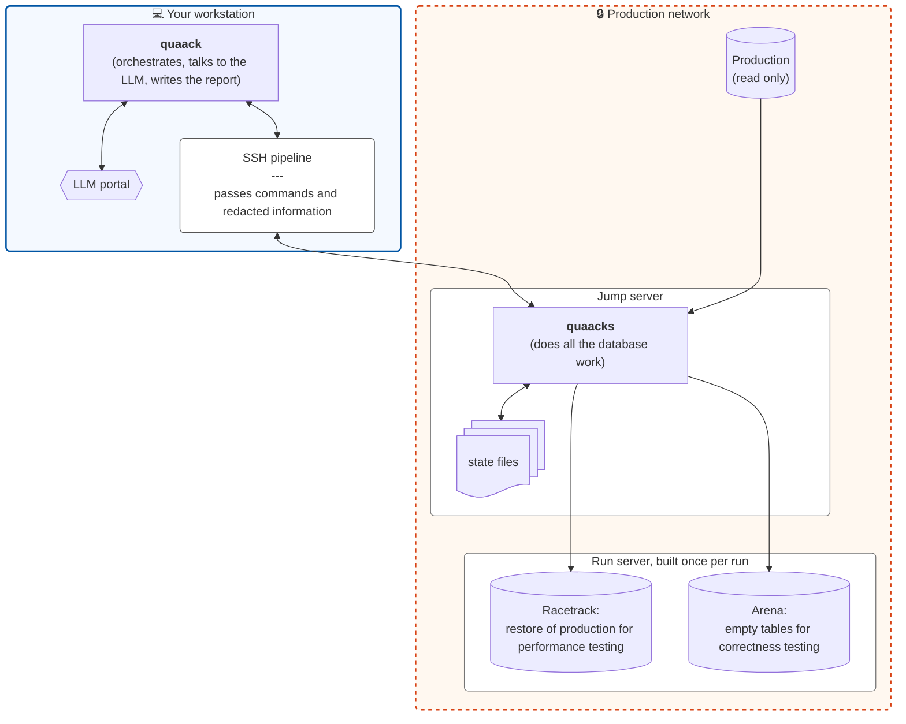
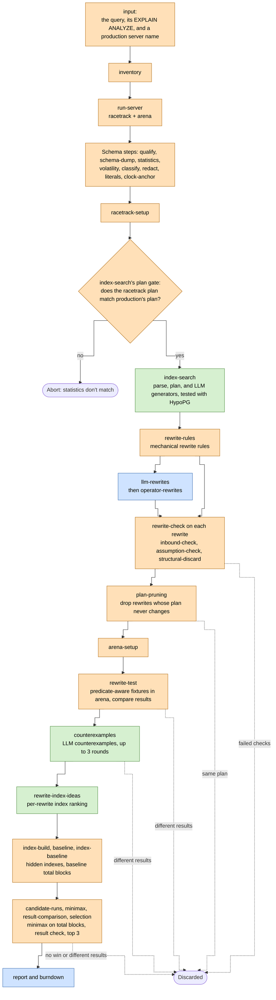

# QUAACK: Query Upgrade Automation Assisted by Chaos and Knowledge

QUAACK takes a slow production query and works through it in stages. It proposes rewrites and indexes, throws out any rewrite that changes the query's results, and then ranks the rest by how many buffers they touch on a restored clone of production.

## Overview.

The driver on the engineer's laptop talks to the LLM, which can be several models from several providers in one run. The enclave script on the jump server touches the databases and every real value. Only shapes cross the line between them.



Each run works through the steps below. Orange steps run in the production data enclave, blue steps run on an external workstation, and green steps are split between them.



## Run order.

Each step has a name, a short slug such as `index-search`. The code, the store, the progress lines, and the report all name steps by slug, never by number. This outline is the only place steps are numbered, and the numbers show the order they run in and which steps repeat. The sections below follow the same order.

1. input (`quaack start`)
2. inventory (`quaack setup` starts here)
3. run-server
4. The schema steps:
   - 4.1 qualify
   - 4.2 schema-dump
   - 4.3 statistics
   - 4.4 volatility
   - 4.5 classify
   - 4.6 redact
   - 4.7 literals
   - 4.8 clock-anchor
5. racetrack-setup (the end of `quaack setup`)
6. Index search for the original query (`quaack run` starts here):
   - 6.1 index-search: the plan gate, then
     - 6.1.1 index-from-query
     - 6.1.2 index-from-plan
     - 6.1.3 index-dedupe
     - 6.1.4 index-test
   - 6.2 llm-index-ideas, then index-dedupe and index-test on its ideas
   - 6.3 llm-index-refine, if any idea fell short, then index-dedupe and index-test again
   - 6.4 index-rank
7. rewrite-rules:
   - 7.1 apply the rules
   - 7.2 rewrite-check on each rewrite:
     - 7.2.1 inbound-check
     - 7.2.2 assumption-check
     - 7.2.3 structural-discard
8. llm-rewrites:
   - 8.1 ask the LLM
   - 8.2 rewrite-check on each rewrite, as in 7.2
9. operator-rewrites, if the operator gave any:
   - 9.1 infer each one's transformation and assumptions
   - 9.2 rewrite-check on each rewrite, as in 7.2
10. plan-pruning. For each rewrite:
    - 10.1 rewrite-index-search
    - 10.2 rewrite-index-rank
    - 10.3 rewrite-prune
11. arena-setup
12. rewrite-correctness. For each rewrite still standing:
    - 12.1 rewrite-test:
      - 12.1.1 fixture-scenarios
      - 12.1.2 vacuity-guard, on S1
      - 12.1.3 fixture-open
      - 12.1.4 fixture-load
      - 12.1.5 fixture-compare
      - 12.1.6 fixture-rollback
      - Repeat 12.1.3 through 12.1.6 for each scenario, in both load orders, until one gets different results.
    - 12.2 counterexamples:
      - 12.2.1 llm-counterexamples
      - 12.2.2 counterexample-compare
      - 12.2.3 counterexample-rollback
      - Repeat 12.2.1 through 12.2.3 until a round disproves the rewrite, or for three rounds.
13. rewrite-index-ideas. For each rewrite that survived 12:
    - 13.1 rewrite-llm-index-ideas
    - 13.2 rewrite-llm-index-refine
    - 13.3 rewrite-index-rerank
14. index-build (measurement-setup; run-discipline governs 14 through 17)
15. baseline
16. index-baseline
17. candidate-runs
18. minimax (blocks-metric)
19. result-comparison
20. selection
21. report, with its negative-result and burndown parts

`quaack setup` runs 2 through 5, and `quaack run` runs any of them the store says haven't run, then 6 through 21. Some steps run as more than one enclave call, and some calls run more than one step. The sections below say which.

### Old step IDs.

Earlier versions of this document numbered the steps, and BACKLOG-COMPLETE.md still does. This table maps each old ID to its slug.

| Old ID | Slug |
| --- | --- |
| 1 | input |
| 2 | inventory |
| 3 | the schema steps |
| 3a | qualify |
| 3b | schema-dump |
| 3c | statistics |
| 3d | volatility |
| 3e | literals |
| 3f | classify |
| 3g | redact |
| 3h | clock-anchor |
| 4 | run-server |
| 4a | racetrack-setup |
| 4b | arena-setup |
| 5 | index-search's plan gate |
| 5a | index-search, as a whole |
| 5a-1 | index-from-query |
| 5a-2 | index-from-plan |
| 5a-3 | index-dedupe |
| 5a-4 | index-test |
| 5a-5 | llm-index-ideas |
| 5a-6 | llm-index-refine |
| 5a-7 | index-rank |
| 6 | rewrite generation: rewrite-rules, llm-rewrites, and operator-rewrites |
| 6a | llm-rewrites |
| 6b | assumption-check |
| 6c | rewrite-rules |
| 7 | operator-rewrites |
| 8 | plan-pruning |
| Steps 9 and 10 | rewrite-correctness |
| 9 | rewrite-test |
| 9a | fixture-open |
| 9b | fixture-load |
| 9c | vacuity-guard |
| 9d | fixture-compare |
| 9e | fixture-rollback |
| 10 | counterexamples |
| 10a | llm-counterexamples |
| 10b | counterexample-compare |
| 10c | counterexample-rollback |
| 11 | rewrite-index-ideas |
| 12 | measurement-setup |
| 12a | index-build |
| 12b | run-discipline |
| 13 | baseline |
| 13a | index-baseline |
| 14 | candidate-runs |
| 14a | blocks-metric |
| 14b | minimax |
| 14c | result-comparison |
| 14d | selection |
| 15 | report |
| 15a | negative-result |
| 15b | burndown |
| `step14` (a burndown stage) | measurement |

The fates `step9_disproved`, `step9_untested`, `step9_failed`, `step10_disproved`, and `step10_failed` are now `rewrite_test_disproved`, `rewrite_test_untested`, `rewrite_test_failed`, `counterexamples_disproved`, and `counterexamples_failed`.

## Trust boundary.

QUAACK splits data into two classes. The code enforces the line between them. It doesn't rely on people following a convention.

**Values never leave the production enclave.** These values never reach an engineer's workstation:

- Literals from the query.
- `most_common_vals` and `histogram_bounds`.
- Fixture contents.
- Result rows.

**Shapes may leave.** These can leave the enclave and go to the engineer's machine and from there to an LLM:

- Relation and column names.
- Types.
- Constraint and index definitions.
- Plan structure, with literals stripped out.
- Derived scalars: `n_distinct`, `null_frac`, `correlation`, and MCV frequencies (without the values they belong to).
- MCV values for low-cardinality columns only, as defined in classify, and only for a text-like column or one whose type is on classify's short allowlist (numbers, booleans, dates and times, uuids, and enums). These are the one exception to "values never leave," and they exist so the LLM can write partial index predicates.

For version 1, we assume the schema dump and partial index predicates contain no PII, and we treat them as shape data. A schema-only dump can still hold literals in `CHECK` constraints, column defaults, comments, and function bodies. Revisit this assumption before using QUAACK on a schema where that isn't true. Partial index predicates are safer, because QUAACK only allows them on low-cardinality columns (see index-dedupe).

Everything that leaves the enclave goes through one egress function, and that function only accepts fields on a whitelist. If a field isn't on the whitelist, it isn't sent at all. We don't scrub it and send it anyway. Adding a field to the whitelist is the single place where this policy gets reviewed.

The enclave's own SQL names every catalog relation, function, operator, and type with its schema, such as `pg_catalog.pg_class`, `pg_catalog.count(*)`, `OPERATOR(pg_catalog.=)`, and `::pg_catalog.text`, and calls HypoPG's functions in the schema `pg_extension` says HypoPG is in. A database or role `search_path` can put another schema ahead of `pg_catalog`, and an unqualified name would then find whatever is planted there: an operator that says no could hide another client from run-server or a volatile function from volatility. `IN`, `LIKE`, `IS DISTINCT FROM`, `NULLIF`, row comparisons, and a simple `CASE` use an operator that can't be qualified, so the enclave writes them another way. A spec checks every SQL string in the enclave. The production reads are done. The rest, the arena reads and some racetrack reads, such as the rewrite rules' catalog and the assumption checks, are on a shrinking list (20261007-9). `COLLATE "C"` isn't qualified yet (20261007-3).

A step whose upstream store entry is missing, because the step that writes it hasn't run, refuses with the rule `missing_<entry>`, such as `missing_statistics`. Entry names are fixed words in the code, never data, so the rule is shape.

### Where QUAACK runs.

QUAACK has two parts:

- **The driver** runs on a engineer's laptop, outside the production enclave. It runs the steps in order, makes every LLM call, and builds the report. It never holds a production value.
- **The enclave script** runs on the production enclave's jump server. It's a stateless command-line script, not a long-running service. It does everything that touches a database or a real value, and it only runs when and how the driver calls it.

The driver calls the enclave script over ssh, passing a subcommand for the step to run plus its arguments. The script reads what it needs from the governed store, does the work, writes any new state back to the store, and prints its result. Nothing stays in memory between calls.

A step that takes input reads it as one JSON object on stdin, from the laptop or an LLM, so it's untrusted. The script refuses more than 64 MiB as `input_too_large`. Parsing JSON can take 50 to 135 times a dense array's size, so before it parses, the script also counts the commas, colons, and opening brackets outside strings, and refuses more than 2,000,000 the same way. That keeps the worst parse near 550 MB. Intake reads the operator's plan file with the same check and calls it `plan_too_large`. A real plan never comes close: EXPLAIN's JSON measured about one every 10.7 bytes or more, even for 1,000 partitions or 1,000 columns, so even a 16 MiB plan, the most intake reads, stays under about 1.6 million, and a step's input, from one LLM reply, has far fewer. Nesting deeper than 3,000 is refused as `bad_input`.

Each call runs `ssh -T -o BatchMode=yes -o ServerAliveInterval=30 -o ServerAliveCountMax=4 -o ConnectTimeout=30 -- <host> quaacks <subcommand> ...`. BatchMode means ssh never prompts, so expired credentials fail the call instead of hanging it. The keepalives end a session whose network has gone away after about two minutes of silence, instead of leaving the call hung, and ConnectTimeout bounds a connection that never answers. Anything else, such as `ControlMaster`, comes from the operator's own ssh config.

ssh exits 255 when it can't connect or its session fails, and a remote `quaacks` that's killed, by the OOM killer for one, comes back as 255 too. A call that fails without an error line from `quaacks` is `incomplete`, and its message names the subcommand and how the call ended, as `exit N` or `signal NAME`. These are the driver's own facts, so nothing crosses the trust boundary. Exit 255 adds a fixed hint: the ssh session failed or ended, or the remote process was killed, so check the ssh login, the network, and the jump server's kernel log (for the OOM killer) and sshd log. When a call exits 255 with nothing at all on stdout, the driver runs one probe, `ssh <same options> -- <host> true`, which runs no `quaacks`. It throws the probe's output away and keeps only its exit status. If the probe fails too, the call fails as `ssh_failed`, and the message says the driver couldn't ssh to the jump server, to check the ssh login or network, and how to go on: `quaack run --run <ID>` or `quaack setup --run <ID>` to resume, or `quaack start` again. Otherwise it stays `incomplete`, and its message ends with how to go on, in the same words. The version check before a run passes `ssh_failed` through as itself, not as a missing `quaacks`. `quaack run` says to resume only while the run's store is left: with `--keep`, when a setup step failed (see setup), when teardown failed, or when it never ran. Once teardown has deleted the store, it says to start a new run with `quaack start`. When the run itself succeeded and only its teardown failed, resuming would redo the run's last steps, so it prints the report's path, which the run wrote, and says to tear the run down as teardown's own message, just before it, says: with `quaacks teardown --run <ID>` on the jump server, or by hand for a store teardown wouldn't or couldn't delete. That holds for every rule teardown fails with, including ones whose message has no next step of its own, such as `teardown_failed` or `destroy_command_failed`, and for an error in the driver itself during teardown, which shows only the rule `driver_error`. It doesn't repeat the command. After a run that failed as `ssh_failed`, it doesn't try teardown, whose call would only fail too, after another connect timeout and probe. The store remains, and so does the run server, with their copies of production data, and it prints the teardown command to run later on the jump server.

The driver never retries an enclave call. A call that exits 255 with no stdout can't be told apart from a remote `quaacks` that was killed before it printed anything, and not every subcommand is safe to run twice. The probe and the resume hint are enough: the operator fixes ssh and resumes, and the resume rule skips every step already stored.

The driver finds the jump server with `jump_command` in its config file on the laptop, `~/.quaack/driver.json`. It's a one-line shell command in which every `{server}` becomes the production server name, as one shell word. `/bin/sh` runs it with no stdin, its stderr thrown away, and a 30-second timeout, and it must print one ssh host name and nothing else. If the file is unreadable, isn't a regular file (such as a FIFO, which it never reads), is a symlink whose target is missing (or `~/.quaack` is), is not JSON, not a JSON object, missing `jump_command`, or has a `jump_command` that isn't one non-blank line, `quaack start`, `quaack setup`, and `quaack run` refuse with `bad_driver_config: <path>: <problem>`. `quaack setup` checks the whole file, so it refuses a bad `jump_command` too, even though it never runs it. A JSON syntax error names only the line and column, never the parser's message or file contents. `quaack start` runs it, then runs `quaacks intake` on that host (input), and records which jump server holds the run, and the production server and `--port` the operator gave, in `~/.quaack/runs/<run ID>.json`, so later commands, such as `quaack run --run <ID>`, take only the run ID. A run with no record there is an unknown run ID. A record that's there but can't be read, such as one under an unreadable `~/.quaack` or `~/.quaack/runs`, one that isn't a file, or one that isn't a JSON object, makes `quaack setup` and `quaack run` refuse with `can't read ~/.quaack/runs/<run ID>.json`, a usage error that names the record by `~`, never by its absolute path.

The driver kills an enclave call that runs longer than its timeout, an hour by default. `enclave_timeout_seconds` in `~/.quaack/driver.json`, a positive number, sets it for `quaack start`, `quaack setup`, and `quaack run`, and `quaack run --enclave-timeout-seconds <n>`, a plain decimal number such as `5400` or `90.5`, overrides it for one run. Anything else is `bad_driver_config`, or for the flag a usage error. A call that hits it fails as `timeout`, and the message says how long the call ran and which setting raises the limit. A version check that times out fails the same way, not as a missing quaacks. `quaack deploy` keeps its own fixed timeouts, so its timeout message names no setting.

A connection failure gets a fixed note from the driver, after its rule, since the enclave's error line holds only the rule and libpq's message, which can name the user or the database, never leaves the enclave. For `production_connection_failed`, it names the production server it tried, read from that record of the run, and says "the production server you gave quaack start" for a run an older driver recorded without one, or whose record holds something that isn't a host name. It names the port too when the record holds one, checked again on read as `quaack start` checks it (`Protocol::Port`). A record that holds the server but no port, or something that isn't a port, is shown as if `quaack start` had no `--port`. A record with neither, from a driver older than 0.1.6, says the port is the one given to `quaack start --port`, or libpq's if none was given, since such a driver passed `--port` on without recording it. It says that QUAACK gives libpq only that host, or that host and port, so the user, the database, the password, and without a port the port, come from the operator's libpq setup on the jump server: `PG*` environment variables, `~/.pg_service.conf` with `PGSERVICE`, and `~/.pgpass`. It says that a non-interactive ssh session may not load the shell rc file that sets them, how to test the connection, as `ssh <jump> 'psql -h <server> -c "select 1"'` with the run's jump host and server, and `-p <port>` only when the record holds a port, to start a new run with `quaack start --port` if production listens on another port, and otherwise how to go on, as for `ssh_failed`. `run_server_connection_failed` gets the same, but doesn't name the run server's host, port, or databases: they come from run-server's flags or `run_server_command`, and once run-server has passed, from its stored entry, which the driver doesn't see. Its test is `ssh <jump> 'psql -h <host> -p <port> -d <racetrack db> -c "select 1"'`. The jump host and production server are the operator's own input, from the laptop, so nothing in these notes crosses the trust boundary.

Every other rule an error line can carry gets fixed words from the driver too, after the rule and any field the line named, such as an intake reason, a column, a cycle, a function, or the other clients. The enclave publishes the list of rules it can send, `Protocol::ErrorRules`, so the driver needn't load it: the names, plus the `missing_<entry>` family for a store entry a step needs and doesn't find. An enclave spec scans the enclave's raise sites with Prism and reads the rules built from tables and prefixes from their sources, so a new rule fails until it's listed, and a cross-gem spec fails until the driver has words for it. A rule the operator can act on, such as a bad flag or file, the jump server's config or store, a run server check, pg_dump, or a query QUAACK v1 can't tune, says what happened and what to do, and most end with how to go on, as for `ssh_failed`. A query QUAACK can't tune doesn't, since going on runs the same query, and teardown's don't, since teardown says how. Every other rule, a check of QUAACK's own work or of the order the driver runs steps in, gets one shared line after the rule and its step: "QUAACK hit an internal check it can't recover from. This is a QUAACK bug: report the rule name and the step." The words are fixed text in `Driver::FixedNotes`, so none of them carries a value.

`quaack setup --run <ID>` then runs setup: `quaacks inventory`, `run-server`, `qualify`, `schema-dump`, `statistics`, `volatility`, `classify`, `redact`, `literals`, `clock-anchor`, and `racetrack-setup`, in that order, each over ssh. It takes `--host`, `--port`, `--racetrack-db`, and `--arena-db`, and passes only those given to `quaacks run-server`, which takes the rest from `run_server_command` (run-server). It resumes the way `quaack run` does: `quaacks status` says which of these steps' outputs the store holds, each step's last-written entry, and those steps are skipped, run-server's flags with it. Since flags that go unused would otherwise go unnoticed, a skipped run-server is followed by a line that names the run-server flags given, never their values, and says to start a new run with `quaack start` to use another run server. `quaack run` prints the same line, before its own steps, when its run has had all of setup. It prints the same numbered progress lines as `quaack run`, each ending with the step's slug in parentheses, one per step with a plain-English description, and then `<run ID> set up`. A step that fails stops it with its rule, as `quaack setup failed: <rule>`, or `<rule>: <note>` for a rule the driver adds a fixed note to, such as `run_server_unspecified`, which says what to give, and keeps the run, so the operator can fix the problem and run it again. Its output is only for show, as every `quaack` command's is (see `quaack run`): once a write to stderr or stdout finds the stream gone, such as a pipe whose reader has exited, the rest of that stream's output is skipped quietly, `quaack setup failed` and usage messages included, and setup goes on to the exit status it would have had. `quaack run` takes the same four flags, and when the store says the run hasn't had all of setup, it runs them first, the same way, counting their eleven steps before its own in its progress. There, a failing setup step fails the run, which is kept, not torn down, since nothing expensive has run yet and the operator may only need other flags, such as after `run_server_unspecified`. It prints `quaack: kept run <ID>, since a setup step failed.`, and `quaack run failed` ends with what to do next: resume with `quaack run --run <ID>`, or tear the run down by running `ssh -- <jump> quaacks teardown --run <ID>`, which names the run's jump host, quoted for the shell, in the plain form that leaves out the ssh options the driver's own calls add. A signal during a setup step, such as a Ctrl-C, keeps the run the same way, just as `quaack setup` keeps its run. `quaack run` then prints `quaack: kept run <ID>, since a signal interrupted a setup step.` with the same next step, since no `quaack run failed` line follows a signal, and the signal then ends the process as usual. With `--keep`, or when the step failed as `ssh_failed`, it says what it does after any step of `quaack run`. A failure or signal in any later step is torn down as before. Every teardown command the driver prints, after `--keep`, `ssh_failed`, or a failed teardown, names the jump host the same way, as one to run from the laptop. `quaack start` does no setup.

The driver talks to each LLM provider through a provider-neutral client, one per provider, behind the router, which owns routing, failover, and fan-out (Several LLM providers). The client owns what's the same for every provider: the burndown count for every attempt (burndown), the JSON-only instruction and the parsing and checking of JSON replies, and the error rules (`llm_auth`, `llm_rate_limited`, `llm_unavailable`, `llm_bad_request`, `llm_bad_response`). Behind it, one adapter per provider holds everything provider-specific: the request's shape, structured output, stop reasons, the SDK's retries, credentials, and which SDK error is which rule. No rule keeps the SDK's error as its cause, since that error holds the response's headers and whole body, which a gateway or proxy can echo a key or cookie in. For the same reason, the Anthropic, Bedrock, and OpenAI-compatible adapters' detail for an API's answer is only its status and the body's own error message (`error.message`, Bedrock's top-level `message`, or, for OpenAI-compatible, a non-empty string `error`, as servers such as Hugging Face TGI send), never the whole body or the URL, and only the status when the body has no message or is text, with secrets replaced by `[key]`: the adapter's own keys, every bearer token an attempt sent (so an `ant auth login` profile's token too, even after a 401 makes the gem reread it), and from `base_url`, as written and decoded, each query value of eight characters or more, the user and password, and each path segment of 16 or more. Each secret goes URL-encoded too, whole or in part, in either case of hex, so an echo of a base64 token with `%2B`, `%2F`, or `%3D` in it goes as well. A `base_url` value that decodes to invalid UTF-8 goes decoded with each invalid sequence dropped, and with each one replaced by U+FFFD. The scrub makes the detail and every secret valid UTF-8 first, so it never raises an error of its own that could quote a secret. A secret of 16 characters or more is replaced wherever it shows, even inside a longer token. A shorter one is replaced only as a whole token, a run of the characters keys are made of (letters, digits, `_`, and `-`), so it can't cut words apart. Unsupported in v1: a key shorter than 16 characters in a `base_url` path segment, which isn't scrubbed, and a short secret that a gateway echoes run together with other key characters. The settings refuse a `base_url` that `URI.parse` rejects, since the gem's own error for one quotes the whole URL. An adapter that needs an SDK loads it only when its client is built, so commands that make no LLM calls start without paying about a second to load the anthropic and openai gems. There are four adapters:

- **Anthropic**, the Messages API through the anthropic gem. Its structured output holds every reply to the schema.
- **OpenAI-compatible**, the Chat Completions API through the openai gem, at the block's `base_url`. One adapter serves OpenAI, Groq, Gemini's OpenAI-compatible endpoint, OpenRouter, and local servers such as Ollama. Not all of them hold a reply to a schema, and some take `response_format` and still don't, so this adapter says it doesn't enforce schemas. It puts the schema in the system prompt, and also sends it as a `response_format` of type `json_schema`. When the API rejects a request for its `response_format` (a 400 or 422 whose `param` is `response_format`, or whose body names it), the adapter asks again without it, and if that works it stops sending it for the rest of the run. Any other 400 or 422 is `llm_bad_request` at once. It sends the token limit as `max_completion_tokens`, which OpenAI, Groq, Gemini, and OpenRouter take. Ollama ignores that name and reads only `max_tokens`, so the block's `token_limit_param` can say `max_tokens` to send the limit under that name instead. It never sends both. Its key comes from the variable `api_key_env` names, or `OPENAI_API_KEY`, and a missing or empty one is `llm_auth` before any attempt. Without a `base_url` it goes to OpenAI; the gem's `OPENAI_BASE_URL` is ignored. The gem's `OPENAI_ORG_ID`, `OPENAI_PROJECT_ID`, and `OPENAI_CUSTOM_HEADERS` go only to OpenAI's own API, and their values are among the adapter's own keys, scrubbed from its details. A `base_url` that ends in `/chat/completions` is a usage error, since the gem adds that path itself. The adapter checks a successful reply before the gem reads it: one whose content-type isn't JSON, whose body isn't a JSON object, or whose choices, messages, tool calls, or functions aren't objects the gem can walk (including a choice with no message) is `llm_bad_response`, quoting none of it, so a bug in the driver surfaces as itself rather than as a bad reply.
- **Bedrock**, Anthropic models on AWS Bedrock through the anthropic gem's Bedrock client, which uses the AWS SDK (`aws-sdk-bedrockruntime`, a driver-only dependency, like the other LLM SDKs). It's the Anthropic adapter with a different edge: the same Messages API request and structured output, rewritten by the gem to Bedrock's InvokeModel URL, with the model in the URL, and signed with SigV4. QUAACK stores no AWS credentials. A Bedrock API key in `AWS_BEARER_TOKEN_BEDROCK` is sent as a bearer token when it's set; otherwise the AWS SDK's credential chain finds them (the block's `aws_profile`, environment variables, `~/.aws` profiles with SSO, assumed roles, or `credential_process`, then instance roles). Finding none, a chain that fails, and an empty `AWS_BEARER_TOKEN_BEDROCK` are `llm_auth` before any attempt, and the chain's own error messages, which can quote files and commands, are dropped. The credentials are taken once, when the client is built, as the gem does. A refused request is `llm_auth` with only its status. The region is the block's `aws_region`, else the SDK's lookup; no region is a usage error, and so is an `AWS_REGION`, `AMAZON_REGION`, or `AWS_DEFAULT_REGION` that isn't a region, which names the variable, not its value. The first of them that's set, in that order (the SDK's), is the one checked and used; when it's empty, as in the SDK, the rest are skipped and there's no region from them. With no base URL, the gem reads `ANTHROPIC_BEDROCK_BASE_URL`, which QUAACK passes through unchecked.
- **Copilot CLI**, a local command such as GitHub's `copilot`, run once per ask without a shell. The block may give a `command_template`, an argv array with `{prompt_file}` and `{model}` placeholders, and a positive `timeout_seconds`. The default template runs `copilot --disable-builtin-mcps --no-ask-user --no-custom-instructions --disallow-temp-dir --available-tools=view --allow-tool=read({prompt_dir}) --deny-tool=shell --deny-tool=write --deny-tool=url --model={model} -s -p "Please follow my prompt in {prompt_file}. Reply only with the answer."` with the default model `claude-opus-5.5`. The prompt file is mode 0600 in a private temporary directory, explicitly allowed with `--allow-tool=read({prompt_dir})`, which is also the command's current directory, and the directory is removed after the ask. The child environment unsets `COPILOT_CUSTOM_INSTRUCTIONS_DIRS`. Global custom instructions can push prose or code fences around JSON replies, causing `llm_bad_response` or subtler bad behavior. The GitHub Copilot CLI command reference documents `--no-custom-instructions` as disabling AGENTS.md and related files, and says it always takes priority; it does not explicitly say whether that includes user-level `~/.copilot/copilot-instructions.md` and `~/.copilot/instructions/**`, so operators should keep those out of the way or canary that they don't reach this provider. The adapter does not enforce schemas: it writes the system prompt, JSON-only instruction, schema, and full labeled transcript to the prompt file, and the client checks the reply and does one re-ask when needed. Each command run counts in the burndown. A missing command, timeout, or non-zero exit is `llm_unavailable`, except a distinctive not-logged-in stderr is `llm_auth`; empty stdout is `llm_bad_response`. An `llm_auth` message quotes none of stderr. An `llm_unavailable` message quotes stderr's last lines, with GitHub tokens, anything after `Bearer` (past spaces, tabs, and a colon or equals sign), and Copilot API session tokens (`tid=...;exp=...;8kp=...`) shown as `[token]`.

For an adapter that doesn't enforce schemas, the client checks each JSON reply against the schema, and when one doesn't match, it asks once more: the same conversation, then the reply, then what was wrong with it (the check's message, which never quotes the reply). A second reply that doesn't match is `llm_bad_response`. The re-ask lives in the client, not the adapter, because the check it repeats is the client's, and it's the same for every such provider. Every attempt counts in the burndown, the re-ask and the one without `response_format` included.

The `llm` block of `~/.quaack/driver.json` picks the provider (`anthropic`, `openai_compatible`, `bedrock`, or `copilot_cli`), the `model`, a `base_url`, and `api_key_env`, the name of the environment variable that holds the key. A key never goes in the file. `QUAACK_MODEL`, `QUAACK_LLM_PROVIDER`, and `QUAACK_LLM_BASE_URL` override the block, and only the block. When `QUAACK_LLM_PROVIDER` switches to a provider other than the block's, every key of the block is still checked, as it would be for the block's own provider, then ignored, so the switch works for one run. A key that doesn't apply even to the block's own provider is a usage error, so the mistake doesn't wait for the next run without the switch. The block's `base_url` and `api_key_env` are meant for its own provider, and another provider's credentials must never go to them. The model and base URL come only from `QUAACK_MODEL` and `QUAACK_LLM_BASE_URL`, or the new provider's defaults, so `openai_compatible` and `bedrock` need `QUAACK_MODEL`, and its absence is a usage error naming it. An `llms` list may replace the block, to use several providers in one run, and `QUAACK_LLM` picks entries of it (Several LLM providers). With no block, it's Anthropic with `claude-opus-5-5`; `copilot_cli` defaults to `claude-opus-5.5`; any other provider needs a `model`. `quaack run` reads the block, and builds the client, before it touches the jump server. A bad block is a usage error that names the key, never the value. For Anthropic, the driver needs no API key of its own. Unless `api_key_env` names one, the anthropic gem finds credentials in its usual order. It tries `ANTHROPIC_API_KEY`, then `ANTHROPIC_AUTH_TOKEN`, then a profile such as the one `ant auth login` saves. It takes the first of those two variables that's set, even an empty one, and looks no further. So an empty value there is `llm_auth`. An empty one after it goes unread. Finding no credentials is `llm_auth` too. So are a profile that can't be read and an API that refuses the credentials.

For `"provider": "bedrock"`, the block also takes `aws_region` and `aws_profile`, and not `api_key_env`, since the credentials come from AWS. `aws_region` and `aws_profile` apply to no other provider. Either mistake is a usage error naming the key. `QUAACK_LLM_PROVIDER` takes `bedrock` too.

For `"provider": "copilot_cli"`, the block also takes `command_template` and `timeout_seconds`, and not `base_url`, `api_key_env`, `aws_region`, or `aws_profile`. `command_template` and `timeout_seconds` apply to no other provider. Any mismatch is a usage error naming the key. `QUAACK_LLM_PROVIDER` takes `copilot_cli` too.

For `anthropic`, `openai_compatible`, and `bedrock`, the block also takes `max_retries`: how many times the adapter's gem retries a 408, 409, 429, or 5xx, with its usual backoff, after the first attempt. It's a whole number from 0 to 10, and 0 turns the retries off. Without it, the gem's own default holds, two retries. Anything else, such as a negative number, a float like `2.0`, or a string, is a usage error naming the key, not the value. It doesn't apply to `copilot_cli`, which retries nothing, so there it's a usage error too. An `llms` entry takes it the same way, named by its position, such as `llms[1].max_retries`. Like every key of the block, a `QUAACK_LLM_PROVIDER` switch to another provider checks it and then ignores it, so the new provider gets its gem's default.

For `openai_compatible` only, the block also takes `token_limit_param`: the name the token limit goes under, `max_completion_tokens` (the default) or `max_tokens`. Set `max_tokens` for Ollama, which ignores the other name. OpenAI's reasoning models reject `max_tokens`, so the default stays as it is. Any other value is a usage error naming the key, not the value, and so is the key under any other provider. An `llms` entry takes it the same way.

Access control comes from ssh. Anyone who can ssh into the jump server already has production access, so they can run the enclave script too. There's no separate login or service to secure.

#### Several LLM providers.

A run can use more than one LLM provider. Different models propose different rewrites, indexes, and counterexamples, and each provider has its own rate and daily limits, so spreading asks across them stretches free tiers.

##### The `llms` list.

`~/.quaack/driver.json` takes an `llms` list in place of the `llm` block. Each entry is shaped like the `llm` block, with the same keys and the same per-provider rules, plus a required `name`:

```json
{
  "jump_command": "...",
  "llms": [
    { "name": "opus", "provider": "anthropic" },
    { "name": "copilot-opus", "provider": "copilot_cli", "model": "claude-opus-5.5" },
    { "name": "copilot-gpt", "provider": "copilot_cli", "model": "gpt-5.5" },
    { "name": "groq", "provider": "openai_compatible", "base_url": "https://api.groq.com/openai/v1",
      "api_key_env": "GROQ_API_KEY", "model": "..." }
  ],
  "llm_routing": {
    "mode": "round_robin",
    "counterexample_pairing": "prefer_different",
    "steps": {
      "llm-rewrites": { "fan_out": true },
      "llm-counterexamples": { "providers": ["opus", "copilot-gpt"] }
    }
  }
}
```

- A provider type may appear more than once. Each entry is its own provider, so the two `copilot_cli` entries above are two providers.
- `name` is one to 32 characters of lowercase letters, digits, `_`, and `-`, and no two entries share one. It shows up in progress lines, error messages, and the report, so it mustn't hold anything secret. A bad name is a usage error that names its position, such as `llms[2].name`, never its value.
- Every other bad key is the usage error it is today, with the entry's position in the key: `llms[3].model in ~/.quaack/driver.json is required unless the provider is anthropic`. Positions count from 0, so the first entry is `llms[0]`. A message an adapter gives while its client is built names the entry's key the same way, such as `llms[2].aws_region` for a Bedrock entry with no region.
- An empty list, a list of something other than objects, or more than nine entries is a usage error.

Backward compatibility:

- An `llm` block alone still works. It becomes a one-entry list, named after its provider (for example `anthropic`).
- No block at all is still Anthropic with `claude-opus-5-5`, named `anthropic`.
- Both `llm` and `llms` is a usage error: `use llm or llms in ~/.quaack/driver.json, not both`. An `"llm": null` beside `llms` counts as both.
- `llm_routing` without `llms` is a usage error, since one provider has nothing to route.

`quaack run` builds a client for every entry before it touches the jump server, as it does for the one client today. So a bad entry, or credentials an adapter can't find at build time (`llm_auth` before any attempt), stops the run at once, even when other entries are fine. The message names the entry: `llm_auth: groq: GROQ_API_KEY is not set`. That's config the operator can fix before anything runs, so it's cheaper to stop than to run a whole pipeline without a provider they asked for. An `llm_auth` that comes back from an attempt, after the run started, is handled differently (see Routing).

##### Environment overrides.

- `QUAACK_LLM=<name>[,<name>...]` keeps only the named entries of `llms`, in the order given, for this run. An unknown name is a usage error that names the variable.
- Without `llms`, `QUAACK_LLM` applies to the one entry a lone `llm` block, or no block, makes, by its provider's name. After a `QUAACK_LLM_PROVIDER` switch, that's the name of the provider it switched to. Any other value is a usage error: `QUAACK_LLM must be anthropic, the one provider's name, since ~/.quaack/driver.json has no llms`.
- `QUAACK_MODEL`, `QUAACK_LLM_PROVIDER`, and `QUAACK_LLM_BASE_URL` still override the `llm` block, as today. With `llms`, they're a usage error that says to use `QUAACK_LLM` instead. There's no one entry they'd clearly apply to, and quietly overriding every entry would surprise.

##### Asks, units, and sessions.

An ask is stateless. It sends the whole conversation, and no provider holds a session, so asks can move between providers. A **unit** is one ask, or one multi-turn exchange that must stay on one provider. Otherwise a model would see another model's reply as if it were its own. The multi-turn units are:

- llm-index-ideas and rewrite-llm-index-ideas: the first ask and its replacement round.
- llm-counterexamples: one rewrite's rounds, up to three.
- The client's re-ask for a reply that doesn't match its schema. It already lives inside one ask, so it stays on that ask's provider for free.

Every other ask is a unit of one: llm-rewrites, operator-rewrites' inference, llm-index-refine, and rewrite-llm-index-refine.

The driver gets a new front, the router. A step opens a session for a unit, and the session picks one provider and keeps it for every ask in the unit. The router owns the routing rules below. Each provider's client keeps everything it owns today: JSON parsing, the re-ask, the error rules, and its adapter's retries.

##### Routing.

Each step has a **pool**: the providers it may use. It's the step's `providers` under `llm_routing.steps`, if given (pinning), in the order pinned, or else every entry, in list order. Either way, the entries `QUAACK_LLM` drops are left out. A pinned name that isn't an entry is a usage error. Pinned names are checked against every entry, including the ones `QUAACK_LLM` drops, so a run that picks fewer entries doesn't turn a good file bad. A pinned step that `QUAACK_LLM` leaves with an empty pool is a usage error too.

`llm_routing.mode`, or a step's own `mode`, picks how a unit chooses from its pool:

- **`round_robin`**, the default: start with the next healthy provider after the one the last unit started on. One cursor turns across the whole list for the run, skipping providers outside the pool. So asks spread evenly across providers, whichever steps make them. That's the default because stretching free tiers is half the point of a list, and spreading asks costs no more calls than sending them all to one provider. The cursor lives in memory, so a resumed run starts it over. A unit in a `failover`-mode step doesn't move the cursor.
- **`failover`**: start with the pool's first healthy provider. The list is then a primary with backups, for an operator who wants one model's answers unless it's out of reach.

Both modes fail over. When a unit's first ask fails, after its adapter's own retries and the client's re-ask ran out, what happens depends on the rule:

- **`llm_rate_limited` and `llm_unavailable`**: the router marks that provider down and starts the unit again on the next healthy provider in the pool. A provider marked down stays down for the rest of the process. A resumed run tries it again.
- **`llm_auth`**: the API refused the credentials, or the command said it wasn't logged in. The router drops that provider for the rest of the run, as for a provider marked down, and says so loudly (see the messages below), since the operator has a setup problem to fix. Then it starts the unit again on the next healthy provider.
- **`llm_bad_response`**: a reply that can't be used, a refusal included. It's the error most tied to one model and one prompt, so the router starts the unit again on the next healthy provider in the pool, but doesn't mark the provider down. Later units may still use it.
- **`llm_bad_request`** doesn't fail over. It means the driver sent something the API won't take, which another provider is unlikely to fix and the operator should hear about at once. It fails the step, as it does today, and the message names the provider.

A unit that has tried every healthy provider in its pool fails the step with the last failure's rule. So the run fails on `llm_auth` only when no provider it may use is left.

A later ask in a unit can't move to another provider as it is, since the new provider would be shown another model's turns as its own. So a later ask that fails with a rule that fails over marks or drops the provider as above, and then:

- **llm-index-ideas and rewrite-llm-index-ideas** keep their first-round ideas, which index-test has already tested and stored, and skip the replacement round. The step goes on as if the replacements had come back empty. The progress line says so, and so does the provenance record.
- **llm-counterexamples** starts the rewrite's remaining rounds as a new unit, fresh, on another provider from the step's pool. The rounds count on: a rewrite that had one round on the first provider gets at most two more, so no rewrite gets more than three in all. The new unit picks its provider as any unit does, from the pool less the providers this rewrite's rounds have already failed on, under the step's mode and pairing. Its first ask is one user message holding the payload, exactly as the first round sent it, and then, under the heading "Earlier rounds, run by another model," each earlier round's inserts and that round's feedback: which inserts were refused and by which rule, whether the accepted ones loaded, and which untested atoms they exercised, in the same words the follow-up after that round already sent. Then it asks for inserts that try something different from all of them. None of it is put in the model's mouth as its own turns. The inserts are the earlier LLM's reply, and the feedback is the driver's text from counterexample-compare's outcome, both of which the driver already holds and already sends to an LLM, so the enclave sends nothing new. A later ask in the new unit that fails is handled the same way. When no provider is left, the step fails with the last failure's rule, as for any unit.

An `llm_bad_request` at a later ask fails the step, as at a first ask.

**Fan-out** is opt-in per step, with `"fan_out": true`. Only llm-rewrites, llm-index-ideas, and rewrite-llm-index-ideas take it; on any other step it's a usage error, even as `"fan_out": false`. A fan-out step runs its unit once on every healthy provider in its pool, one after another, never at the same time, so progress lines and failures come in a fixed order. It takes the union. The usual checks dedupe it: rewrite-check's for rewrites, and index-dedupe's for indexes. Mode doesn't apply to a fan-out step, and its branches don't fail over, since every healthy provider already has a branch. A branch that fails is dropped, with its provider marked down or dropped by the rule as above, the progress line and the report say which and why, and the step goes on with the rest. The step fails only when every branch failed, or when a branch fails with `llm_bad_request`, as everywhere. A branch whose replacement round fails keeps its first-round ideas, as a unit does. Fan-out multiplies a step's calls by the size of its pool, which is why it's opt-in.

How they combine, in order: the pool comes from pinning, or from the whole list. Pairing filters it, for llm-counterexamples. Then fan-out runs a branch on every healthy provider left, or the mode picks one and fails over through the rest.

##### Adversarial pairing.

`llm_routing.counterexample_pairing` makes llm-counterexamples use a different provider from the one that wrote the rewrite, so the model hunting for counterexamples isn't grading its own work. It takes:

- **`any`**, the default: pick as for any other step.
- **`prefer_different`**: drop the rewrite's author from the pool, then pick as usual. If nothing healthy is left, use the author, and record that the pairing wasn't met.
- **`require_different`**: the same, but with nothing healthy left the step fails as `llm_unavailable`, naming the rewrite and its author.

Pairing applies to a fresh start of the remaining rounds too, so a rewrite's rounds stay off its author's provider whenever another is healthy.

A provider counts as the author if it's the entry that wrote the rewrite, or another entry with the same `model` string. That catches two keys for the same Groq model, but not the same model spelled differently by two vendors, such as `claude-opus-5-5` and `claude-opus-5.5`. There's no key to say two spellings are the same model in v1. Pairing only applies to llm-rewrites' rewrites. Rule-made and operator rewrites have no author model, so they pick as with `any`. A rewrite whose author wasn't recorded (see provenance) picks as with `any` too, and the report says the pairing couldn't be checked.

`require_different` with fewer than two providers in llm-counterexamples' pool is a usage error at startup.

##### Provenance.

The driver records which provider and model produced each idea, rewrite, and counterexample round. It's all driver-side, on the laptop, in `~/.quaack/runs/<run ID>.llm.json`, next to the run's record. It's mode 0600 in the 0700 runs directory, written whole to a temporary file and renamed into place after each LLM step. It holds:

- `providers`: each entry's name, provider type, and model, as this run used them, and the rule the run marked it down or dropped it for, if it did. A resumed run adds any new entries and keeps the old ones as first recorded, so a rewrite's author stays named even after the config changes. A resumed run that asks a provider and doesn't mark it down or drop it clears the rule an earlier run recorded for it, since the resumed run tried it again and didn't find it down. A provider counts as asked when this run called it, whatever came back. So one whose every reply this run was a bad response (`llm_bad_response`, which doesn't mark a provider down) counts as asked and not down, and loses its earlier rule too. That says only that it answered, not that its replies were usable. A provider this run never called keeps its earlier rule.
- `rewrites`: for each stored llm-rewrites rewrite, by its store name (`rewrite_<n>`, from rewrite-check's `rewrite_outcome`), the entry that wrote it. `rewrites_proposed`: how many rewrites each entry proposed, stored or not. When two fan-out branches propose the same SQL, the union keeps only the first copy in its interleaved order, so only that branch gets credit for it, here and in `index_ideas` for the same DDL. The repeat isn't recorded, so the per-provider counts add up to what went to the enclave.
- `counterexamples`: for each rewrite, each entry that ran its rounds, in order, with how many rounds it asked and, for each fresh start, the rule that ended the entry before it, plus the pairing's outcome: met, not met, not applicable (the pairing is `any`), or couldn't be checked (no author was recorded). The record can't tell a rule-made or operator rewrite from an llm-rewrites rewrite whose author is missing, so unless the pairing is `any` it records both as couldn't be checked. The report tells them apart by the rewrite's source and says nothing of pairing for a rule-made or operator rewrite, since those have no author.
- `index_ideas`: for each search and LLM round (first, replacement, refinement), and each entry, how many statements it wrote and how index-test's `index_outcome`s for them came out, as counts by outcome and rule, plus each replacement round skipped and the rule that skipped it. A rerun of a search's llm-index-ideas replaces that search's first and replacement rounds and skips, since the rerun's rounds are the ones that count.
- `failed_branches`: each fan-out branch the router dropped, once each, by its step, its entry, and the rule it failed with (`llm_rate_limited`, `llm_unavailable`, `llm_auth`, or `llm_bad_response`), never the reason's words. A resumed run adds its own and keeps the earlier ones, since each is something that happened.
- `operator_inference`: the entry that inferred the operator rewrites' transformations and assumptions.

It holds names, models, store names, rules, and counts only. It never holds SQL, DDL, a prompt, or a reply. The driver never holds a production value, so none can get in.

The router reports which provider answered each unit, and the step that called it writes the record. For a fan-out step, the driver maps each outcome back to its branch by its position in the input, since rewrite-check and index-test answer one outcome per input, in order.

A run started by an older driver, or on another laptop, has no record, or a partial one. Anything it lacks is "not recorded" in the report, never a guess. The report also checks that the record's per-provider counts add up to the LLM total row's, from the burndown; when they don't, as for a record that missed a step, every per-provider count in that table is "not recorded". A record read back keeps only the parts that have exactly the shapes above, so nothing else in the file reaches the report.

##### Limits.

Every limit keeps its place and its number. Fan-out doesn't raise any of them:

- llm-rewrites' cap of five, which rewrite-check enforces per call. A fan-out step sends the union in one call, interleaved: each branch's first rewrite, then each branch's second, and so on, after dropping exact repeats of the SQL text. So every provider gets its best in, and rewrite-check drops the rest as `too_many`, which the burndown already counts as over the cap. Five is the cap for the step in all, not per provider, in v1.
- llm-index-ideas' cap of five per index-test call, the same way: one interleaved call for the first round, and one for the replacements.
- The replacement round still runs at most once per unit. Under fan-out, each branch asks for replacements for its own dropped ideas, since that's a turn in its own conversation, and the replacements go to index-test together.
- llm-index-refine runs once, as one unit on one provider, with every LLM candidate that fell short, whoever wrote it.
- llm-counterexamples' three rounds per rewrite, on one provider unless a later round's failure starts the rest fresh on another.

##### Accounting.

The burndown counts every attempt under its step, as today, and now also under its provider. The adapter's retries and the client's re-ask count under the provider that made them. A failed-over unit counts its attempts on every provider it tried, and so does a counterexample unit started fresh. Counts stay in memory, so a resumed run counts only the calls since it resumed, as today. The protocol gem's `LLM_STEPS` doesn't change, and nothing about calls goes to the enclave.

##### Progress and failure messages.

- Each ask's progress line names its provider: `Asking the LLM (llm-rewrites, groq)`.
- A failover gets its own line, with the failure's short reason: `groq is rate limited (the API answered 429: Rate limit reached), so the rest of this run skips it; trying opus (llm-rewrites)`. For `llm_bad_response`, it says the reply couldn't be used, and why, and that later asks may still use the provider.
- A provider dropped for `llm_auth` gets a line that stands out, starting with the rule: `llm_auth: opus: the API refused the credentials, so the rest of this run skips opus. Fix its credentials before the next run. Trying groq (llm-rewrites)`. It gets the line even when no provider is left to try: `... Fix its credentials before the next run. No other provider is left (llm-rewrites)`.
- A replacement round skipped: `groq is rate limited (<reason>), so the rest of this run skips it; going on without replacement ideas (llm-index-ideas)`.
- A counterexample unit started fresh: `groq is rate limited (<reason>), so the rest of this run skips it; asking opus for the remaining rounds, starting fresh (llm-counterexamples, Rewrite Silver Fox)`.
- A fan-out branch that fails: `copilot-gpt failed with llm_unavailable: <reason>; going on with the others (llm-rewrites)`.
- When every provider in a pool is down, or every branch failed, the step fails with the last failure's rule, and the message lists what was tried, each with its reason: `llm_rate_limited: every LLM provider llm-rewrites may use failed: groq (llm_rate_limited: <reason>); opus (llm_unavailable: <reason>). <request sizes>`.
- A reason is the adapter's detail for that failure, before the request's sizes. For an API that answered, it's `the API answered <status>: <message>`, with the body's own error message and never the URL. The Anthropic, Bedrock, and OpenAI-compatible adapters scrub their own credentials from it (for OpenAI-compatible, the key and OpenAI's organization and project), along with what `base_url` holds: each query value of eight characters or more, its user and password, and each long path segment. Each becomes `[key]`, since a gateway or proxy at `base_url` can echo any of them. The Copilot CLI adapter's detail shows GitHub tokens, and anything after `Bearer`, as `[token]`. Otherwise it's the adapter's own words, such as `the reply stopped for max_tokens`. It's on one line and cut to 120 characters. It's the detail the step's failure message already holds. `llm_auth`'s line already says why, so it shows no reason.
- An error that doesn't fail over names its provider after the rule: `llm_bad_request: opus: <detail>`.

Every message names entries by their `name`, which comes from the operator's own config. None of it comes from the enclave or the LLM.

With a lone `llm` block, or none, lines and messages name no provider and read as they did before several providers, with one change. A later ask that fails with a rule that fails over is handled as above, so llm-index-ideas and rewrite-llm-index-ideas now keep their first-round ideas where the step used to fail, and say so: `The LLM is rate limited, so the rest of this run skips it; going on without replacement ideas (llm-index-ideas)`. For `llm_auth`, the line starts with the rule and says to fix the LLM's credentials. After `llm_rate_limited`, `llm_unavailable`, or `llm_auth`, the one provider is then down or dropped, so the next unit that asks, such as llm-index-refine's, fails at once without a call. After `llm_bad_response` nothing is marked, so the next unit asks as usual. It fails with the skipped round's own failure, unchanged: its rule, the API's own detail, such as a retry hint, and that ask's request sizes, as the step would have failed before. It's never the list of what was tried. A counterexample unit that would start fresh fails the same way, since no provider is left.

##### Trust boundary.

Nothing new crosses the boundary in either direction. Provenance, names, models, and per-provider counts stay on the laptop. The enclave sees the same inputs it sees today, from the same steps, under the same checks and caps. A fan-out union is still LLM output, sent through rewrite-check and index-test as before. The driver reads only what already comes out: `rewrite_outcome`'s store name and `index_outcome`'s position, outcome, and rule. A counterexample unit started fresh sends only what an earlier round already sent to an LLM: the payload, the earlier LLM's inserts, and the driver's feedback on them. No provider name or model goes into any prompt either, so an LLM never learns which model wrote what it's shown.

#### Deploying the enclave.

The enclave script deploys by gem install only. Never run it from a checkout on the jump server: the repo's one Gemfile also installs the driver, its LLM SDK, and the dev tools. From a checkout on the laptop, run `quaack deploy --host <jump server>`. It builds the `quaack-protocol` and `quaacks` gems from their gemspecs, copies them over ssh into `~/.quaack/deploy` on the jump server, and runs `gem install --user-install --no-document` there. That installs into the ssh user's own gem directory, never an OS-wide one, and never with sudo. gem install gets the gems' dependencies, such as pg_query and pg, from rubygems, and builds pg_query from source, so the jump server needs Ruby 3.4, `gem` on PATH, gcc, and make. As each step starts, `quaack deploy` prints a line on stdout: building each gem, copying each one, running gem install (which can take a few minutes, since it builds pg_query), and checking `quaacks`. Once `quaacks` answers the new version, deploy removes old versions of `quaacks` and `quaack-protocol` from the user gem directory. For each gem, it keeps the version it just installed and the highest installed version older than that, even when the operator skipped a release, so there's always one release to fall back to. It removes each other older version with `gem uninstall --install-dir <user gem directory> -v <version>`, printing a line for each. That touches only the user gem directory: `--user-install` would also remove the same version from GEM_HOME, such as an rbenv or asdf Ruby's gem directory, where deploy never installs. It leaves any version newer than the one it installed, saying so. Versions compare as RubyGems versions, so 0.1.10 is newer than 0.1.9. It never uninstalls any other gem, such as pg or pg_query. It also deletes the old `quaacks-*.gem` and `quaack-protocol-*.gem` files from `~/.quaack/deploy`, keeping the two it just installed. A deploy whose version check fails removes nothing. Once the check passes, the new version is live, so a cleanup step that fails (listing what's installed, an uninstall, or deleting the old gem files) prints a warning on stderr naming the step and the jump server. Deploy runs the rest of the cleanup, skipping it all if the listing failed, and still exits 0. When it's done, it prints the version that `quaacks` now answers over ssh, last. Errors go to stderr.

The driver runs a bare `quaacks` over non-interactive ssh, so the user gem bin directory must be on PATH for a non-interactive session, and the remote login shell must be POSIX-compatible (bash, sh, or zsh). To find the directory, run `ruby -e 'puts Gem.user_dir'` on the jump server and add `/bin` to what it prints. With Ruby 3.4's RubyGems, that's `~/.gem/ruby/3.4.0` if `~/.gem` exists, and otherwise `~/.local/share/gem/ruby/3.4.0` (under `$XDG_DATA_HOME`, if that's set). Put it on PATH in a file your shell reads for non-interactive ssh sessions, such as `~/.bashrc` for bash (above any line that returns early for non-interactive shells) or `~/.zshenv` for zsh. `~/.profile` works only if your shell reads it for such sessions. To check, run `ssh <jump server> quaacks --version` from the laptop.

If `quaack deploy` installs but then can't run `quaacks`, it works out why. It makes one more ssh call, the same way the driver does, that runs `sh -s` with a read-only probe script on stdin. Any login shell can run that, even one that can't parse POSIX sh. The probe reports the login shell (from `getent passwd`, which also covers LDAP and SSSD accounts, or `$SHELL` if getent can't answer), what `ruby -e 'puts Gem.user_dir'` prints or that `ruby` isn't on PATH, whether `quaacks` is in that directory's `bin`, whether `gem` on PATH sits beside `ruby` (comparing physical directories, with `cd -P`), and which `quaacks` a bare command finds, if any, which shows whether that `bin` is on PATH. The failure then says, in this order: that a fish or csh login shell isn't supported; that `ruby` isn't on the non-interactive PATH; that `quaacks` isn't installed for the `ruby` on PATH, while another `quaacks` is on PATH (when `gem` and `ruby` sit in different directories, it names both, says gem install put `quaacks` in the other Ruby's user gem directory, which this `ruby` doesn't load gems from, and says to put Ruby 3.4's bin directory first on PATH, then run `quaack deploy` again; otherwise it says to run `quaack deploy` again); that another `quaacks` comes first on PATH; that the `ruby` on PATH isn't the one whose `gem` installed `quaacks` (naming both when `gem` and `ruby` sit in different directories), so put Ruby 3.4's bin directory first on PATH, then run `quaack deploy` again; the exact `export PATH="<dir>/bin:$PATH"` line and where it goes (`~/.bashrc` for bash, above any early return; `~/.zshenv` for zsh; for another shell, a file it reads for non-interactive commands, if it has one); or, when the installed `quaacks` is on PATH, that `quaacks version` didn't answer with the version just installed, so run it by hand. It ends with `ssh <jump server> quaacks --version`, to check the fix. It never edits the jump server's shell config: the engineer does. It shows only paths made of plain characters and spaces, and a shell name, and if the probe fails or finds anything else, it gives the general advice to put the user gem bin directory on PATH.

If ssh itself fails at that final version check, as when the ssh login expires during the long `gem install`, deploy doesn't diagnose PATH. It fails as `quaack deploy failed: installed quaacks <version> on <host>, but ssh_failed: couldn't ssh to the jump server; check your ssh login or network, then run `quaack deploy --host <host>` again`.

Before each `quaack start`, `quaack setup`, and `quaack run`, the driver runs `quaacks version` on the jump server. If `quaacks` is missing or isn't the version this driver expects, it refuses and says to run `quaack deploy`.

`quaacks` itself refuses to run, with the rule `driver_present`, if the driver gem is loadable where it runs, as under the repo's own bundle or with the driver gem installed beside it. That catches the wrong deploy. The repo's specs set `QUAACKS_DEV_CHECKOUT=1` to run it from the checkout on purpose.

Everything the enclave script prints goes through the egress function, including error messages. Postgres errors can include real values, such as the key in a unique-violation message, so errors get filtered too. That's where the trust boundary is enforced. An intake unreadable-file error may carry only one fixed reason (`missing`, `symlink`, `not_regular_file`, or `permission_denied`), never the path or the operating system's message.

With `QUAACKS_PROFILE=<path>` set, `quaacks` samples its step's backtrace from a thread every 10 ms, using only the standard library, and when the step ends writes each sampled `path:lineno`'s self and total counts to that file on the jump server, mode 0600. It holds code locations only, never a value, and never goes to stdout or stderr, so it crosses nothing. It's for an operator troubleshooting a slow step by hand, since rbspy can't attach to Ubuntu's packaged Ruby.

**What goes into the enclave**, from the driver to the enclave script:

- Requests to run a step.
- Rewrite candidates, written with placeholders instead of literals.
- Index DDL.
- The LLM-generated inserts from counterexamples.

All of this came from an LLM or a laptop, so the enclave script treats it as untrusted. Before running any of it, the script parses it with pg_query and rejects anything that isn't what it claims to be:

- **Rewrite candidates** must be exactly one `SELECT` statement. Reject data-modifying CTEs (`WITH ... DELETE`), `SELECT INTO`, and locking clauses like `FOR UPDATE`. A candidate that uses a construct outside the supported SQL list (see input) is refused too. Also run the volatility check from volatility on the candidate, so it can't call a function with side effects. Refuse a string literal cast to any reg type (`regclass`, `regtype`, `regproc`, `regprocedure`, `regoper`, `regoperator`, `regnamespace`, `regrole`, `regcollation`, `regconfig`, or `regdictionary`, as an array too) as `unsupported_reg_literal`, whatever it names and before anything reads the catalog. Postgres reads such a literal's text through the catalog while it parses the query, so whether the candidate plans would tell the LLM whether a relation, type, or other name exists in the racetrack, even one the original doesn't use. The original's literals are redacted, so a candidate keeps one of the original's reg literals as its `$n`, such as `$1::regclass`. Unsupported in v1: a literal cast to a domain over a reg type, and an uncast literal that Postgres reads as a reg type from where it stands, such as `pg_relation_filenode('s.t')` or `COALESCE($1::regclass, 's.t')`, aren't caught.
- **Index DDL** must be exactly one `CREATE INDEX` statement on a table the query uses, named with its schema. Reject `CONCURRENTLY`, `UNIQUE`, `NULLS NOT DISTINCT`, `TABLESPACE`, `ON ONLY`, `WITH (...)` storage options, and an unqualified table. Reject a key expression or predicate that uses a `$n` parameter, a subquery, an aggregate or window call, a construct outside the supported SQL list, or a volatile function, operator, or cast (the volatility check). The index name is dropped. A STABLE function is left to Postgres and HypoPG, which refuse it when they build the index.
- **counterexamples inserts** must be plain `INSERT` statements into tables in the subset schema from schema-dump. Reject `WITH`, `ON CONFLICT`, and `RETURNING`. `OVERRIDING SYSTEM VALUE` (and `OVERRIDING USER VALUE`) is allowed, so an insert can set a `GENERATED ALWAYS` identity key, as rewrite-test's fixture rows do: the inserts load only into the throwaway arena, and an id that collides with another row just fails that round's load. Each value must be a constant, a cast, an array, or a call to an `IMMUTABLE` function. A value mustn't read the clock either. A string constant holding `'now'`, `'today'`, `'tomorrow'`, or `'yesterday'` as a word of its own, in any case, is refused as `clock_literal` where Postgres could read it as a date, time, or timestamp. The check follows each constant to the type that reads it: its column, a cast on the way there, or the parameter of a function it's passed to, in every function of that name and argument count the search path could pick. It splits an array, range, multirange, or composite type's text the way Postgres's input functions do, quotes and backslash escapes undone, and looks at each part by the type of that element, bound, or field, through domains. So `'today 10:00'`, `'now'::timestamptz`, `'{today}'` and `'{to\day}'` for a `date[]`, `'[to\day,infinity)'` for a `daterange`, `tstzrange('now', 'infinity')`, and `lower('today')::date` are refused, while `'now'` for a `text` column, `to_tsvector('english', 'Today only')`, `lower('Today')`, and a composite whose `text` field holds `now` are fine. A function's result passes its argument through to the type it's cast to or loaded as, since a polymorphic or `text` function could hand the word on. A polymorphic parameter (`anyelement` and the like) counts as a date or time only when an uncast literal shares the call with other arguments, since a lone unknown literal can't resolve one. Only a type that is a date, time, or timestamp, or holds one as an element, bound, or field, through domains, can read the clock, so `string_to_array('today', ',')` for a `text[]` column is fine. Text the splitter can't read for such a type, such as an array of a type whose delimiter isn't a comma, is refused if it holds a clock word anywhere. The deterministic special inputs, `'epoch'`, `'infinity'`, `'-infinity'`, and `'allballs'`, are fine. The check runs after each `$n` is bound to the query's literal, but a `$n` whose literal is just a clock word, such as `' Today '`, where the check would find it reads the clock, is bound to that word's value from the clock anchor instead, written out in the session's `TimeZone`. So `VALUES ($1)` loads the anchor's date for a `date` column and the word for a `text` one, `string_to_array($1, ',')` loads `{today}` for a `text[]` column and the anchor's date in a `date[]` when cast to one, and neither a refusal nor its absence tells the LLM whether the literal was a clock word. A `$n` only a polymorphic parameter could read as a date, such as `array_append(ARRAY['x'], $1)`, isn't anchored, since Postgres could resolve it to `text`: it's bound as it is and refused. A literal that holds a clock word and more, such as `'today 10:00'`, is still bound as it is and refused, which, like `bad_value`, tells the LLM one bit about it. Unsupported in v1: a word a function builds, such as `textcat('to', 'day')::date`, isn't a constant the check can see, so it still reads the clock. Every arena session runs with `TimeZone` set to production's, as inventory recorded it, so a `timestamptz` literal without an offset, or a date cast to one, is the same instant in every round, whatever the operator's `PGTZ` or the run server's default, and a rewrite that's equal only in some other time zone, such as `interval '1 day'` to `interval '24 hours'` on a `timestamptz` across a daylight-saving change, can still be disproved. The racetrack keeps production's `TimeZone` too. One thing isn't checked in v1. An uncast literal is still converted by its column type's input function, and a domain's `CHECK` still runs, at insert time. Those functions come from the production schema, not the LLM.

A rejected input fails with a message that says which rule it broke. The script then runs the accepted input only in the ways the steps below describe.

**What comes out**, from the enclave script to the driver, is shape-class data only:

- The redacted query and redacted plans from redact.
- The subset schema from schema-dump and the existing index definitions from statistics.
- The derived scalars and low-cardinality MCV values from classify.
- Costs, estimated and built index sizes, block counts, and whether the planner used each index.
- Pass or fail results, with the scenario or predicate atom behind each failure.
- Which predicate atoms vacuity-guard couldn't exercise, identified by their redacted shape.
- Counts of what each stage added and dropped, for the burndown.
- Production's major version, and whether inventory found its instance memory.

Result rows, fixture contents, and literals never come out.

**Which part runs each step:**

- **The enclave script** runs input through racetrack-setup, index-search (the plan gate and index-from-query through index-test), the filtering and testing of the LLM's index ideas, index-rank, rewrite-rules, rewrite-check (inbound-check, assumption-check, and structural-discard), plan-pruning, arena-setup, rewrite-test, counterexample-compare, counterexample-rollback, the filtering, testing, and re-ranking in rewrite-index-ideas, and index-build through selection.
- **The driver** runs the LLM asks of llm-index-ideas, llm-index-refine, llm-rewrites, operator-rewrites, llm-counterexamples, rewrite-llm-index-ideas, and rewrite-llm-index-refine, and report. These are the steps that talk to an LLM or an operator, plus the report.

Inside the enclave, the enclave script keeps its data in three places:

| Part | What it holds | Where it lives | Used in |
| --- | --- | --- | --- |
| Governed store | The input step's inputs, the set of literals the literals step chose, the placeholder map from redact, the raw statistics the statistics step read, and every intermediate result between calls. | A directory on the jump server in the operator's home directory. | Every step. |
| Racetrack | A full restore of production, with everything production has. | The run server. | index-search, plan-pruning, and rewrite-index-ideas for hypothetical-index planning. index-build through selection for measurement. |
| Arena | An empty copy of the schema in an independant db, loaded with generated fixtures inside transactions that get rolled back. | The run server. | rewrite-test and counterexamples. |

All three hold production values, so treat them like production: same access controls, same encryption at rest, same auditing, and same retention limit.

When the run ends, destroy the run server and delete the run's governed store directory. Nothing in either is worth keeping as a cache. `quaacks teardown --run <run ID>` deletes the store directory. If the quaacks config sets `destroy_command`, a one-line shell command given `{server}` and `{run}` like `run_server_command` (run-server), teardown first runs it to destroy the run server, ignores what it prints, and reports `next_step` `none`. If it fails, teardown fails with `destroy_command_failed` or `destroy_command_timed_out` and keeps the store, so it can run again. So `destroy_command` must be idempotent: running it for a run server that's already gone, or half gone, must succeed. If teardown can't read the run's server, it doesn't run the command, fails with `destroy_command_not_run`, and keeps the store, and the driver says to destroy the run server and remove the store by hand, since the run server may still be up. Without `destroy_command`, or for a run that's already gone, it prints a reminder to destroy the run server by hand. Running it on a run that's already gone succeeds. It won't delete a run path that's a symlink or isn't a private run directory (a real directory, mode 0700, owned by the current user). It checks the run path again after `destroy_command`, just before the delete, and if it no longer passes, teardown fails with `bad_run` and keeps the store, even though the run server may already be destroyed. If `~/.quaack` or `~/.quaack/runs` is a symlink, every `quaacks` step that uses the store refuses it with the rule `bad_store_base`, and nothing is made or deleted through it.

Each run's store records its format, as the entry `store_format`, `{"format": 4}`, written when intake starts the run. The format changes when entry names, or what an entry holds, change in a way an older run would be misread by. Format 2 is the first that names steps by slug, in store entries and burndown stages alike. Format 3 is the first that records plan-pruning, rewrite-test, and counterexamples under each rewrite's own search, so a format 2 run, resumed, would count its surviving rewrites twice. Format 4 is the first whose classification allows only sendable types' values out (see classify): a format 3 run's stored classification may hold a bytea or inet column's most common values, and resume, which skips classify once its entry exists, would send them. A run with another format, or none, was started by an older version: every `quaacks` step that opens the run's store refuses it with the rule `run_from_older_version`, before it reads anything else, and the driver says, in place of the rule, that an older version of QUAACK started the run, that this version can't resume it, and to start a new run with `quaack start`. `teardown` only names the run, without opening its store, so it still cleans such a run up.

## input. Input.

QUAACK takes three inputs:

- The query text.
- The full output of `EXPLAIN (ANALYZE, BUFFERS, SETTINGS, FORMAT JSON)` for that query.
- The production server name the explain plan came from.

Optionally, production's port, when it doesn't listen where the operator's libpq setup on the jump server points.

The operator finds the slow query and puts these inputs in the governed store on the jump server. They never pass through the laptop, because the query text and the plan both contain real literals. The driver only ever sees the redacted versions from redact.

To do that, the operator saves the query and the plan as files on the jump server and runs `quaacks intake --query <file> --plan <file> --server <name>`. It checks that each input is well formed, starts a run in the governed store that holds them, and prints only the run's ID for the driver to use. An optional `--captured-at <time>` gives the time the production plan ran, as an ISO-8601 time with a zone, for clock-anchor. It must be no earlier than 1970 and no more than one day after intake, or intake refuses it as `bad_captured_at`. Without it, the run anchors the clock at the time of intake. An optional `--port <n>` gives production's port, a whole number from 1 to 65535 written with plain digits and no leading zero, the same check as run-server's `--port`, or intake refuses it as `bad_port`. The run keeps it as its `production_port` entry, an integer, beside `server`, and every connection to production uses it (see inventory). Without it there's no such entry, and the operator's libpq setup picks the port, as it did before the option existed, so a run from an older version still reads the same. The port is the operator's own configuration, like the server name, not production data: it stays in the store and never goes out, and it isn't a value in the trust boundary's sense. A refused input leaves no run behind, and its error names only the rule it broke.

The operator usually starts this from the laptop instead, with `quaack start --server <name> --query <file> --plan <file> [--port <n>] [--captured-at <time>]`, where the files are paths on the jump server. A relative path starts from the ssh user's home directory there. A leading `~/` is expanded by `quaacks` on the jump server, never by a shell; `~otheruser` is not special. Before it opens ssh, the driver refuses an absolute `--query` or `--plan` path under the laptop user's home, since that is usually an accidentally expanded laptop path. The driver checks `--port` the same way intake does before it opens ssh, and refuses a bad one as a usage error. The driver finds the jump server with `jump_command` (see "Where QUAACK runs"), runs `quaacks intake` there over ssh, passing `--port` and `--captured-at` on when given, and prints the run ID. The driver doesn't parse `--captured-at`: it passes the text unchanged, as one quoted word on ssh's remote command line, and intake checks it. When intake refuses it as `bad_captured_at`, the driver adds a fixed note saying what a good value looks like. The files stay on the jump server.

If `quaacks intake` can't read the query or plan, it still refuses as `query_unreadable` or `plan_unreadable`, but the error line may add one fixed reason: `missing`, `symlink`, `not_regular_file`, or `permission_denied`. The reason never includes the path or the operating system's message.

The query can only use the SQL constructs QUAACK supports. A query that uses anything else is refused, with the rule `unsupported_construct`. For v1, the operator sees only that rule. The error line doesn't say which construct it was. A query with `$1`-style parameters is refused as `query_has_parameters`, since the plan must come from the query with its literals. The list lives in `SupportedSql` (`enclave/lib/quaack/enclave/supported_sql.rb`). It covers `SELECT` with joins, subqueries, CTEs (but not `CYCLE` or `SEARCH`), set operations, `CASE`, aggregates, window functions, the usual operators, casts, `IN`, `ANY`, `LIKE`, `BETWEEN`, `IS NULL`, and the row comparisons of keyset pagination, such as `(created_at, id) < ($1, $2)`, with `<`, `<=`, `>`, `>=`, `=`, or `<>` between two rows of the same length. A row anywhere else, such as `ROW(a, b)` in the select list, `(a, b) IN (SELECT ...)`, or a nested row, is refused. Every enclave step that walks the query's parse checks it against the list first, so each one only has to be right for what's on it. Today those are relation qualification in this step, the volatility check in volatility, generator one in index-from-query, and the predicate atoms in rewrite-test. The plan's expressions and index predicates aren't the query, so they aren't checked against the list.

Fully qualify every relation in the query, and every other name where that can't change what it means (see qualify), so `search_path` matters as little as it can. For the names left bare, every later step runs with the plan's `search_path`.

This step also defines the **canonical plan form** that every later step uses to compare plans. A canonical plan keeps each node's type, relation, index, join type, strategy, quals, and sort keys. It strips costs, row counts, buffers, and aliases.

## inventory. Production inventory.

Validate the connection to input's production server. Then record the following from it:

- Major version.
- Installed extensions.
- Instance memory.
- `shared_buffers`, `effective_cache_size`, `work_mem`, `random_page_cost`, and `jit`.
- `TimeZone`, `DateStyle`, `IntervalStyle`, and `default_statistics_target`, which change plans or how a literal is read, but which `SETTINGS` never lists.
- Every parallel setting.
- Every non-default planner GUC listed in the `SETTINGS` section of the input plan.
- From `pg_database`: `datcollate`, `datctype`, `datlocprovider`, `datlocale`, and `datcollversion`.
- `default_text_search_config`.

The driver runs `quaacks inventory --run <run ID>`, the first of `quaack setup`'s steps (see "Where QUAACK runs"). It connects to the server named at intake with the operator's own libpq setup on the jump server. The host comes from the run, and so does the port when intake had `--port`. Everything else, and the port without `--port`, comes from where libpq looks for it: `PGUSER` and the other `PG` environment variables, a service in `~/.pg_service.conf` named by `PGSERVICE`, and the password in `~/.pgpass`. QUAACK stores no credentials. Every step that connects to production, inventory, qualify, schema-dump (its `pg_dump` too), statistics, and volatility, takes the run's host and port from one place (`Inventory::Production.params`), so none can leave the port out. The run server's connections are separate, with their own port from run-server. It reads everything inside one read-only, repeatable read transaction, so it can't write to production. That transaction sets `statement_timeout` to 60 seconds, far longer than any of these catalog reads takes, so a read that hangs fails as `production_read_failed` with SQLSTATE `57014` instead of holding the step. The other steps that read production through the same transaction, qualify, schema-dump, statistics, and volatility, get the same timeout. It covers the reads, not the connect, which the operator's `PGCONNECT_TIMEOUT` covers. Production must run Postgres 17 or later, since older versions don't have `datlocale`.

For each setting the plan's `SETTINGS` lists, and for every other setting it records, it records the value in the operator's session on production, not the value in the plan. That's production's value as the operator's connection sees it, so the operator's `PGOPTIONS`, and any `ALTER ROLE ... SET` for the operator's role, change it. It records settings the way `SHOW` prints them, such as `128MB`.

The instance memory comes from a command the operator configures, since Postgres can't report it and every cloud provider finds it differently. The command lives in the `quaacks` config file on the jump server, `~/.quaack/config.json`, under the key `memory_command`:

```json
{ "memory_command": "aws rds describe-db-instances ... {host} ..." }
```

It's one line of shell. Each `{host}` becomes the production host, quoted as one shell word, and `/bin/sh -c` runs it with no stdin, throwing its stderr away. It must print the memory as a whole number of bytes, or as a whole number and a unit: `kB`, `MB`, `GB`, `TB`, `KiB`, `MiB`, `GiB`, or `TiB`, in any case, with an optional space. Every unit is binary, as in Postgres, so `64GB` is 64 × 1024³ bytes, and it can't be more than 1 PiB. The command gets 30 seconds, and a timeout stops everything it started. Its output is what it printed by the time its shell exits, so a child left in the background holding stdout doesn't keep the step waiting, and it's stopped with the rest of the command. Unsupported in v1: a child that leaves the command's process group, as with `setsid`, isn't stopped.

- With no config file, or no `memory_command` in it, the step records the memory as unknown and carries on. Later steps that need it refuse clearly.
- A command that fails aborts the step with `memory_command_failed`, one that runs too long with `memory_command_timed_out`, and one whose output isn't a size with `memory_command_bad_output`. The command's output never appears in any message.
- A config file that's a symlink, isn't a readable regular file, isn't a JSON object, or has a `memory_command` that isn't one non-blank line, `null` included, is refused as `bad_config`, before the step connects.

Failing to connect is `production_connection_failed`. A Postgres error while reading is `production_read_failed`, with its SQLSTATE. Neither error names the host, the user, or the server's message. The driver adds a note to `production_connection_failed` from its own record of the run (Where QUAACK runs). Nothing is recorded unless the whole step succeeds.

The inventory stays in the governed store. The step prints only its shape: production's major version and whether the memory is known.

## run-server. Run server.

The operator builds one server for each run of QUAACK. It must meet all of these requirements:

- Running the same major version and extensions as production, plus HypoPG.
- Using the same planner GUCs and locale settings recorded in inventory.
- Superuser access.
- No clients other than QUAACK.
- No background jobs, and autovacuum turned off. A background `ANALYZE` would change the statistics partway through the run.

Verify every requirement. If any check fails, abort and name the check that failed.

The checks compare the run server with inventory's inventory. A planner setting is any setting `EXPLAIN`'s `SETTINGS` would list, any Query Tuning setting, and `TimeZone`, `DateStyle`, and `IntervalStyle`. Production's value of one is the value inventory recorded, if it recorded one. Otherwise it's the built-in default, since `SETTINGS` lists every setting that differs from it. The database's name can differ from production's. For quiet, `pg_stat_activity` must show no client other than QUAACK, and if pg_cron is loaded, it must run its jobs from this database and have none active. Schedulers outside Postgres, such as a cron job on another host that connects later, are the operator's to turn off. The error names only the check, such as `run_server_guc_mismatch`. The one exception is `run_server_other_clients`, whose error line also names the other clients so the operator can find and stop them: `clients`, one `{ "pid", "backend_start" }` per other client backend, oldest first, at most 20. The pid is a positive integer and the start time is UTC, as `YYYY-MM-DDTHH:MM:SSZ`. Nothing else about a client goes out: not its user, application name, address, database, state, or query, which are production configuration or free text. A pid and a start time are neither, so they're shape. The check still fails with more than 20 other clients, and a client whose start time isn't known is left off the list. If any entry isn't exactly that shape, the whole field is left out and the error names only the check.

A pooler such as PgBouncer can sit in front of the run server in session mode. There, each client keeps one server backend for its whole session, so later steps that rely on one session still work. QUAACK learns which backends are its own by running `SELECT pg_backend_pid()` on each of its connections. It doesn't use the pid libpq reports, which is the one sent at connect time, and behind a pooler that's a pid the pooler made up. A server backend the pooler holds idle in its pool, such as one a closed client left behind, is a client backend in `pg_stat_activity`, so it counts as another client. The pooler must hold none when the check runs. Unsupported in v1: transaction and statement pooling, where one client's queries can run on different server backends. QUAACK doesn't detect them.

Unsupported in v1: per-tablespace `random_page_cost` and `seq_page_cost` aren't compared, since inventory doesn't record them.

The driver runs `quaacks run-server --run <run ID> --host <host> --port <port> --racetrack-db <name> --arena-db <name>`, as `quaack setup` or `quaack run` passes on those of the four flags the operator gave it. It connects to the racetrack database with the operator's own libpq setup, as inventory does for production: the user comes from `PGUSER` or a service in `~/.pg_service.conf`, and the password from `~/.pgpass`. QUAACK stores no credentials. It runs the checks there and nowhere else. Arena doesn't exist yet, since arena-setup makes it, and the quiet checks already see every database on the server. If every check passes, it records the host, the port, and both database names in the run, and later steps connect with them. It prints nothing but its done line.

The operator can set `run_server_command` in the quaacks config (`~/.quaack/config.json`) instead of passing the flags. It's a one-line shell command in which every `{server}` becomes the run's production server name and every `{run}` the run ID, each as one shell word. `/bin/sh` runs it on the jump server with no stdin, its stderr thrown away, and a one-hour timeout. It builds or finds the run server from production and prints one JSON object with exactly the keys `host`, `port`, `racetrack_db`, and `arena_db`. `quaacks run-server --run <run ID>` with any flag missing calls it, and each flag given overrides its value. With a flag missing and no `run_server_command`, run-server fails with `run_server_unspecified`, which names no flag and no value, and the driver says to give all four flags or set `run_server_command`. The values are checked as the flags are. A failure is `run_server_command_failed`, `run_server_command_timed_out`, or `run_server_command_bad_output`, and nothing the command prints goes out.

It refuses rather than guesses. The host must be a hostname or an IPv4 address (`bad_run_server_host`), the port a whole number from 1 to 65535 (`bad_run_server_port`), and each database name a plain identifier of letters, digits, underscores, and hyphens, up to 63 characters (`bad_run_server_database`). The racetrack and arena must be different databases (`run_server_same_database`). A run with no inventory is refused with `run_server_no_inventory`, and failing to connect is `run_server_connection_failed`. None of these errors names the host, the user, or a database. Nothing is recorded unless the whole step succeeds. Unsupported in v1: Unix socket paths, IPv6 addresses, and other database names.

## The schema steps.

Setup runs these eight steps in order, after run-server: qualify, schema-dump, statistics, volatility, classify, redact, literals, and clock-anchor. Each reads production's schema or statistics, or works on the query, and keeps what it finds in the governed store.

### qualify. Relations.

Use pg_query to list the relations the query uses, and check the `relkind` of each one. For now, only plain tables (`relkind` `r`) are allowed. Abort if the query uses anything else, such as a view, a materialized view, a partitioned table, or a foreign table. The error's rule names the kind, such as `view_relation`. Don't handle partitioning until we need it.

A function in `FROM` could read a view or foreign table this check never sees, so each one, anywhere in the query, must be `pg_catalog`'s, such as `generate_series` or `unnest`. An unqualified name resolves to the first schema in the `search_path` with a function of that name. Unsupported in v1: any other function in `FROM`, including a user-defined one that shadows a `pg_catalog` name earlier in the path, is refused with `user_function_in_from`. Functions in the select list or `WHERE` aren't affected.

Names other than relations are qualified only where that's exact, since QUAACK doesn't work out the query's types. Only schemas on the path that the operator's role has USAGE on count. A type or collation resolves to the first of its name on the path, so it gets that schema, such as `'ok'::public.mood`, unless that's `pg_catalog`, whose names stay bare, such as `::text` and `COLLATE "C"`. A function, or an operator written as one (`a + b`, `a = ANY (...)`, `ORDER BY a USING <`), gets a schema only when exactly one schema on the path has one of that name, and it isn't `pg_catalog`: `shout(name)` becomes `public.shout(name)`, and `a =~= b` becomes `a OPERATOR(public.=~=) b`. A name only `pg_catalog` has, such as `count` or `lower`, stays bare. So does a name several schemas have, such as citext's `=` beside `pg_catalog`'s, since Postgres picks among them by argument types. So do the operators Postgres supplies, or that are written as keywords, such as `IN`, `BETWEEN`, and `LIKE`, which have no qualified spelling. A string literal cast to `regclass`, such as `'orders'::regclass`, gets its relation's schema, as a relation does, and is refused as `unknown_relation` when no schema on the path has it. One cast to `regtype` gets its type's schema, as a type does. A literal that names its schema keeps it. Other reg types, such as `regconfig`, are left as written. qualify stores the plan's path as the run's `search_path` entry, a list of schema names in order, with `"$user"` as the operator's role and without the schemas that role may not use, and every racetrack and arena connection sets the session's `search_path` to it, so a name left bare resolves as it did in production, though the run server's role is another. rewrite-check qualifies a candidate through that stored path too, not the plan's, and index-test and counterexample-round check functions for volatility through it. A run without the entry keeps the role's own path. Unsupported in v1: a `regproc`, `regprocedure`, `regoper`, or `regoperator` literal, and a `regclass` or `regtype` literal that's an oid, an array, or doesn't read as one name or type, are refused with `unsupported_reg_literal`.

The driver runs `quaacks qualify --run <run ID>`, which does input's qualification and this check together. It connects to the run's production server the way inventory does, with the operator's own libpq setup, and reads only the catalog. It resolves each unqualified name through the `search_path` in the input plan's `SETTINGS`, or the default `"$user", public` without one. `"$user"` resolves to the operator's role, the one qualify connects as, not the role of the application that ran the plan. For the application, `"$user"` may have named any schema named for a role, the operator's own included, or none. So when the path has `"$user"`, qualify refuses the query with `ambiguous_user_schema` if such a schema, put where `"$user"` is, could change what something the query names without a schema resolves to. For a relation, type, or collation, Postgres takes the first of the name in the path, so the schema matters only when no schema before `"$user"` that the operator's role has USAGE on has the name (Postgres skips the others), and the path doesn't list that schema as the first after `"$user"` to have it. For a function or operator, Postgres chooses among every one of the name in the path, so the schema matters unless the path lists it before `"$user"`, or lists it after `"$user"` with no schema between that has the name. Operators count where the query writes them and where Postgres supplies them unqualified: `=` for `IN`, `NULLIF`, `IS DISTINCT FROM`, a simple `CASE`, and `JOIN USING` or `NATURAL JOIN`; `>=` and `<=` for `BETWEEN`, `<` and `>` for `NOT BETWEEN`, and `ORDER BY ... USING`'s. A schema the query names nothing in, such as a monitoring tool's `datadog` or `pganalyze` schema, doesn't matter. The operator's own schema isn't trusted: the application may not have run as the operator's role, so the refusal says the name could resolve to a schema the application never saw. Capture the plan again with the application's `search_path` set explicitly, without `"$user"`. qualify's catalog reads run in one read-only transaction, as inventory's do, so a failed read is `production_read_failed`. It stores the qualified query as the run's `qualified_query` entry, the path as `search_path`, and the relations, each once and in the order the query first names them, as `relations`, a list of `{"schema", "name"}` objects. Later steps of 3 read both from there. It prints nothing but its done line, since the driver sees the schema only as schema-dump's subset. A refusal names only its rule, such as `view_relation`, `unknown_relation`, `unsupported_construct`, or `production_connection_failed`, and stores nothing.

### schema-dump. Schema dump.

Run `pg_dump --schema-only --no-owner --no-privileges` on every namespace the query touches, and on every namespace that one of its tables' FK ancestors lives in, at any depth, the same tables the subset below holds. Without an FK parent's namespace, arena can't create the FK, and the load fails. Always include `public` in the list of namespaces, even if the query doesn't reference it. Also always include `dba`, but only when production has a schema of that name, since functions in the dumped namespaces can reference it, and arena can't load them without it. A database without `dba` dumps as before. Only this full dump gains `dba`, not the subset below. 20261001-10 replaces this hard-coded name with a general fix. `pg_dump --schema` emits no `CREATE EXTENSION`, so also pass `--extension=<name>` for every extension in production's `pg_extension` except `plpgsql`, and add each one's schema to the namespaces, so the dump holds `CREATE EXTENSION IF NOT EXISTS ... WITH SCHEMA ...` and loads into arena. It carries no version, so arena gets the run server's default version of each. Never pass `--schema` for a system schema (`pg_catalog`, `information_schema`, or any other `pg_*` schema, such as `pg_toast`), whether it came from the query or from an extension such as `plperl`, which lives in `pg_catalog`. With one, `pg_dump` dumps the system catalog itself: a read-only role can't lock `pg_authid`, so the dump fails, and a superuser's dump holds DDL for the catalog's own objects, which won't load into arena. `--extension=<name>` alone still brings that extension's `CREATE EXTENSION IF NOT EXISTS ... WITH SCHEMA pg_catalog`. The stored namespaces leave the system schemas out too.

Separately, build a smaller subset: the query's tables plus their FK parent tables. This subset is the only schema that the LLM and the fixture generator ever see.

The driver runs `quaacks schema-dump --run <run ID>` after `quaacks qualify`. It reads the run's `server`, `production_port`, and `relations` entries. It connects to the production server the way inventory does and reads the catalog inside one read-only transaction. It runs the jump server's `pg_dump` from `PATH`, given only the run's host, and its port when intake had `--port`, so the user, database, and password, and the port without `--port`, come from the operator's own libpq setup. That `pg_dump` must be at least the server's major version. It stores the full dump as `schema_dump`, `{"namespaces", "ddl"}`, for racetrack-setup, and the subset as `schema_subset`, `{"tables", "ddl"}`, where `tables` lists each `[schema, name]`. It prints nothing but its done line: the subset reaches the LLM only in llm-index-ideas' payload, which reads it from the store. A refusal names only its rule, such as `unknown_relation`, `pg_dump_missing`, `pg_dump_too_old`, `pg_dump_failed`, `production_connection_failed`, or `production_read_failed`, and stores nothing. `pg_dump` runs with `--no-password`, so it never prompts.

Unsupported in v1: a `SQL_ASCII` database is refused with `sql_ascii_database`, since its names have no known encoding.

### statistics. Statistics.

Pull planner statistics for the query's tables and their indexes, including extended statistics. Also pull current index definitions and sizes, which the report uses for its redundancy check.

These statistics include real values in `most_common_vals` and `histogram_bounds`. That makes them value-class data under the trust boundary, so they stay in the governed store.

Leave out invalid indexes (`indisvalid` false), such as one left by a failed `CREATE INDEX CONCURRENTLY`, so index-dedupe doesn't count one as covering. This step also records which columns have a text-like type, for classify's heuristic, which are sendable (text-like, or a type on classify's allowlist), for classify's low-cardinality rule, and which have a date, timestamp, or timestamptz type, for clock-anchor's clock literals.

This step captures each table's `reltuples` and `relpages`, not `relallvisible`, which the planner uses to price index-only scans. v1 assumes production is vacuumed normally, so its visibility map is current, and that the racetrack is fully vacuumed and analyzed after restore (racetrack-setup). QUAACK doesn't capture or restore `relallvisible`.

The driver runs `quaacks statistics --run <run ID>` after `quaacks qualify`. It reads the run's `server`, `production_port`, and `relations` entries, so it covers the query's own tables, not schema-dump's FK parents. It connects to the production server the way inventory does and reads the catalog and `pg_stats` inside one read-only transaction. It stores the result as the run's `statistics` entry, `{"tables"}`, one object per table in `relations` order with its row count, columns, text-like columns, sendable columns, `pg_stats` rows, valid indexes with their definitions and sizes, and extended statistics. Generators one and two, Dedupe, and classify read it from there. It stores nothing until the transaction has closed, and prints nothing but its done line. A refusal names only its rule, such as `unknown_relation`, `inheritance_parent`, `production_connection_failed`, or `production_read_failed`, and stores nothing.

Unsupported in v1: a table with inheritance children is refused with `inheritance_parent`, because `pg_stats` keeps two rows for each of its columns and QUAACK doesn't choose between them. The element and range statistics in `pg_stats` and the statistics on expressions in `pg_stats_ext_exprs` aren't read.

### volatility. Function volatility.

Check `provolatile` for every function anywhere in the query, including the select list. If any function is volatile, abort and say which function caused it. A volatile function breaks both rewriting and result comparison.

The driver runs `quaacks volatility --run <run ID>` after `quaacks qualify`. It reads the run's `server`, `production_port`, `plan`, and `qualified_query` entries. It connects to the production server the way inventory does and reads only the catalog, inside one read-only transaction, resolving unqualified function names through the `search_path` in the input plan's `SETTINGS`, or the default without one. This step is a gate, so all it stores is that the query passed: the run's `volatility` entry, `{"passed": true}`, which later steps can require before they run the query. It stores nothing until the transaction has closed, and prints nothing but its done line. A refusal names only its rule, such as `volatile_function`, `unsupported_construct`, `production_connection_failed`, or `production_read_failed`, and stores nothing. A `volatile_function` refusal's error line also names the volatile function, schema-qualified, such as `pg_catalog.random`, and never its arguments. Function names are schema, so they're shape. A name that needs quoting is left out.

### classify. PII classification.

Classify each column as PII or not PII. Use a configured list plus a heuristic that flags high-cardinality text columns.

- The configured list is `pii_columns` in the `quaacks` config: `schema.table.column` globs, such as `*.users.email`. A `*` matches within one name part and never crosses a dot. Matching ignores case, so a glob can only match more columns, never fewer.
- The heuristic flags a column whose type is text-like (text, varchar, char, name, citext, or a domain over one) and that has 50 or more distinct values. A text column whose distinct count is unknown, because it was never analyzed, counts as PII too.
- The config's `cardinality_threshold` moves the line of 50, here and for low-cardinality below.

This classification doesn't decide whether values get sent, because no values are ever sent. Instead, it controls which derived scalars go out:

- For a PII column, also withhold the MCV frequencies. A frequency vector plus a column name can be enough to re-identify values in a small domain.
- For every column, PII or not, still send `n_distinct`, `null_frac`, and `correlation`. A single number that summarizes a whole column reveals nothing about any one row.

This step also marks each column as **low-cardinality** or not. A column is low-cardinality when it has fewer than 50 distinct values, isn't classified as PII, is sendable (see below), and its `n_distinct` in `pg_stats` is positive. Count distinct values the same way as index-from-query: if `n_distinct` is negative, take its absolute value times `reltuples`. ANALYZE stores a positive `n_distinct` only when the distinct values are at most about a tenth of the rows, so each value repeats. A negative, zero, or unknown `n_distinct` means the column isn't low-cardinality, even with few distinct values. A 40-row table of emails has fewer than 50 distinct values, but they don't repeat, so they aren't categories. For a low-cardinality column, also send its MCV values. A column with that few values, like a status or type column, holds categories, not facts about individual people. Columns with more distinct values are where PII starts to show up, so their values never go out. Histogram bounds never go out for any column.

Expression-index and extended-statistics MCVs follow the rules of their base columns, the columns their definition names. One that names any PII column counts as PII, so none of its MCV data goes out. Otherwise its MCV frequencies go out, and its MCV values go out only when every base column is low-cardinality. An index's expressions are classified together.

Only a sendable column can be low-cardinality, so only a sendable column's MCV values ever go out. A column is sendable when it's text-like (the string category above, whose values go through the PII heuristic), or its type is on an allowlist of types whose values are safe to send, or a domain over one, at any depth. Every other column is withheld, however few values it holds: never low-cardinality, so its MCV values never go out. The rule is an allowlist so that it fails closed: a type QUAACK doesn't know, such as an extension's, is withheld. The allowlist:

- Numbers: smallint, integer, bigint, numeric, real, double precision, and money. A small set of repeated numbers is a set of codes, tiers, or amounts, not a fact about one person. oid is a number too, and only names a database object.
- boolean.
- Dates and times: date, time, timetz, timestamp, timestamptz, and interval. A repeated timestamp is a batch or a cutover, not one person's moment.
- uuid. A uuid that repeats is a reference, such as a tenant's, like a repeated integer key.
- Enum types. The schema already names every value an enum can hold, so its values say nothing the schema dump doesn't.

Withheld, among others:

- Structured types: json, jsonb, xml, tsvector, tsquery, hstore, composite types (including a table's row type), ranges and multiranges, and every array, even of an allowlisted type such as int[]. A document, a list, a record, or a span can hold facts about one person even when it repeats.
- bytea and bit strings (bit, bit varying), which can hold any bytes, text included.
- The geometric types (point, line, lseg, box, path, polygon, circle), which can hold a place, such as a home's.
- The network types (inet, cidr, macaddr, macaddr8), which can name a person's device or address.
- `"char"`, Postgres's internal one-byte type, which isn't in the string category, so the heuristic never sees it.
- Everything else: jsonpath, pg_lsn, the reg* types, xid, tid, and any type from an extension that isn't string-category. An extension's string-category type, such as citext, is text-like and goes through PII classification like text.

A withheld column isn't text-like for the heuristic, so its MCV frequencies follow the usual rules and may go out. An expression index or extended statistics object that names a withheld column follows from it: since that base column isn't low-cardinality, the object's MCV values never go out, even when its expression, such as `prefs->>'note'` or `encode(photo, 'escape')`, returns text. ANALYZE keeps no MCV list for json, xml, or point, which have no equality operator, or for tsvector, ranges, and multiranges, which have statistics of their own that QUAACK doesn't read. They're withheld anyway, so their values stay in if a future Postgres keeps one. statistics reads each column's type from the catalog with every operator named as pg_catalog's, so an operator planted ahead of it on the search_path can't make a type look text-like or allowlisted.

The driver runs `quaacks classify --run <run ID>` after `quaacks statistics`. It reads the `quaacks` config and the run's `statistics` entry, and doesn't connect to production. It stores the run's `classification` entry, `{"columns", "outbound_statistics"}`: each column's schema, table, name, and whether it's PII and low-cardinality, plus the statistics that may go out. For each column, `outbound_statistics` holds `n_distinct`, `null_frac`, and `correlation`, plus the MCV frequencies (null for a PII column) and the MCV values (null unless the column is low-cardinality). Dedupe (index-dedupe) reads the low-cardinality columns from there. The step sends none of it and prints nothing but its done line. The llm-index-ideas payload step sends `outbound_statistics` as part of the payload, so the data leaves only when the LLM needs it. A missing `statistics` entry or a bad config fails, and stores nothing. So does a statistic that isn't the shape Postgres gives it, such as a frequency that isn't a number from 0 to 1, refused as `statistics_bad_shape`, since only a catalog read gone wrong could write one.

This step stores the classification and the statistics that may go out in the governed store. It doesn't send them. The llm-index-ideas payload step does.

### redact. Redaction.

Produce a redacted query and a redacted production plan. These redacted versions are what the driver gets, and what every LLM call uses.

- Replace each literal with a numbered placeholder. The placeholder keeps the literal's shape, such as a leading versus trailing wildcard, or a numeric versus text type.
- Give each literal its own placeholder, except where Postgres requires two expressions to match. There, equal literals in the same places of the same expression share one placeholder, because Postgres compares the expressions after binding and won't treat `$1` and `$2` as equal. These are the places:
  - A GROUP BY expression and the same expression in the select list, HAVING, or ORDER BY.
  - DISTINCT ON and ORDER BY.
  - SELECT DISTINCT and ORDER BY.
  - An aggregate's DISTINCT arguments and its ORDER BY.

  A GROUP BY, DISTINCT ON, or ORDER BY key written by position or by alias, such as `GROUP BY 1`, stands for its select-list entry. A key that's a whole subquery shares the subquery's literals too. The search for the key's copies covers everything in the other clause, including aggregate arguments and FILTER. That can share a few more literals than Postgres needs, but they always hold equal values, so the query means the same. A key written differently from its copy, such as `status` against `o.status`, isn't found, and the query fails to prepare.

  A shared placeholder gets its row counts the same way as any other. When the quals of more than one node hold it, its row counts are marked ambiguous.
- Annotate each placeholder with two row counts from the input plan, taken at the node that consumes it: the planner's estimated rows and the actual rows.
- Strip literal values out of the plan's quals the same way.

Keep a one-to-one placeholder map in the governed store. The map is value-class data too, so it never leaves. Any plan that leaves the enclave later, including plans from the racetrack, goes through this same redaction first.

Rewrite candidates arrive from the driver with placeholders. When the enclave script needs to turn one into a runnable query, use `PREPARE` and bind the real literals as parameters. Never splice strings.

The driver runs `quaacks redact --run <run ID>` after `quaacks classify`. It reads the run's `qualified_query` and `plan` entries, and doesn't connect to production. It stores four entries: `placeholder_map`, which holds the literals and never leaves; `placeholder_shapes`, each placeholder's shape and row counts; `redacted_query`, the qualified query with a placeholder in place of each literal; and `redacted_plan`, `{"explain", "masked", "dropped"}`, the input plan with its literals stripped. The step sends none of them and prints nothing but its done line. The llm-index-ideas payload step sends the redacted query, plan, and shapes. It computes everything before it writes, so a missing entry or a query it can't redact, such as one with `$n` parameters of its own, fails with only its rule and stores nothing.

### literals. Literals.

Build the literal set that later steps test against. It has three literals:

- The **slow** literal(s), which is the set of literals in the input query itself.
- A **worst-case** literal, taken from the top MCV of each equality column.
- A **typical** literal, taken from a histogram bound.

This literal set is value-class data, so it stays in the governed store. QUAACK runs these values on the racetrack and in arena. No LLM ever sees them.

Each set is keyed by the redact placeholder numbers, in the same form as the placeholder map, so any set binds the same way the slow values do. Values come from the statistics step's statistics for the column each placeholder is compared with, picked by operator:

- **Equality (`=`):** the worst case is the top MCV, and the typical value is the middle histogram bound.
- **Ranges (`<`, `<=`, `>`, `>=`):** the worst case is the histogram bound that selects the most rows: the last bound for `<` and `<=`, and the first for `>` and `>=`. The typical value is the middle bound. For `BETWEEN`, the worst case is the first and last bounds, and the typical value is the middle bucket: the middle bound and the one after it. A lower bound (`>` or `>=`) and an upper bound (`<` or `<=`) on one column in the same `AND`, such as `created_at >= $1 AND created_at < $2`, are treated like `BETWEEN`, whichever side the column is written on. A range on its own keeps the single-bound rule.
- **`IN` lists and `= ANY`:** the list keeps its length. In the worst case, each element takes the next most common value. In the typical set, the elements take consecutive bounds around the middle.
- **`LIKE` and any other operator,** including `<>`, `NOT IN`, and `NOT BETWEEN`: the slow literal in all three sets.

A picked value keeps the placeholder's declared type. A number placeholder widens to `bigint` or `numeric` when the value needs it, such as `20` against a numeric column.

When a set can't get a value, the placeholder keeps its slow literal there, and the store records why. That happens when the column has no statistics, or lacks the MCV list or histogram the pick needs, or when a value doesn't read as the placeholder's type. Unsupported in v1, these also keep the slow literal in all three sets:

- A placeholder that isn't compared directly with a plain table column, such as one compared with an expression or function on the column (`lower(email) = $1`), a column of a subquery or CTE, or a join column reached through a subquery. A placeholder outside any predicate, such as a `LIMIT`, also falls in this group.
- A cast placeholder, such as `DATE '2026-01-01'`, which redact keeps as `$1::date`.
- A placeholder in a keyset row comparison, such as each of `(created_at, id) < ($1, $2)`.
- A placeholder that redact shares between expressions, since it can feed more than one place.
- A clock-reading literal, such as `'today'`, compared with a date or timestamp column, since clock-anchor anchors it.

The driver runs `quaacks literals --run <run ID>` after `quaacks redact`, since the sets are keyed by redact's placeholders. It refuses with the rule `volatility_not_passed` unless the run's `volatility` entry shows that volatility passed. It reads the run's `placeholder_map`, `redacted_query`, and `statistics` entries, and doesn't connect to production. It stores one entry, `literal_sets`: the three sets and the fallbacks. It sends none of it and prints nothing but its done line. A missing entry fails with only its rule and stores nothing.

### clock-anchor. Clock anchoring.

In the AST, replace each of these with a schema-qualified call to `quaack.clock_anchor()`:

- `now()`
- `transaction_timestamp()`
- `statement_timestamp()`
- `current_timestamp`
- `current_date`
- `localtimestamp`
- `localtime`

Leave all other stable functions alone.

The string literals `'now'`, `'today'`, `'yesterday'`, and `'tomorrow'` read the clock too, where Postgres reads them as a date or timestamp, so they're anchored the same way. Case and surrounding whitespace don't matter, as in Postgres. By clock-anchor each literal is a redact placeholder, so the word comes from the placeholder map, and the placeholder is replaced when it's cast to `date`, `timestamp`, or `timestamptz` (such as `'today'::date` or `timestamp 'now'`, which redact keeps as `$1::date`), or compared with a column whose type, from statistics, is one of those. `'now'` is `quaack.clock_anchor()`, `'today'` is its date, and `'yesterday'` and `'tomorrow'` are that date minus or plus one day, each cast to the target type, so `'today'` as a timestamp is midnight in the session's time zone. `'now'` cast to `time` or `timetz` is anchored too. A real date, such as `'2024-01-01'`, or a longer string such as `'today 12:00'`, is left alone.

The report shows the query with the original functions, and the placeholders the clock literals were, put back.

The driver runs `quaacks clock-anchor --run <run ID>` after `quaacks redact`. It reads the run's `redacted_query` entry, the `search_path` in its `plan` entry's settings, and its `placeholder_map` and `statistics` entries for the clock literals, and doesn't connect to production. It stores two entries: `anchored_query`, the redacted query with its clock anchored, which the run server runs in run-server and the original query's index-test (a rewrite's index-test runs its own SQL); and `clock_replacements`, `{"replacements", "added_names"}`, each replaced function and each column name anchoring added, which the report uses to put the originals back. The placeholder map doesn't change: a clock literal's placeholder stays in it, and a rewrite that still uses it binds the word. Its replacement records only the placeholder. The step sends none of it and prints nothing but its done line. It computes everything before it writes, so a missing entry or a query it can't anchor fails with only its rule and stores nothing.

Unsupported in v1: a clock literal typed any other way, such as an argument to a function that takes a date, or compared with an expression on a column or with a column of a domain over a domain, is left alone and reads the clock. A clock function named with its database, such as `mydb.pg_catalog.now()`, is refused with `database_qualified_function`.

## racetrack-setup. Racetrack.

The racetrack is a clone of production, restored from a production backup at full size. QUAACK never generates its data. Synthetic data can't reproduce production's physical layout: row width, page density, index depth, and how closely heap order matches index order. That layout decides how many blocks a plan touches. Matching production byte for byte is the whole point of the racetrack.

The restore also brings production's statistics with it. That's why the racetrack can do the hypothetical-index planning too. No separate statistics-only database is needed.

v1 assumes the racetrack is fully vacuumed and analyzed after the restore, so its visibility map, and with it `relallvisible` and the price of index-only scans, is current, as production's is assumed to be. QUAACK doesn't capture or restore `relallvisible` (statistics).

In the racetrack database:

1. Create a schema named `quaack` and a function `clock_anchor()`. The function returns `timestamptz`, is marked `STABLE`, and returns the capture time from clock-anchor.
2. Create the `hypopg` extension in the `quaack` schema, unless the racetrack has it already. The session's `search_path` is the plan's (qualify), which can name only schemas the racetrack doesn't have, so the extension is never left to it.

The driver runs `quaacks racetrack-setup --run <run ID>` after `quaacks clock-anchor`, as the last of `quaack setup`'s steps. It refuses a run with no recorded run server, then connects to the recorded racetrack database and does both steps above, with the run's `clock_anchor` entry. A `quaack` schema that already holds anything else but `hypopg` and its objects fails the step and changes nothing. Only when setup succeeds does it store `racetrack_setup`, a marker that later racetrack steps require. It prints nothing but its done line, and a failure names only its rule.

The racetrack holds real production data, including PII. Nothing read from it ever leaves the enclave without going through redact first.

## index-search. Index search.

### Plan gate.

`EXPLAIN` the original query on the racetrack with the slow literal(s). Compare its canonical form with the input plan. If they differ, abort.

A mismatch usually means the racetrack's statistics don't match production's. For example, the backup might be older than the statistics the statistics step read. The abort message should name that as the likely cause.

This gate stops QUAACK from confidently optimizing against a racetrack that doesn't behave like production.

### Index candidates.

This step uses HypoPG to find index candidates for the original query on the racetrack. Everything here is based on estimates, because HypoPG only works during plain `EXPLAIN`, not `EXPLAIN ANALYZE`. Every literal used here comes from the set of literals the literals step chose.

Three different generators propose candidate index definitions. The steps run in this order:

1. The two mechanical generators, index-from-query and index-from-plan, propose candidates.
2. The index-dedupe filter removes duplicates and anything already covered.
3. index-test tests each surviving mechanical candidate on its own.
4. The LLM generator, llm-index-ideas, sees those test results and proposes candidates that the mechanical generators missed. Its candidates go through the same filter and the same testing.
5. If any LLM candidate fell short, llm-index-refine gives the LLM one chance to revise.
6. index-rank combines and ranks every candidate that survived, whichever generator it came from.

`quaack run --run <run ID>` drives this order through the enclave script: `quaacks index-search` (the plan gate and index-from-query through index-test), `index-payload` and `index-test` (llm-index-ideas), `index-feedback` and `index-test --round refinement` (llm-index-refine), then `index-rank`, which tests the used candidates again, ranks and combines them, and stores the result. It can resume: `quaacks status --run <run ID>` says which of these steps' outputs the store already holds, and those steps are skipped. After plan-pruning it runs `quaacks arena-setup`, since rewrite-test and counterexamples need the arena. After rewrite-index-ideas it runs `index-build`, `baseline`, `index-baseline`, `candidate-runs`, `minimax` (blocks-metric and minimax), `result-comparison`, and `selection`, in that order, then writes the report. The same resume rule skips each of these whose output is stored, and a step that fails stops the run with its rule. It prints its progress to stderr: a numbered line as each step starts, ending with the step's slug in parentheses, and, unless the clock below makes it redundant, another as it ends that says what the step did and how long it took, such as `Built 2 indexes in 15s (index-build)`, `Got 3 rewrites from the LLM, 2 kept in 1m10s (llm-rewrites)`, or `No rule applied in 1s (rewrite-rules)`. It also prints a line for each step it skips and a line for each LLM ask and retry. An enclave call that runs under an LLM step, between or after its asks, gets a note of its own first, ending with that step's slug, so a slow or failed enclave call isn't shown under the LLM's line: `Reading the query's shape for the LLM` (or the rewrite's) before `index-payload`, `Testing the LLM's index ideas` and `Recording that the LLM gave no index ideas` before `index-test` in llm-index-ideas, `Reading how the LLM's index ideas did` and `Testing the LLM's revised index ideas` in llm-index-refine, `Checking the LLM's rewrites` in llm-rewrites, `Checking your rewrites against what the LLM says they assume` in operator-rewrites, and, in each rewrite's counterexamples, `Reading the rewrite's shape for the LLM` before `counterexample-payload` and `Loading the LLM's rows and comparing results` before each `counterexample-round`. Inside a rewrite, these start with the rewrite's name like its other lines, such as `quaack: [9/18] Rewrite Silver Fox: Loading the LLM's rows and comparing results (counterexamples)`. When stderr is a terminal, the latest line printed while a step runs, the step's own or a note under it, carries a clock with the step's time so far, such as `quaack: [6/18] Asking the LLM (llm-rewrites) 1m10s`. It counts up in place: about once a second, the line goes back to its start with `\r`, is cleared with `\e[K`, and is drawn again. The clear comes before the text, never after, since a line exactly as wide as the terminal leaves the cursor waiting on the last column, and a clear there erases the last character. The redraw takes the same lock as every other progress line, so a note never lands in the middle of one. A step waits for its last redraw to finish before its closing line prints, so a redraw never lands on the next step's line. A new line leaves the one before at its final reading. The step's closing line, when it prints one, gives the final time; on a terminal, a step that prints no closing line gives it as its last open line's final reading. On a terminal, lines the clock makes redundant are left out. A step with no summary, such as each of setup's, prints no closing `Done` line there: its last open line ends at the step's final reading, even `0s`. Each step flags whether its summary carries more than its own line, such as counts or the report's path; every step of `quaack run` with a summary does, and their closing lines, such as `Got 3 rewrites from the LLM, 3 kept in 51s (llm-rewrites)`, always print. A note that says no more than the step's own line, its words being the step's description or its first words and its slug the step's, isn't printed when the latest line is the step's own, so that line keeps the clock. That's the note for a step's LLM ask, such as `Asking the LLM (llm-rewrites)` under `Asking the LLM for rewrites of the query (llm-rewrites)`. Under a sub-step, a note that says no more than the sub-step's line after its rewrite's name isn't printed either when the latest line is the sub-step's, whatever its slug, such as `Asking the LLM for rows that could break the rewrite (llm-counterexamples)` under `Rewrite Silver Fox: Asking the LLM for rows that could break the rewrite (counterexamples)`. When another note came between, the clock would tick on that note, which would read as if its enclave call took the LLM's time, so the ask prints as a short line instead, `Waiting for the LLM` and the ask's slug, and the clock ticks on it: `Waiting for the LLM (llm-index-ideas)` after llm-index-ideas' `Reading the query's shape for the LLM` note, or `Waiting for the LLM (llm-counterexamples)` after a rewrite's `Reading the rewrite's shape for the LLM`. Another such ask right after a wait line isn't printed. Notes that add something still print: an ask again or a retry, a sub-step's line, or an ask under a step that doesn't say it asks the LLM, such as operator-rewrites. `Failed after` always prints. On a terminal too narrow for the line and its clock, the line is cut short with `…` to fit in one row, since `\r` only goes back to the start of a row; the terminal's width is read at each redraw. When the line ends, it's printed whole, so a finished line is never cut. A line that ends within the step's first second gets no clock, unless it's the line that gives a step's time in place of a `Done` line. When stderr isn't a terminal, such as a log file, nothing is redrawn, every line prints, and only the closing line gives the time. The clock is only a duration, so it carries nothing new across the trust boundary. Progress is only for show, so losing stderr doesn't stop the run. The first write to stderr that fails, a step's line, a note, or a redraw, such as to a pipe whose reader has exited, ends `quaack run`'s output on stderr quietly: that line and every later one, progress, teardown's lines, and `quaack run failed`, are skipped, and the run goes on, each step to its own result or failure, through teardown, to the exit status it would have had. stdout is treated the same way, since the report's path and `<run ID> done` are only for show too: with `quaack run … 2>&1 | head`, where stdout goes away as well, the run still finishes, writes its report, tears down, and exits with the status it would have had. Only these two streams are treated so: a failed write to the enclave's ssh pipes or the report file fails as before. And only a stream that's gone is skipped: a pipe whose reader has exited (EPIPE), a reset connection (ECONNRESET), or a closed stream. Any other failed write or flush there, such as a full disk under a stdout sent to a file (ENOSPC), still fails loudly. The same rule holds for every `quaack` command's output on stderr and stdout, its usage messages included: `quaack start`, `quaack deploy`, and `quaack setup` each go on to the exit status they would have had. The driver writes those two streams through at once, holding nothing back, since Ruby flushes stdout before it starts a child process, such as ssh, and held bytes for a reader that has exited would fail there. A step with no summary ends with `Done`, except on a terminal, and a skipped or failed step keeps its usual line. Each summary is built from counts and QUAACK's own words, never from text in the step's result, so those lines carry only step names, counts, and timings. index-search, index-rank, arena-setup, and baseline through selection print nothing else, so each sends one `step_counts` message before `done`, such as `{"type":"step_counts","found":12,"used":3}`: only small counts under fixed names (`Protocol::StepCounts::COUNTS`). index-search sends found (candidates tested) and used (the planner used them); index-rank ranked and combined (indexes in the best combination, 0 for none); arena-setup tables; baseline sets and timed_out; index-baseline combinations and timed_out; candidate-runs measured (runs measured, the timed-out ones included) and timed_out; minimax compared and survivors; result-comparison compared, discarded, and partial; and selection top and excluded. rewrite-rules sends one too, whose rules are the names of the rules applied in any rewrite its generator gave, in the order of `Protocol::StepCounts::RULE_NAMES`, the shared list that an enclave spec holds equal to the enclave's RULES. The egress function sends a step_counts only if `Protocol::StepCounts.valid?` passes, so every value is a non-negative Integer below 10^12 and every name is on that list, and the driver uses one only if the same check passes. So their summaries say how much, such as `Found 12 possible indexes mechanically, 3 used by the planner`, `Set up the arena with 12 tables`, or `QUAACK's rules made 3 rewrites, 2 kept, with key_in_self_join and or_to_union`. Without a step_counts that passes and has every count its summary needs, such as from an older enclave, a step says only what it did, such as `Searched for indexes`. On a resumed run, plan-pruning and rewrite-index-ideas count only the rewrites they did work for, and say how many were already done. A sub-step's lines start with its rewrite's name (see report), such as `quaack: [7/18] Rewrite Silver Fox: Ranking the index ideas (rewrite-index-rank)`. The driver picks the name, so it carries nothing new across the trust boundary. Sub-steps, such as each rewrite's rewrite-index-search, rewrite-index-rank, and rewrite-prune in plan-pruning, print no closing line, so what they did isn't shown, including whether rewrite-prune kept or dropped the rewrite.

### index-from-query. Generator one: from the parse.

For each table in the query, including the tables of every subquery and CTE body, each read as a query of its own, where a correlation such as `o.customer_id = c.id` counts as an equality on the inner table's column:

1. Use pg_query to collect the columns that appear in equality predicates, range predicates, join conditions, `ORDER BY`, `GROUP BY`, and the select list. A predicate's other side can be any expression that names no column of a table in that `FROM`, such as `now()` or `$1 - interval '1 day'`. A column under `COLLATE` gets a key column with that collation. Each arm of an `OR` also gets candidates on its own, so a `BitmapOr` can combine them.
2. Rank the equality columns by selectivity using `pg_stats`. Watch out: a negative `n_distinct` means it's a fraction of the row count. Convert it by taking the absolute value times `reltuples`, then discount by `null_frac`.
3. Build the index key in this order:
   - Equality columns, most selective first.
   - At most one range column. A keyset row comparison, `(created_at, id) < ($1, $2)`, takes its place with all of its columns, in order. A prefix `LIKE 'abc%'` can be the range column too. A plain btree serves it only under the C collation, so it also gets a key with that column under `text_pattern_ops`, unless the `LIKE` is under `COLLATE "C"`.
   - The `ORDER BY` columns, but only if they come after the equality columns and their sort directions match. That lets the planner drop the sort.
   - As a separate key, the `GROUP BY` columns after the equality columns, when every `GROUP BY` item is a plain column of the table. The scan then comes out grouped.
4. Cap the key at three or four columns.
5. Add the rest of the select-list and `GROUP BY` columns as `INCLUDE` columns, but only when that makes the index covering: every column the query reads from the table is then in the key or `INCLUDE`, so an index-only scan becomes possible. Emit the bare key too, so ranking can compare them. When the `INCLUDE` wouldn't cover, emit only the bare key, since the heap visit happens anyway.
6. Also emit every leading prefix of the key as a separate candidate.
7. If the range column's `pg_stats` correlation is close to 1 or -1 and the table is large, also emit a BRIN candidate on that column.

### index-from-plan. Generator two: from the plan.

Use the production plan from input, not a plain `EXPLAIN` from the racetrack. The production plan has actual row counts and rows removed. A plain `EXPLAIN` only has estimates.

Each problem pattern in the plan points to a potentially-helpful index:

- **Seq Scan whose filter removes most rows:** a btree on the filter's equality columns. If the filter includes a constant predicate that removes most rows on its own, also try a partial index. A predicate's share of the rows comes from the column's MCV frequencies in `pg_stats`, matched by text. Postgres prints `b = true` as `b` and `b = false` as `NOT b`, so those count as equalities too. A literal that isn't an MCV, on a column whose MCVs and nulls cover at least 99% of the rows, gets no partial index. It's most likely a common value spelled another way, such as `1.5` for a numeric that `pg_stats` prints as `1.50`, so its share is unknown.
- **Index Scan or Bitmap Heap Scan with a Filter or Recheck that removes many rows:** extend the index in use with the filtering columns, or add them as `INCLUDE` columns.
- **Sort, especially an external merge or a Sort under a Limit:** an index whose key has the sort keys after the equality columns, so the scan comes out already sorted.
- **Nested Loop with an expensive inner side:** an index on the inner table's join key plus its filter columns.
- **Hash Join with a large inner build:** an index on the join key, so a nested loop or merge join becomes an option.
- **BitmapAnd or BitmapOr combining several single-column indexes:** one composite index on those columns.
- **Sort or Hash feeding an aggregate:** an index on the `GROUP BY` keys.
- **Heap Fetches on an Index Only Scan:** this isn't an index problem, so skip it.

### index-dedupe. Dedupe and filter.

This filter runs on each generator's output as soon as the generator produces it, not once at the end.

Normalize every definition. Normalizing folds a column compared with true or false to the bare test, as the planner does, so an existing `WHERE (deleted = true)`, which pg_indexes keeps as written, matches a candidate's `WHERE deleted`. An existing index's `WITH (...)` storage parameters, such as fillfactor, are dropped, and a `NULLS NOT DISTINCT` unique index reads as plain unique, since neither changes what the index serves. Drop any candidate whose key columns and `INCLUDE` columns are a leading prefix of an existing index. Also drop any candidate that matches one an earlier generator already proposed, but add the later generator to its list of sources.

A dropped duplicate isn't lost work. If generator one's ideal key already exists, the query isn't slow for lack of that index, and that's worth knowing. Record every duplicate and the index that covers it, so negative-result can report it.

Drop any partial index candidate whose predicate uses a column that isn't low-cardinality, as defined in classify. This applies to every generator, including generator two's partial indexes. A predicate on a column with 50 or more distinct values risks putting PII into the DDL. The one exception is a predicate with no literal at all, made only of bare columns tested with `IS NULL`, `IS NOT NULL`, or as a boolean (`archived`, `NOT archived`), joined by `AND`, such as `WHERE deleted_at IS NULL`. It holds no values, only column names, so it's allowed on any column.

This fails closed on a column whose type classify withholds, such as `inet`, `"char"`, or a bit string. Such a column is never low-cardinality, however few values it holds, so a partial index that compares it with a constant gets dropped.

HypoPG can't model every index method (GIN, GiST, and SP-GiST among them), so set aside any candidate using a method HypoPG can't model that survive this filter. Carry them forward to measurement-setup untested, and note that they weren't tested.

### index-test. Single-candidate testing.

Test each candidate on its own in the racetrack:

1. Run `hypopg_reset`, then `hypopg_create_index`.
2. For each literal in the set of literals the literals step chose, run `EXPLAIN (format json)` of the original query.
3. Record whether the plan uses the hypothetical index, the total cost, the canonical plan, and `hypopg_relation_size`.

Discard any candidate the planner never uses, but keep its results. The LLM learns from what the planner ignored as much as from what it used.

This step runs twice: once on the mechanical candidates before llm-index-ideas, and again on the LLM's candidates after it.

### llm-index-ideas. Generator three: the LLM.

The LLM has no database connection. The driver builds a payload from what the enclave script has sent it, and the LLM returns index DDL as text. The driver then sends that DDL to the enclave script, which tests it on the racetrack. Everything the LLM needs is shape-class data:

```json
{
  "query": "SELECT ... FROM orders o JOIN customers c ON c.id = o.customer_id
            WHERE o.status = $1 AND o.created_at > $2 AND c.name LIKE $3
            ORDER BY o.created_at DESC LIMIT 50",
  "placeholders": {
    "$1": {"type": "text",        "shape": "exact",            "est_rows": 480000, "actual_rows": 512300},
    "$2": {"type": "timestamptz", "shape": "range_lower",      "est_rows": 12000,  "actual_rows": 340},
    "$3": {"type": "text",        "shape": "trailing_wildcard","est_rows": 10000,  "actual_rows": 3}
  },
  "plan": "<input plan, quals carrying placeholder ids instead of literals>",
  "schema": "<schema-dump subset, trimmed to the query's own tables, with their indexes and constraints>",
  "mechanical_results": "<index-test results for every generator one and two candidate: DDL, whether the planner used it, cost per literal, estimated size, and any refusal; canonical plans redacted through redact only for the baseline and the best candidate>",
  "stats": {
    "orders.status":     {"n_distinct": 6,     "null_frac": 0.00, "correlation": 0.21,
                          "mcv_freqs": [0.71, 0.12, 0.09, 0.04, 0.03, 0.01],
                          "mcv_vals":  ["delivered", "shipped", "pending", "cancelled", "returned", "failed"]},
    "orders.created_at": {"n_distinct": -0.94, "null_frac": 0.00, "correlation": 0.99},
    "customers.name":    {"n_distinct": -1.00, "null_frac": 0.02, "correlation": 0.01,
                          "mcv_freqs": null, "withheld": "pii"}
  }
}
```

That payload is enough for every recommendation this stage is meant to make:

- 71% of `status` rows are `'delivered'`, so a partial index on the other values is worth testing. `status` has six distinct values and isn't PII, so it's low-cardinality, and the LLM gets the values it needs to write that predicate.
- `created_at` has a correlation of 0.99, so BRIN is a candidate.
- `$3` is a trailing wildcard on a nearly unique column. The planner estimated 10,000 rows, and it returned three. That points to `text_pattern_ops`, and it shows the estimate is off by three orders of magnitude.

Only the `status` partial index needed real values, and those came from a low-cardinality column. The PII lives in the literals, and the literals are the one thing the recommendation doesn't depend on. What matters about `$3` is that it's a trailing wildcard estimated about 3,000 times too high. It doesn't matter that it was `'smith%'`.

Ask the LLM for:

- Partial indexes.
- Expression indexes.
- BRIN indexes, where correlation supports them.
- Operator class choices, such as `text_pattern_ops` for prefix `LIKE` or trigram GIN for infix `LIKE`.

Ask for up to five candidates. Tell the LLM that the existing indexes and the candidates in `mechanical_results` are already covered, so it should only propose indexes that aren't on either list. The mechanical generators handle the obvious btree keys well. The LLM's job is to find what they miss.

The `mechanical_results` field shows the LLM where to aim. It can see which mechanical indexes the planner used, how much each one helped for each literal, and what's still expensive in the best plan. It doesn't have to guess at those.

The enclave script runs the LLM's output through index-dedupe right away. If any candidates get dropped, the driver tells the LLM which ones and why, such as "already covered by `orders_status_created_at_idx`," and asks for replacements. Do this once. After that, go ahead with whatever survived, if anything. The first ask and the replacement round are one unit, on one provider (Several LLM providers). A fan-out runs one branch per provider, sends the union to index-test in one interleaved call, and asks each branch for replacements for its own dropped ideas.

Only ask for partial indexes whose predicates use low-cardinality columns. Tag every partial index candidate with a note: it only works if the predicate's literal is a constant in the application's SQL. A generic plan for a bind parameter can't use a partial index. That tag stays with the candidate all the way into the report.

Then run index-test on the LLM's surviving candidates.

The driver gets the payload from `quaacks index-payload --run <run ID> [--search original]`, which sends it as one `index_payload` message. It reads it from the store: the redacted query, plan, and placeholder shapes from redact, the schema subset from schema-dump, the outbound statistics from classify, and the index-test results that `quaacks index-search` saved. Generator two reads the unredacted plan, so a stored candidate's predicate or key expression can hold a real literal. Every constant in a candidate's DDL is sent as `?`, unless it's in the predicate, compared directly with a low-cardinality column, and one of that column's MCV values, which the stats already carry. The plan goes without its `Settings`. To fit a 131k-token context window, the payload is trimmed. The schema holds only the query's own tables (the run's `relations`), not their FK parents, plus the indexes and constraints on them and every type, enum, and domain. pg_query splits the DDL into statements, and pg_dump's noise is left out: `SET` and `set_config` lines, comments, `COMMENT ON`, ownership, grants, and sequence statements. A statement it can't classify is kept. The stored `schema_subset` stays whole, since fixtures and arena need the FK parents. Each candidate in `mechanical_results` keeps its DDL, sources, size, refusal, and, per literal, whether the planner used it and its total cost. Only the baseline and the best candidate keep their plans: the best is the used candidate with the lowest total cost summed over the literals. The stats already cover only the query's own tables (statistics), and they go out only for the columns the query references. pg_query finds every column reference in the qualified query, in any clause, subquery, or CTE, plus every `USING` column. For a rewrite's search (rewrite-index-ideas), the rewrite's SQL counts too. A qualified reference counts for the table its alias, table name, or schema and table name names. A CTE's name, or an alias for a CTE, resolves like a table of that name, which drops nothing real, since the CTE body's own references count. An unqualified one, or one whose qualifier is a subquery's alias, counts for every table with a column of that name. A name from an alias's column list, such as `a` in `FROM orders o(a, b)`, also keeps the real column at its position, since classify lists each table's columns in `attnum` order. A list longer than those columns keeps the whole table. `t.*`, a whole-row reference, or a `NATURAL` join keeps every column of the tables it covers, and a bare `*`, or a query that won't parse, keeps every column of every table. Each kept column's stats, and each table's indexes and extended statistics, go out as classify left them. The stored `classification` stays whole. It then sends the LLM's DDL to `quaacks index-test --run <run ID> [--search original]`, with `{"ddls": ["CREATE INDEX ...", ...]}` on stdin. Anything else on stdin is refused with `index_test_bad_ddls`. That step runs the DDL through the search's saved index-dedupe filter and runs index-test on what's accepted. It adds the results to the search's store entry, next to the mechanical ones, and sends one `index_outcome` per DDL. The replacement round calls it again. Every stored result carries the partial index tag.

### llm-index-refine. Refinement round.

The results from index-test up front make the LLM's first pass much better. But they can't teach it about its own kinds of candidates. Partial, expression, and operator-class indexes fail in ways btree results don't reveal. A partial index predicate might not match the query closely enough for the planner to use it. An operator class might not fit the column's collation. An expression index might not match the query's expression exactly.

Run this round only if at least one LLM candidate fell short in index-test:

- The planner never used it.
- It helped less than a simpler mechanical candidate did.

If every LLM candidate was used and helped, skip this round.

Otherwise, send the LLM the index-test results for its own candidates:

- Whether the planner used each one.
- Cost before and after, per literal.
- Estimated size.
- The resulting canonical plan, redacted through redact like every other plan.

Then ask it to revise. A model that sees the planner ignored its partial index, or that its four-column key lost to a two-column prefix, can usually fix the problem on a second try.

This is the feedback loop people want when they talk about giving an LLM database access. It doesn't need a connection. The enclave script runs `EXPLAIN` and hands the driver the redacted result. Run index-dedupe and index-test on whatever comes back. Do only one round. It's one unit, on one provider, which may not have written every candidate it's shown, so its prompt says an LLM already proposed them, not that it did.

An LLM candidate fell short if the planner didn't use it, or if a simpler mechanical candidate did at least as well. Simpler means fewer key and `INCLUDE` columns, with ties broken by smaller estimated size. At least as well means its worst-case cost across the set of literals is no higher. The driver gets the feedback from `quaacks index-feedback --run <run ID> [--search original]`, which sends one `index_feedback` message: whether to revise, whether the round already ran, the baseline cost per literal set, and each of the LLM's llm-index-ideas candidates with its DDL redacted as in llm-index-ideas, its index-test results, its shortfall, and the simpler mechanical candidate that beat it, if any. The LLM's revisions go to `quaacks index-test` with `--round refinement`, which tags their results and records that the round ran.

### index-rank. Combination and ranking.

Combine candidates from all three generators greedily. Start with the best single candidate. Test it paired with each remaining candidate. Keep adding candidates as long as each addition lowers the cost further, up to three indexes total.

Rank by the **worst-case** cost reduction across the set of literals. That way, an index that only helps the slow literal(s) ranks below one that helps across the board. Use estimated size to break ties.

A cost reduction compares costs measured with the same values, so index-test's baseline and each of its results record the literal values they were measured with, and index-rank refuses to rank any whose values differ from its own, even under the same set names. The refusal is an internal error that names no set and no value. The values stay in the enclave's memory: index-rank measures its baseline again on each run, from the literals step's `literal_sets` entry, so no stored entry carries them and the store's format doesn't change.

Keep the top three by that ranking. Also keep the best combination if it beats the best single candidate. Each entry you keep carries:

- Its DDL.
- Its estimated size.
- Cost before and after, per literal.
- Its canonical plan.
- Its partial-index tag, if it has one.

## Rewrite generation.

Three sources make rewrites, in this order: rewrite-rules, then llm-rewrites, then operator-rewrites if the operator gave any. Each source's rewrites go through rewrite-check as they arrive, and only its survivors are stored.

### rewrite-rules. Mechanical rules.

This runs first, before llm-rewrites, as index-from-query and index-from-plan run before llm-index-ideas. It needs no LLM, so a run with a weak model still gets rewrites.

The enclave script walks the redacted query's pg_query parse and applies a list of rules. Each rule is a sound transformation: given the catalog facts it names, its output returns the same rows as its input for every data set the schema allows. A rule only fires when the catalog proves those facts, and it states them as assumptions in assumption-check's vocabulary (`not_null`, `unique`, `foreign_key`, `check`), so assumption-check checks them again like anyone else's.

A heuristic rule is allowed too, if what it rests on is a `denormalized_equal` assumption, which assumption-check checks against the data. It's sound only for the data as assumption-check found it, not for every data set the schema allows. The report says so, naming the columns. rewrite-test and counterexamples test such a rewrite on fixtures that keep the copy, on the class's rows only (see rewrite-test).

The rules in version 1, each one something Postgres's planner doesn't do for itself and ORMs often write, are below. Each rule has its own page in `docs/transforms/`, named for the rule, that says in full what it does, when it applies and when it refuses, what it rests on, and gives an example the rule made from a Rails-style query. A spec holds the pages to `RULES`, so a new rule can't land without its page.

| Rule | What it does | Needs |
| --- | --- | --- |
| [`implied_predicate_removal`](docs/transforms/implied_predicate_removal.md) | Redundant predicates in a `WHERE` or inner-join `ON` are removed when an equality on the same column proves them. | None. |
| [`transitive_predicate_copy`](docs/transforms/transitive_predicate_copy.md) | A filter on one side of a column equality in a `WHERE` or inner-join `ON` is copied to the other side. | None. |
| [`shared_scan_cte`](docs/transforms/shared_scan_cte.md) | A table read more than once in the top-level `FROM` is read once, by a `MATERIALIZED` CTE of the `WHERE` and inner-join `ON` conjuncts every copy shares. | None. |
| [`key_in_self_join`](docs/transforms/key_in_self_join.md) | An `IN` subquery that reads the outer table again by a unique, not-null key becomes that table's own predicates, and an `EXISTS` on what's left of the subquery. | `k` unique and not null. |
| [`or_to_union`](docs/transforms/or_to_union.md) | An `OR` whose arms read different tables or subqueries becomes a `UNION` of one query per arm, which the rest of the query reads in place of its tables. | A unique key of every `FROM` table, of one column or several, each not null, so `UNION` removes exactly the rows both arms return. |
| [`not_in_to_not_exists`](docs/transforms/not_in_to_not_exists.md) | A `NOT IN` subquery whose tested columns and selected columns are all not null becomes a `NOT EXISTS` correlated on each pair. | Every tested and selected column not null (`x` and `y`, or each column of a row on both sides, in every branch of a `UNION`), and no table on the nullable side of an outer join. |
| [`existence_in_flip`](docs/transforms/existence_in_flip.md) | An existence check under `LIMIT 1` is turned inside out: an uncorrelated `IN` subquery's table drives, and the rest of the query becomes an `EXISTS` correlated on the `IN`'s two sides. | None. |
| [`distinct_join_to_exists`](docs/transforms/distinct_join_to_exists.md) | A `SELECT DISTINCT` of one table's columns over a join, with a unique, not-null key of that table among them, becomes that table alone with an `EXISTS` on the other tables, and no `DISTINCT`. | The select list holds every column of a unique key of the kept table, each not null. |
| [`cte_hoist_dedupe`](docs/transforms/cte_hoist_dedupe.md) | CTEs with the same body, at any depth, become one CTE in the top-level `WITH` that every reference reads. | None. |
| [`union_outer_filter_removal`](docs/transforms/union_outer_filter_removal.md) | A `WHERE` conjunct on a `UNION` subquery's columns is removed when every arm's `WHERE` already applies it to the column it outputs. | None. |
| [`unused_join_removal`](docs/transforms/unused_join_removal.md) | An inner join to a table the query reads nowhere else, on a validated foreign key whose columns are all not null, is removed. | A foreign key from the joining columns to the joined columns, and each joining column not null. |
| [`polymorphic_key_copy`](docs/transforms/polymorphic_key_copy.md) | Where a joined parent is filtered to one Rails polymorphic type and id, the child's own column for that type is filtered to the same id. | `denormalized_equal`, checked against the data. |

One rule's rewrite can raise where its input doesn't. `or_to_union` splits an `OR` with a `LIKE` or `ILIKE` arm whose pattern is a parameter, though it can't see the parameter's value. If the app passes a pattern that ends in a lone backslash, the rewrite raises where the original might not, since the original's other arm can skip the `LIKE` for a row and the `UNION`'s branch can't. QUAACK makes every constant a parameter before the rules run, so refusing these would keep every `OR` with a `LIKE` arm from splitting. The report adds no caveat for it. The rule still refuses a column pattern, a `LIKE` or `ILIKE` when the database uses a nondeterministic collation or the `LIKE` names a collation with `COLLATE`, and, when `standard_conforming_strings` is off on the racetrack session, a constant pattern with a backslash in it. The rule reads that setting on the racetrack session only. Nothing reads or records production's, so a production server or app session with it off can read a pattern's backslashes otherwise than the racetrack did. Unsupported in v1: QUAACK reads every query as `standard_conforming_strings = on` reads it.

Rules chain. A rule runs on the original and on every rule's output, its own included, breadth first, in the order the rules are listed, shallowest first, at most two rules deep. A result whose deparsed SQL was already produced is dropped. Keep at most ten rewrites.

A rule is one object with a name, and one method that takes a parse tree, the catalog facts, and a literal oracle, then returns zero or more rewritten trees, each with its assumptions. The oracle answers only booleans: whether two placeholders have the same literal text and shape, or whether a boolean expression over placeholders holds when Postgres evaluates it with the real values bound as parameters. The generator knows nothing about any one rule: it holds a list. Adding a rule means adding one file and one line in that list. A rule's name and its description are QUAACK's own constants, so they're shape-class data and the report can show them.

Each rewrite goes through rewrite-check, as an LLM's does: inbound-check, assumption-check, and structural-discard. Survivors are stored as `rewrite_<n>` before llm-rewrites', with their source (`rule`) and the names of the rules applied, in order. From there they go through plan-pruning to selection like any other rewrite. Rules are sound by design, but the tests still run: a rule's rewrite that rewrite-test, counterexamples, or result-comparison disprove is a bug in QUAACK, and the report says so prominently, naming the rule. A rewrite resting on a `denormalized_equal` assumption is the exception for rewrite-test and counterexamples. Their fixtures honour it (see rewrite-test), but they're made-up data, not the data assumption-check checked, so their disproof of it isn't called a bug. result-comparison's is, since result-comparison runs on the data assumption-check checked.

`quaacks rewrite-rules --run <run ID>` runs this. The driver calls it right before llm-rewrites, with no LLM call and no payload. It writes the `rewrite_rules_applied` marker, which `quaacks status` reports, so a resumed run doesn't run it again. The marker holds how many results were dropped as duplicates and how many were over the cap. Its only output is one `rewrite_outcome` per rewrite, as `rewrite-check` sends.

It records the rewrite-rules burndown stage: every result the rules made, counted by the last rule applied, and how many were dropped as a duplicate, as over the cap, or for failing the checks. A result pg_query can't deparse faithfully isn't counted.

The marker is its last write, so a call that dies can leave rewrites stored with no marker, and the driver then calls it again. Running it again must change nothing. It writes in this order: each survivor, then the rewrite-rules burndown record, then the marker. A second call keeps a rule-made rewrite the store already holds with the same SQL instead of storing it again, and records the burndown only if no rewrite-rules record is there yet.

`report-payload` sends each rewrite's source (`rule`, `llm`, or `operator`) and, for a rule-made one, its rule names and its `denormalized_equal` assumptions as `empirical`: the tables and columns, never the type value. It sends a source or a rule name only if it's one of QUAACK's own, never what a store entry holds as it is, and an assumption only if every table and column it names is in the rewrite's own SQL, which the report sends anyway. It also sends `rule_bugs`: each rule-made rewrite that rewrite-test, counterexamples, or result-comparison disproved, with its rule names and the step, less rewrite-test and counterexamples disproofs of a rewrite resting on `denormalized_equal`. Only a test that compared results and found them different counts. In result-comparison that means a failing verdict whose rule is a result mismatch (`column_count`, `column_types`, `row_count`, `value`, `multiset`, `subset`, or `candidate_unordered`). A result-comparison timeout (`timed_out`) isn't a disproof: result-comparison runs the rewrite with no index shown, so a sound rewrite that only wins with its index can run past the timeout. Nor is `unsupported_order`, which fails every candidate of an original whose order result-comparison can't check. selection still drops such a rewrite, but the report doesn't call it a bug. A rewrite plan-pruning pruned for planning as the original does was never tested either, so it isn't one: on Postgres 18 the planner removes a single self-join on a key by itself, so `key_in_self_join`'s plainest rewrite is pruned that way.

An operator can't yet assert a fact the schema doesn't state, such as "a content participation belongs to its submission's user". A rewrite that needs one is disproved in rewrite-test or counterexamples.

### llm-rewrites. LLM rewrites.

Give the LLM the redacted query and annotated plan from redact, plus the schema subset from schema-dump, trimmed the way llm-index-ideas trims it, to the query's own tables without pg_dump's noise. `quaacks rewrite-payload` sends these with the placeholders and stats, as llm-index-ideas' payload does, less `mechanical_results`. Its stats are cut the same way, to the columns the qualified query references. No other LLM step sends stats. It also sends `rule_rewrites`: each rewrite rewrite-rules stored, as its SQL, with the original's placeholders, and its rule names, never its transformation or assumptions. A rule's SQL comes from the redacted query, so it holds no literal value; still, one holding a constant that neither the redacted query nor a rule writes (`1` and `true`) isn't sent. Tell the LLM those are already covered, so it should only propose rewrites that aren't on that list, as llm-index-ideas does with `mechanical_results`. Require each rewrite candidate to state two things:

- The transformation it applied.
- Every assumption it relies on, such as a column being `NOT NULL` or a key being unique.

Attach these statements to each candidate. Later steps use them to guide adversarial testing.

The ask is one unit, routed like any other (Several LLM providers). A fan-out sends the union, interleaved, in one rewrite-check call, so the cap of five still holds for the step in all.

### operator-rewrites. Operator candidates.

Operators can submit their own rewrites through the driver as plain SQL. They write them with the redact placeholders in place of literals, because the laptop never holds real values. For each one, ask the LLM to compare it with the redacted original query and infer the transformation and the assumptions it seems to rely on. Mark these as inferred. The inference is routed like any one-ask unit (Several LLM providers), and the rewrite's source stays the operator.

Run the assumption-check constraint check on operator candidates too. But an unmet inferred assumption only adds a warning to the report. It doesn't reject the candidate, because the operator may know something the schema doesn't capture. The candidate still has to survive plan-pruning and rewrite-correctness like any other.

The operator passes them as `quaack run --run <run ID> --rewrites <file>`, where the file is on the laptop and holds one `;`-terminated statement per rewrite. The driver reads and parses the file before it touches the jump server, so an unreadable or unparseable file, like an unknown run ID, fails at once with a usage error (exit 64). Right after llm-rewrites, on the same `quaacks rewrite-payload`, it sends the rewrites through `rewrite-check` with `"inferred": true`. The survivors are stored after llm-rewrites', so they go through plan-pruning to selection like llm-rewrites'. That call writes the `operator_rewrites_checked` marker, which `quaacks status` reports, so a resumed run doesn't run operator-rewrites again.

### rewrite-check. Checking each rewrite.

Every rewrite goes through these checks, whichever source made it: llm-rewrites and operator-rewrites send their rewrites to `quaacks rewrite-check`, and rewrite-rules runs the same checks on its own rewrites inside the enclave. They run in order, on one racetrack connection, and a rewrite that fails one goes no further. First, a stated assumption must be one of QUAACK's kinds, and only a rewrite-rules rule may state `denormalized_equal`; anything else is refused as `bad_assumption` before anything is checked.

#### inbound-check. What goes into the enclave.

The rewrite must pass the checks under "What goes into the enclave": a single `SELECT` with no side effects, using only the supported SQL. A rewrite that fails is dropped. The burndown counts it under llm-rewrites or operator-rewrites, by the rule it failed, or, for a rule-made one, in rewrite-rules' `failed_checks`.

#### assumption-check. Assumption check.

Check every stated assumption mechanically against `pg_constraint` and `pg_index`. Treat `NOT VALID` constraints as if they don't exist. A `unique` assumption means no two rows are equal in its columns by each column's own `=`, so the unique index that meets it must compare each key column as the column does: with a btree operator class whose `=` is the default class's for the column's type (a domain's base type; for a type with no default class of its own, such as varchar, an enum, an array, a range, or a composite, the default class of the operator class's input type), as `text_pattern_ops`'s is on `text` but `text_ops`'s isn't on `citext`, and in the column's own collation, unless both collations are deterministic, whose `=` is byte equality. An index in another collation, such as `COLLATE "C"` on a case-blind column, lets in two rows the column calls equal. This runs after inbound-check. Reject any candidate with an unmet assumption (`unmet_assumption`) before anything executes it. An operator's rewrite is the exception: see operator-rewrites.

One kind, `denormalized_equal`, states what the data holds and the schema can't: a child row's `column` equals its parent's `id_column` wherever the parent's `type_column` is `type_value`, the child joining the parent on `join_column = references_column`. A polymorphic association copied into a column, such as Canvas's `submissions.course_id` and `assignments.context_id` where `context_type = 'Course'`, is one. assumption-check checks it against the data: on the racetrack, read only, with a 300000 ms statement timeout, it asks whether any child row of a parent with that type has a different value, with `IS DISTINCT FROM` so a `NULL` counts as different. Each comparison uses the `=` of the columns' own types, found in the catalog and named with its schema, so an operator planted on the `search_path` can't stand in for it, and citext's stays case-insensitive. It's the equality of the left type's default btree operator family for the two types, a domain counting as its base type, an enum as `anyenum`, and a type with no default btree class of its own, such as `varchar`, as the one preferred type it converts to without a function, such as `text`. Two columns of exactly the same array, range, multirange, or composite type use that kind's polymorphic `=` (of `array_ops`, `range_ops`, `multirange_ops`, or `record_ops`), which compares elements, bounds, or fields by their own types' `=`. When the `=` found takes other types than the columns' own, as for an enum, `varchar`, or those polymorphic ones, and an `=` in any schema matches the columns' types exactly in more places than it does, even on one side only, such as one made for a single composite type or `=(varchar, text)`, a bare `=` picks that one instead whenever its schema is on the `search_path`, since Postgres prefers the candidate with the most exact matches, so the assumption is unmet. Unsupported in v1: two columns whose types share no such `=` make the assumption unmet, so the rewrite is dropped. That's an integer, `numeric`, or floating-point type with one of another of those kinds (`int4` with `numeric`, `float8` with `int8`, `float4` with `int4`), `char(n)` or citext with `text`, `varchar`, or `name`, and two different array, range, multirange, or composite types, such as `int4[]` with `int8[]`, since QUAACK takes the polymorphic `=` only for one type. A bare `=` would accept them, but only by Postgres's implicit casts, and for citext with `text` the cast picks `text`'s case-sensitive `=`, so QUAACK refuses rather than guess which `=` the application's query gets. The type value is bound as a parameter. Only a boolean comes back. It's met only if the answer is no; a timeout or an error makes it unmet, so the rewrite is dropped. The data can change after the check, so a rewrite resting on it is only as good as the data was then. Only a rewrite-rules rule may state it. `rewrite-check` refuses an LLM's or an operator's rewrite that carries one as `bad_assumption`, before anything is checked, so neither can make the enclave probe the tables it names. rewrite-test and counterexamples honour a checked one in the fixtures they test its rewrite on (see rewrite-test).

#### structural-discard. Structural discards.

Plan the rewrite on the racetrack with the slow literals. Discard it if it fails to plan (`failed_to_plan`), or if its output column count or types differ from the original's (`output_mismatch`). The burndown counts these drops, and clock anchoring's, under plan-pruning, with its own. A rewrite that reaches plan-pruning comes in once, whether it's dropped here or in three-configuration pruning, so plan-pruning's out is the rewrites that went on. A rule-made rewrite's drops here count in rewrite-rules' `failed_checks` instead.

## plan-pruning. Plan-based pruning.

A rewrite can need completely different indexes than the original query. So each rewrite candidate gets its own index search, using the same sub-steps as index-search but run on the candidate's own parse and plan. That search is split into two halves:

- **plan-pruning** does the cheaper mechanical half now, using no LLM calls. It tries to drop candidates we have a high confidence will not be able to run better than the original query, before they progress to more expensive parts of the pipeline.
- **rewrite-index-ideas** uses LLM-suggested indices later, and only for candidates that survived rewrite-test and counterexamples. It's a more expensive operation, so we want to apply it after removing as many candidates as we can.

Within one candidate's search, the index-dedupe filter compares only against existing indexes and against that candidate's own earlier proposals. An index that the original query's search also found still gets tested here, because it may behave differently with the rewrite.

### rewrite-index-search. Mechanical index search.

rewrite-check has already dropped the rewrites that fail inbound-check or structural-discard. For each remaining candidate, rewrite-index-search runs the mechanical half of its index search:

1. **index-from-query and index-from-plan:** Run generator one on the candidate's parse and generator two on its plan. Generator two uses the candidate's plain `EXPLAIN` plan from the racetrack, because a rewrite has no production `EXPLAIN ANALYZE`.
2. **index-dedupe:** Filter the results.
3. **index-test:** Test each surviving index on its own, running the candidate query instead of the original.

### rewrite-index-rank. Ranking.

rewrite-index-rank ranks what index-test kept, the same way index-rank does.

### rewrite-prune. Pruning.

rewrite-prune runs `EXPLAIN` on the candidate on the racetrack in three configurations:

1. With no hypothetical indexes.
2. With the original query's top three indexes from index-rank.
3. With the candidate's own top three mechanical indexes, ranked the same way index-rank ranks them.

Discard the candidate only if its canonical plan matches the original's in all three configurations. A candidate like that can't run any better than the original.

Save each remaining candidate's index-test results. rewrite-index-ideas picks up from there.

## arena-setup. Arena.

The driver runs `quaacks arena-setup --run <run ID>` after plan-pruning, since rewrite-test and counterexamples need the arena and nothing before them does.

Arena is a second database on the same server. Set it up like this:

1. Create it from `template0`. Set `LOCALE_PROVIDER`, `LC_COLLATE`, `LC_CTYPE`, and `ICU_LOCALE` to match inventory. Do this before you load the schema dump.
2. Load the full schema and the extensions from schema-dump.
3. Create the `quaack` schema and `clock_anchor()` function, the same way as in the racetrack.
4. Anchor every column default and domain default that reads the clock, so an insert that leaves such a column out, or writes `DEFAULT`, loads the clock anchor's time, not the wall clock's, which would differ between rounds and from anchored predicates such as `= CURRENT_DATE`. In each default, `now()`, `transaction_timestamp()`, `statement_timestamp()`, `clock_timestamp()`, `current_timestamp`, `current_date`, `current_time`, `localtimestamp`, and `localtime`, with any precision, become `quaack.clock_anchor()` cast to their type, and so does a clock word cast through `text` to a date or time type, as `('today'::text)::date`. `DEFAULT 'now'` without the `text` cast is already a constant, since Postgres reads it once when the table is made. Unsupported in v1: a default that reads the clock some other way, such as `timeofday()` or a user function that calls `now()`, still reads the wall clock.
5. Keep all `VALID` constraints.
6. Disable user triggers only, so FK triggers still fire.

Every arena session sets `TimeZone` to production's, from inventory's `settings`, whatever the operator's `PGTZ` or the run server's default.

Arena's job is to disprove rewrites, not to measure them. rewrite-test generates its fixtures from the query's predicate structure. Every fixture load happens inside a transaction that gets rolled back, so arena stays empty between tests.

Arena shares the server with the racetrack, and its activity can change what's in the cache. That only affects the hit-versus-read split, which is a secondary measure. Total blocks don't depend on the cache.

## rewrite-correctness. Correctness.

rewrite-test and counterexamples together make up rewrite-correctness, which runs for each rewrite that rewrite-check kept and plan-pruning didn't prune. A rewrite either of them disproves goes no further.

### rewrite-test. Predicate-aware fixtures.

The enclave script runs all of rewrite-test. The fixtures are built around the real literals, so they never leave the enclave. The driver only gets back which candidates passed, and which scenario or atom disproved the other candidates.

#### fixture-scenarios. Scenarios.

From the pg_query parse, pull out every predicate atom:

- Column-versus-literal equality.
- Range and `LIKE` predicates.
- `IN` lists.
- `IS NULL` tests.
- Every join condition.
- Each keyset row comparison, as one atom. With `<`, `<=`, `>`, or `>=`, its pool is on its leading column: values that decide the comparison on that column alone. S1 through S5 also get tie rows, where the later columns decide: for each later column, a copy of the hit row with the columns before it at their literals and that column at its literal or one unit either side. A tie that would set a join key column or break a CHECK is left out. Unsupported in v1: a keyset whose columns span tables, or whose elements don't all evaluate to literals, gets no tie rows, and one with `=` or `<>`, or with an expression in the column row, gets no pool, so vacuity-guard may mark it untested.

For each atom, build a pool of interesting values. Include one value that satisfies the atom, one that fails it, and the boundary values where they exist. Boundary values include the literal itself, one unit on either side of it, a matching and a non-matching pattern, and case variants for text. Add `NULL` for nullable columns, and add the type's boundary values for every column.

Build every non-empty scenario from these pools:

- Each table gets at least one **hit row** that satisfies all of its predicates.
- Each table also gets one **near-miss row** per atom. A near-miss row fails only that one atom.
- Each scenario either creates or withholds join partners.
- Every row satisfies every `VALID` constraint, except a copy's foreign key that an honoured `denormalized_equal` drops (below).
- An atom no stored value can satisfy, such as `r.id IS NULL` on a `NOT NULL` key that an outer join reads, doesn't constrain the rows, so the groups the outer join leaves unmatched still get built. A unique column it reads still takes a value per row.

The scenarios are:

- **S0:** All tables empty.
- **S1:** Hit and near-miss rows only, FK-consistent, with no `NULL`s.
- **S2:** `NULL`s in every nullable join key and every nullable predicate column.
- **S3:** Duplicates on join keys that have no unique constraint, so joins fan out. A duplicate takes its own value for a key its table holds unique, so a parent gets two children that a self-referencing foreign key tells apart. S3 also holds, for each foreign key to another table that shares no column with another of the table's foreign keys, a row whose foreign key points at the hit's parent rather than its own group's.
- **S4:** Orphan rows on each side of every join that has no FK.
- **S5:** Type boundary values substituted into the hit rows.
- **S6:** One group with one row, one group with many rows, and one empty group.

Columns the query never mentions still need values. A column with a `DEFAULT` gets its default. Any other column gets a type-typical value (0, an empty string, the epoch, `'empty'` for a range, `'{}'` for an array, `'(0,0)'` and its kin for a geometric type, zeros for a `bit(n)`), or, when a `CHECK` constrains it, a value that satisfies the `CHECK`. rewrite-test works out a `CHECK`'s own satisfying values only when the typical value fails it. It asks Postgres whether a value passes an atom or a `CHECK` once per value: it keeps the answers for the whole rewrite-test run, and columns of one type with the same `CHECK`, such as many tables' `workflow_state`, share them.

A column that needs a distinct value per row, such as a key or a column of a unique key, gets the type's nth value: a number, a text such as `k7`, a date, a uuid, and so on. Each candidate is checked as an insert reads it, typmod and all, so a value too long for a `varchar(n)` or `char(n)` is passed over rather than cut short into a value another row has. A range's nth value is the range holding just its subtype's nth value, such as `[7,7]`, and an array's is the array holding just its element type's, such as `{7}`. A `bit(n)` is padded to its length. A `smallint`, an `integer`, or a `numeric` with a precision, or a domain over one, wraps to a negative number past the largest it holds, so a narrow column such as `numeric(5,2)` still gets distinct values. Columns that share a key, such as a `smallint` joined to an `integer`, take a value they all hold. A unique key needs only one of the columns rewrite-test fills on its own to differ per row: the one that takes distinct values best (a number, text, time, uuid, or network address before a boolean, enum, or bit string, and any of those before a type rewrite-test can't give distinct values, such as `pg_lsn`, and within each of those a column no `CHECK` constrains before one a `CHECK` does), unless one of them already varies for a smaller unique key or an expression unique index. The key's other such columns get their typical value. So a column that is a unique key on its own always varies, and in a key such as `(root_account_ids, login)`, only `login` does.

Unsupported in v1: a column that needs a value and whose type rewrite-test can't fill is refused with `unsupported_type`. A domain whose `CHECK` rejects every candidate value is refused with `domain_check`. Both error lines also name the column, as `column`: `{ "table", "column", "type" }`, such as `{ "table": "public.courses", "column": "tags", "type": "int4range" }`, where the table is schema-qualified and the type is as `format_type` prints it. Table, column, and type names are schema, so they're shape. If any of them needs quoting or isn't that shape, the whole field is left out and the error names only the rule. The error line never names a value. The types that still refuse are those that read none of rewrite-test's candidate values, such as `pg_lsn` and custom base types, and arrays and ranges over them. A nullable column of such a type is left `NULL` instead, when the query never names it (nor reads every column, as with `*`, a whole-row reference, or a `NATURAL` join; a `JOIN ... USING` names its columns; a name qualified by an alias that pins it to one other table doesn't count, but an unqualified one, or one through an alias rewrite-test can't pin to one table, does), no `NULLS NOT DISTINCT` key holds it, and neither its `CHECK`s nor a `NOT NULL` domain under its type rejects `NULL`. That choice looks at the original query only, so a rewrite that adds `IS NULL` on such a column still passes, as one that tests any unmentioned column's typical value does. Counterexample parent rows do the same, when neither the original nor the candidate reads the column. A `bit(n)` that needs more than 2^n distinct values repeats them.

Unsupported in v1: a fixture table with a `CHECK` that isn't simple is refused with `complex_check`. A simple `CHECK` is an `AND` of tests of one column against constants: a comparison, an `IN` list, `BETWEEN`, or `IS [NOT] NULL`. A `CHECK` that compares two columns, uses `OR`, or calls a function on the column isn't simple. A foreign-key cycle is broken where it can be. A foreign key whose columns are all nullable is cut, meaning left out of the load order, when it still closes a cycle. Keys no predicate atom reads are tried first, then the ones an atom reads, so a query that joins on a cycle's only nullable edge still runs. The cut is only for load order. Its columns share their parent's key class as usual, so they get the same values as without the cycle. The exception is a group that leaves out a cut column's parent table and isn't a copy or a cross: S6's empty group, which holds only the tables with no uncut foreign key to another fixture table. Its cut columns are `NULL`, since their parents' tables have no row in the group. A copy of one table's row keeps its cut columns pointing at its row's parent, as without the cycle, so copies tie with their row on the cut column and a sort on it needs its tie-break. When that parent never built, the copy points at nothing and is left out like any orphan. A cut foreign key also gets an S3 cross row, like an uncut one: a row with no parent of its own that points its cut columns at the hit's parent, so two rows share one parent. With Canvas's `accounts.course_template_id`, that's an account with no courses whose template is the hit account's course, so a rewrite of a join on the template as `EXISTS`, or of "no template" as "no courses", is disproved. Each fixture row loads with `NULL` in its cut columns. Once every row has loaded, an `UPDATE` keyed to the row's `tableoid` and `ctid` (from `RETURNING`) sets them, in load order, so every constraint is still checked. If the row doesn't come back from its `INSERT`, or can't be found again that way (a trigger skipped or moved it, say), the load fails with `fixture_load_failed`. Only a cycle with no nullable foreign key is refused with `fk_cycle`. The refusal names the cycle that's left, as `cycle`: its tables, schema-qualified, in the order their foreign keys point, ending with the first again, such as `["public.accounts", "public.courses", "public.accounts"]`. Table names are schema, so they're shape. Before it leaves the enclave, each must be one of the run's `schema_subset` tables (schema-dump), and the cycle must close and hold at least two tables, or the whole field is left out and the refusal names only the rule. On an error line, a table that needs quoting also leaves the field out. A refusal never names a row of a cycle's tables. A foreign key that references its own table never counts toward the load order. A unique index on an expression, such as `lower(email)`, is supported: one column its keys read gets a distinct value per row, a column that is a key on its own before one inside an expression, and rewrite-test evaluates the index keys in Postgres and leaves out a group whose keys still collide. One that calls a function outside `pg_catalog` is refused with `expression_unique_index`, since rewrite-test won't run user code. A partial unique index is treated as always unique. `NULLS NOT DISTINCT` keys collide on NULL. After loading a fixture, each identity or serial sequence is moved to its column's max, so an insert that leaves the column out doesn't collide with a fixture row.

A domain's `CHECK` counts as a `CHECK` on each column of that domain, with the same rule for what's simple.

A refusal (`fk_cycle`, `complex_check`, `unsatisfiable_check`, `expression_unique_index`, `unsupported_type`, or `domain_check`) doesn't end the run. rewrite-test can't build scenarios for the query, so it tests no rewrite. Each rewrite is stored as untested, with the refusal's rule and nothing else: not the column an `unsupported_type` or `domain_check` error names. The one exception is `fk_cycle`, which also stores its cycle's tables, for the report. An untested rewrite goes to neither counterexamples nor rewrite-index-ideas, and it's never measured or recommended. The run goes on to the index steps (index-build, baseline, index-baseline, candidate-runs) and the report, which says why, by the rule (report's `rewrite_test_untested`), and for `fk_cycle` names the cycle, such as `public.accounts -> public.courses -> public.accounts`. If counterexamples meets a cycle anyway, because the arena changed after rewrite-test, its error line names the cycle the same way. A resumed run reads the stored refusal and doesn't test the rewrite again.

Also unsupported in v1, these limit what the fixtures exercise, so vacuity-guard may mark an atom untested, but they never make a fixture break a constraint:

- Only a join on plain equality between two columns ties the two sides' keys together. Any other join condition gets no shared keys.
- A join atom gets no near miss when a foreign key touches either of its columns.
- A self-join's aliases share one row per group, so atoms on different aliases of the same table can't be failed one at a time.
- A group whose row would collide with an earlier row on a unique key first tries the later pool values that still fit its atoms, so with `tg.name IN ('ruby', 'rails')` on a unique name, a second group takes `rails`. S3's cross rows come before its duplicates, so they get first pick. A cross row's group holds no parent of its own for the foreign key it points across, unless another of its foreign keys needs that parent. A group whose row points by foreign key at a parent row that isn't there, because that parent's group was left out, counts as colliding too. A group that still doesn't fit goes in a further fixture of the same scenario, with copies of the parent rows it points at: with `u.email = 'a@b'` on a unique email, S6's user with no profile can't share a fixture with the hit, so it gets its own. A group that fits no fixture as built tries, in a further fixture only, each pooled atom's near miss instead. Each fixture is loaded and compared, in both load orders, on its own, under its scenario's name, so a further fixture only adds comparisons. A group that fits nowhere is left out. The rewrite-test report counts as `dropped` the groups left out of their scenario's first fixture, and vacuity-guard checks the first fixture of S1 only.
- The pools don't use the literals step's literal sets or the statistics step's statistics.

A rule's rewrite that rests on a `denormalized_equal` assumption (assumption-check, rewrite-rules) is right only on data that keeps the copy, so the fixtures it's tested on keep it. Once a fixture has loaded, inside its transaction, the arena runner drops the foreign keys on the copy column, since the copied id needn't be a row of the table they reference, and sets the column to the parent's id column on every row whose parent's type column is the class, and on no other row. Every name goes in as a quoted identifier and the class as a parameter, and the rollback undoes it all. Only the rewrite's own assumptions are honoured, and only when its entry's source is `rule`. The original runs on the same fixtures, and vacuity-guard checks them too. Rows of any other class keep what the fixture gave them, so a rewrite that drops the type filter can pass rewrite-test, and counterexamples' inserts are what catch it. A fixture the update breaks, say on a unique key over the copy, won't load, which rewrite-test treats as any other load failure.

First, vacuity-guard checks S1. Then, for each scenario, fixture-open, fixture-load, fixture-compare, and fixture-rollback run once for each load order (see fixture-compare). The first scenario whose results differ disproves the candidate, and the rest don't run.

#### vacuity-guard. Vacuity guard.

This guard checks that the fixture actually tests every atom. Without it, a candidate can pass just because the fixture never exercised the part of the query it changed.

Run the guard on S1 only, in its own transactions that roll back, before any scenario is compared. S1 is the scenario built to exercise every atom both ways. The other scenarios leave things empty on purpose. S0 has no rows at all, S4 withholds join partners, and S6 has an empty group. So they're extra coverage for edge cases, not full coverage.

For each atom, run the original query twice:

1. As written.
2. With that one atom replaced by `TRUE`.

If the two results differ, the atom's near-miss row did its job, and the atom counts as exercised. If they're the same, the atom is **vacuous**: nothing in the fixture depends on it.

Don't use `EXPLAIN ANALYZE` row counts for this. "Rows Removed by Filter" is one total for all of a node's conditions, not a count for each atom. Conditions used as an Index Cond, and hash or merge join conditions, don't report removed rows at all.

When an atom is vacuous:

1. **Retry.** Roll back, rebuild that atom's hit and near-miss rows from other values in its pool, and check again. Most vacuous atoms come from an unlucky value, such as a near-miss value that a `CHECK` constraint forces back into range. Try up to three times.
2. **If it's still vacuous, keep going.** Mark the atom as untested. Every candidate that passes rewrite-test carries a note saying which atoms were never exercised, and that note goes into the report.
3. **Hand it to counterexamples.** Pass the untested atoms to llm-counterexamples so the LLM can aim its counterexamples at them.

A scenario never crashes QUAACK. If S1 won't load in arena, say because a trigger or constraint QUAACK doesn't model rejects a row, it exercises nothing: its atoms stay vacuous, get their retries, and end untested. In fixture-compare, a scenario that won't load disproves each candidate with the load failure's rule, which is safe but means no candidate passes.

Some atoms can't be replaced by `TRUE` at all, so they're untested with no retry. A `JOIN ... USING` column is one, since `USING` also merges the two columns into one. Unsupported in v1: a `NATURAL JOIN`'s condition isn't written in the query, so each `NATURAL JOIN` is one marker atom with the shape `NATURAL JOIN`, which is always untested. QUAACK doesn't work out its common columns.

The enclave script tells the driver which atoms are untested by their redacted shape, such as `o.status = $1`, never by their values.

#### fixture-open. Open the transaction.

Begin a transaction on arena with `statement_timeout` off, and give each statement `statement_timeout` of its own. A statement that hits it fails the load or the comparison as a timeout. The runner tells that from any other cancel by the arena server's clock, as run-discipline does. It reads that clock just before each statement, and again after a cancel, once it has rolled back. That second read runs in a short transaction of its own with `statement_timeout` off, which it then rolls back, so a nonzero setting from the server, the database, the role, or the session can't cancel it, and the session's setting stays as it was. If that read fails, the cancel isn't counted as the timeout, and fails as `statement_canceled`, as any other cancel does (see run-discipline). The `ROLLBACK` before that read can't turn `statement_timeout` off first, since an aborted transaction refuses everything but `ROLLBACK`. The runner's own timeout doesn't apply to it, since Postgres drops settings made in a transaction as it aborts, but a nonzero session setting does. If the server takes longer than that to reach the `ROLLBACK`, as a loaded one rarely can, the setting cancels it, and the timeout reads as `statement_canceled`. That's unsupported in v1: it's rare, and it errs on the safe side, as a failed read does. Each statement's round trip (one libpq pipeline) reads the clock and sets `statement_timeout` for the transaction in one statement, then runs the statement, then sets `statement_timeout` back to 0. The server arms the timeout as each statement starts, so the clock read itself can't time out, a statement can't turn the timeout off for later ones, and the closing `ROLLBACK` runs without the runner's timeout, so that can't cancel it and leave the transaction open. After a transaction that didn't abort, the `ROLLBACK` runs with no timeout at all. After one that any error aborted, it runs under the session's setting, as the first `ROLLBACK` after a cancel does, since Postgres drops the runner's settings as the transaction aborts. That setting can be nonzero: QUAACK sets none, but the run server is a restore of production, which can bring a server-wide or role setting with it. The runner doesn't turn it off at connect, since other queries run on the same connection outside the runner with no timeout of their own, such as counterexamples' value evaluation, its catalog reads, and the scenario builder's lookups of types and values. When the run server brings a nonzero setting, they benefit from it; under Postgres's default of 0, nothing times them out. If the server takes longer than the setting to reach that `ROLLBACK`, the setting cancels it, and the transaction stays open but aborted, so it can't keep anything. The error that aborted it still goes up, or, if the block caught that error, the closing `ROLLBACK` fails as `statement_canceled`, and the runner refuses the next fixture on that connection as `already_in_transaction`. Where nothing catches that refusal, as when vacuity-guard goes on to retry, the step fails. rewrite-test catches a runner failure for each candidate it tests, though, so after vacuity-guard's last attempt, or an earlier candidate's fixture, left the transaction open, it records each candidate it then tests (every one, if vacuity-guard left it open) as `passed: false` with rule `already_in_transaction`. `RewriteFate` counts that as a runner failure (`rewrite_test_failed`), not a disproof, and the candidate goes no further, so that's safe too. That's unsupported in v1, like the cancel case: it's rare, and it errs on the safe side. A cancel that fires just as a statement finishes comes after the statement's result, in the reset's place, and the runner treats it as the statement's own, unless that statement had already failed on its own, whose error it keeps. So a fixture load takes no extra round trips and no extra transaction IDs. Since a cancel ends the transaction that way, the runner refuses every later statement of the transaction before sending it, so no statement runs outside it, without `statement_timeout`; only the closing `ROLLBACK` still goes out. It checks that from libpq's own state, with no round trip, and the refusal is `transaction_ended` if the connection is idle, or `connection_unusable` if it has died or its state can't be trusted. The runner also refuses to begin unless the connection is idle: `already_in_transaction` if it's inside a transaction, and `connection_unusable` if it's closed, broken, or busy. That refusal's message says the connection can't start a transaction, so it reads differently from a connection that stopped working partway through.

#### fixture-load. Load the fixture.

Load the scenario's rows.

#### fixture-compare. Compare results.

Run the original and every remaining candidate through the result comparator. The comparator follows these rules:

- **No `ORDER BY`:** compare results as multisets.
- **`ORDER BY` that doesn't give a total order:** for this run only, add a tiebreaker to both queries. Use the driving table's PK, or all output columns. Keep the `LIMIT`.
  - The tiebreaker runs both ways, ascending and descending. When the original returns the same rows both ways, the candidate must match it row for row in both runs.
  - When it doesn't, its `LIMIT` or `OFFSET` cuts through a tied group, and the two runs show only the group's first and last rows. So both queries run again both ways without their `LIMIT` and `OFFSET`. Each tied group comes back exactly reversed in the descending run, which shows where the groups are and where the cut falls. The candidate's rows before the cut's group must match the original's, in order, and its rows in the group must come from the group, with no more copies of a row than the group holds. Anything else is a `value` mismatch. Its own ties at the cut must hold only rows from the original's group too, or it could keep a row its two runs don't show, and the comparison refuses with `unsupported_order`. That recovers top-N queries such as `ORDER BY created_at LIMIT 10` over tied timestamps.
  - When the original has a `LIMIT` and an `OFFSET` that might not be 0, both runs can return the same rows and still sit in the middle of a tied group, such as `OFFSET 1 LIMIT 2` over four tied rows. So the original runs both ways once more, with its `OFFSET` added to its `LIMIT` and no `OFFSET`: the rows up to the end of the ones kept, which it reads anyway. When those hold the same rows both ways, no tied group crosses either edge of the rows kept, and the candidate must match row for row as above, with nothing run without a `LIMIT`. That's the usual case for pagination. Otherwise the check above runs. A candidate with a `LIMIT` and an `OFFSET` that might not be 0 can hide a tie the same way: its own tied group can reach past both edges of the rows it keeps while both its runs keep the original's rows, such as `OFFSET 2 LIMIT 1` over five tied rows. So when such a candidate matches row for row, it runs both ways once more, through the end of its own window. When those hold the same rows both ways, it passes. Otherwise the check above runs, with its runs without a `LIMIT`. A candidate that already fails row for row runs nothing more.
  - The check still refuses with `unsupported_order` for a `DISTINCT ON` in either query, since the full runs can't show which row it picks. It refuses when an `OFFSET` that isn't an integer constant, such as a parameter, fits in more than one place in the full result. It also refuses when the full runs don't split cleanly into reversed groups, such as when float noise differs between runs.
  - On the racetrack (result-comparison), the full runs can cost far more than the query, since they return every row. They keep only row hashes, never values. When one times out, the comparison refuses with `unsupported_order`, as it did before this check, rather than failing with `timed_out`. Each candidate runs the original's full runs again; they aren't shared between candidates.
  - It fails closed, with `unsupported_order`, when a column, domain, or range type in the database uses a nondeterministic collation, or either query names one in a `COLLATE`. It also refuses when a query has a `LIMIT` or `OFFSET` and a column btree can't order, such as `json`, is left out of the tiebreaker, or when the original has rows equal on every tiebreaker column that differ in a left-out one. `FETCH FIRST ... WITH TIES` is refused outright.
- **`LIMIT` with no `ORDER BY`:** run the original once without the `LIMIT`. The candidate's rows must be a subset of those rows, with the expected row count.
- **Float aggregates:** compare with a tolerance.
- **Intervals:** compare by value, as interval's own equality does, so `'1 day'` equals `'24 hours'` and `'1 mon'` equals `'30 days'`. The original's own `GROUP BY`, `DISTINCT`, or `=` can return either, so neither is wrong. The comparator reads the text of every `IntervalStyle`. An interval inside an array, range, or composite still compares as the container's text.
- **Built queries must round-trip.** Dropping the `LIMIT` or adding a tiebreaker means deparsing a changed tree. That SQL must parse back to the same tree, or the comparison refuses with `deparse_mismatch`. That's unsupported in v1.

Each comparison runs twice, each time in its own transaction that rolls back. The first run loads the fixture forward. The second loads it in reverse. Fixtures load in id order, and a small sort often keeps its input order for ties, so a rewrite can match one load by luck. Examples are a subquery that drops a secondary sort key before its `LIMIT`, or a `DISTINCT` that keeps the `jsonb` value `{"a": 1.00}` where the original returns the equal `{"a": 1.0}`. The reverse load flips the order rows reach those steps in.

- **Index scans are off.** Both runs turn off index, index-only, and bitmap scans for the transaction. Arena has the production indexes, and an index on `(grp, id)` returns the `grp` ties in `id` order however the rows were loaded. fixture-compare compares only results, so the plan doesn't matter.
- **Rows reverse within each table.** Only each run of consecutive rows for one table is reversed. Rows of different tables keep their order, so parents still load before their children. A table whose foreign key references itself can't be reversed this way, and its reverse load fails with its own error, so the fixture isn't blamed for it.
- **counterexamples' raw inserts don't reverse.** One `INSERT` can hold many rows, and reordering them would mean rewriting it. They load in their own order, after the rows, in both runs. The rows' deferred `UPDATE`s for cut foreign-key columns (see rewrite-test) run after all the rows and before the inserts, in the order the rows loaded. Every such row is updated, even to `NULL`, since an update moves a row to a new place in its table, and updating them all in load order keeps the order a scan returns them in. The inserts' own deferred `UPDATE`s (see llm-counterexamples) run after all the inserts, in both runs.
- **Gaps remain.** A pick that doesn't follow the order rows arrive in comes out the same both ways, so the reverse load can't catch it. Examples are a hash aggregate's or hash join's order, a top-N heapsort's pick, and the middle row of an odd-sized tie group (`OFFSET 1 LIMIT 1` over three ties).
- **Both runs must match.** A mismatch in either run disproves the candidate, and the verdict says which load order did it. If either run refuses to compare, the whole comparison refuses.

Any mismatch disproves the candidate.

#### fixture-rollback. Roll back.

Roll back the transaction.

### counterexamples. Adversarial fixtures.

Run up to three rounds of llm-counterexamples through counterexample-rollback for each surviving candidate. A rewrite that rewrite-test refused to test (see rewrite-test's refusals) never survived it, so it never gets here. Each round is one llm-counterexamples ask, then counterexample-compare and counterexample-rollback in the enclave; a round that disproves the candidate ends its rounds.

#### llm-counterexamples. Generate counterexamples.

Give the LLM:

- The candidate's stated transformation and assumptions from llm-rewrites, or the inferred ones from operator-rewrites.
- The subset schema.
- The constraint list.
- Any atoms that vacuity-guard marked as untested. Ask the LLM to make sure its counterexamples exercise these, since rewrite-test couldn't.

A rewrite's rounds are one unit, on one provider, unless a later round's ask fails and the remaining rounds start fresh on another, and `counterexample_pairing` can keep them off the provider that wrote the rewrite (Several LLM providers).

Ask it for inserts that satisfy every constraint but make the two queries return different results. The driver sends them to the enclave script, which loads them into arena inside a transaction. If there are FK gaps, fix them by adding parent rows. Never bypass constraints, except to honour a rule's `denormalized_equal`, as in rewrite-test: once the inserts have loaded, and after any deferred `UPDATE`s, the copy column's foreign keys are dropped and the copy is set on the class's rows.

The enclave evaluates each value of an accepted insert in arena, once, to find its FK gaps and its deferred values (below). A value Postgres can't evaluate, such as `'abc'::integer`, refuses its insert with `bad_value`, and the round goes on without it. That's a data error (SQLSTATE class 22), a domain's CHECK or NOT NULL rejecting the value (class 23), or an expression that doesn't type-check, such as `abs('a'::text)` (class 42). Postgres's message can quote the value, so it's dropped: the refusal names only the rule. Any other error, such as a statement timeout or a dropped connection, isn't the value's fault. It fails the step, reported by rule and SQLSTATE alone.

Inserts load parents' tables first. When a foreign-key cycle leaves no such order, nullable foreign keys are cut as in rewrite-test, with no atoms to prefer around. An insert that sets a value in a cut column loads with NULL there. Once every insert has loaded, an `UPDATE` keyed to the inserted row's `tableoid` and `ctid` (from `RETURNING`) sets the LLM's value, so the final data is exactly the LLM's rows and every constraint is still checked. The UPDATEs run last in both fixture-compare load orders. A `DEFAULT` in a cut column stays `DEFAULT`. If an inserted row can't be found again by its `tableoid` and `ctid` (a trigger skipped it or moved it, say), the load fails with `insert_failed`, and the round disproves nothing.

#### counterexample-compare. Compare results.

Run the comparator from fixture-compare. Any mismatch disproves the candidate.

For each atom that vacuity-guard marked as untested, also run the vacuity-guard test on this fixture. If the atom counts as exercised, record that counterexamples covered it.

#### counterexample-rollback. Roll back.

Roll back the transaction.

## rewrite-index-ideas. Per-candidate index ranking.

For each candidate that survived rewrite-test and counterexamples, and that plan-pruning didn't prune, run the LLM half of the index search that plan-pruning started.

The LLM asks here are the rewrite's own: the burndown and the progress lines count them as rewrite-llm-index-ideas and rewrite-llm-index-refine, never as the original query's llm-index-ideas or llm-index-refine. They route as llm-index-ideas and llm-index-refine do, under their own step names, so pinning and fan-out treat them apart (Several LLM providers).

The candidate's plan came from the racetrack, so its quals contain real literals. The enclave script redacts it through redact before sending it to the driver. The placeholder rules apply to candidate plans exactly as they apply to the production plan.

### rewrite-llm-index-ideas. Generator three.

Run generator three on the candidate, as llm-index-ideas does for the original. The payload uses the candidate's redacted query and plan in place of the original's, and its `mechanical_results` are the index-test results that plan-pruning saved. Then run index-dedupe and index-test on the LLM's proposals, running the candidate query.

### rewrite-llm-index-refine. Refinement round.

If any LLM proposal fell short, give the LLM its one refinement round, as llm-index-refine does.

### rewrite-index-rerank. Combination and ranking.

Combine and rank all of the candidate's indexes, mechanical and LLM, and keep what index-rank would keep.

Each candidate's winning indexes may differ from the original query's.

## measurement-setup. Measurement setup.

measurement-setup, baseline, and candidate-runs measure real block counts on the racetrack. The burndown counts index-build through selection as one stage, `measurement`.

### index-build. Indexes.

Build every distinct index from index-search and rewrite-index-ideas, with `maintenance_work_mem` and `max_parallel_maintenance_workers` raised. Record each index's built size for the report.

The indexes are built grouped by table, so every index on one table is built while that table is still in cache, before moving to the next. Tables go in the order each one first appears, and each table's indexes keep the order they came in. `--index <n>` counts in this same order.

The driver builds one index per enclave call, `quaacks index-build --index <n>`, so each index gets its own timeout (`enclave_timeout_seconds`) and a big table's indexes don't all have to fit in one call. The first call's progress line gives the total, and the driver prints each index's line as its call starts. Then a plain `quaacks index-build` call hides them all, records their sizes, and writes `index_build`. Each index is named `quaack_` and a hash of its DDL, so any call skips an index that's already on the racetrack. A resumed run picks up after the last index built, and an index it skips isn't built again or counted as a failure. When a call times out, the driver kills ssh, but the server can keep building. So the build connection sets `client_connection_check_interval` (Postgres 14 and up), and the server stops a build soon after its client is gone. Before it builds an index, a call also cancels any other backend still building that `quaack_` name and waits for it to stop, so a quick resume doesn't race the old build and fail on a duplicate name. The old build's client is gone, so nobody would use its result, and waiting it out could use up the resume's whole timeout. If it hasn't stopped after 30 seconds, the call refuses `index_build_orphan_running`. If the build role may not signal it, as when a superuser owns it, the call refuses `index_build_orphan_cancel_denied`, never with Postgres's error. Only an active backend counts, not an idle one whose last query built that name. A racetrack serves one run at a time, so the backend it cancels is always this run's own: runs mustn't share a racetrack at once in v1, since each run's racetrack-setup replaces `quaack.clock_anchor()` with its own anchor and measurement hides and shows indexes for the whole database.

Hide all of them by setting `indisvalid` to false in `pg_index`. Only ever flip proposed non-unique indexes. Never touch existing constraints. Before measuring, confirm with a plain `EXPLAIN` that the right set of indexes is hidden.

### run-discipline. Run discipline.

Run every statement in a `READ ONLY` transaction with `statement_timeout` set. Run one at a time, never in parallel.

A statement that hits `statement_timeout` counts as timed out. Any other cancel, such as an operator's, is an error, not a timeout. The two share an SQLSTATE, and the message text depends on `lc_messages`, so the enclave tells them apart by time: a cancel is the timeout only if `statement_timeout` has passed since the statement started. `statement_timeout` fires by the run server's clock, and the jump server's clock can run at a slightly different rate, so the enclave reads the run server's clock just before the statement and again after a cancel, never its own. Neither read is part of the statement, so neither adds to what it measures. If the second read fails with a Postgres error, the cancel can't be shown to be the timeout, so it's treated as any other cancel: the enclave raises the cancel, not the read's error. The one exception is a connection that's gone: then the `ROLLBACK` that ends the transaction fails too, and its connection error is what's raised. The arena runner has no such exception: it also treats a failed read as any other cancel, reporting it as `statement_canceled` (see rewrite-test), but it catches its own `ROLLBACK`'s failure there, so a dropped connection is reported as `statement_canceled` too. That's the safe side: counting it as a timeout would drop a candidate as slow, or fail a comparison as `timed_out`, with nothing to show the timeout fired, and the read's error would hide what happened to the statement. A failed read needs no handling of its own, since it ends as any other cancel does: the arena runner's callers handle `statement_canceled`, and elsewhere, as in measurement, the cancel fails the step. Any other error from the read, such as a value that isn't a clock, is a bug in the enclave, and is raised as itself, not passed off as a cancel.

## baseline. Baseline runs.

For each set of literals the literals step chose, run the original query with `EXPLAIN (ANALYZE, BUFFERS, TIMING OFF)`. Record total blocks, which is the sum of:

- Shared hit and read.
- Local hit and read.
- Temp read and written.

For a fixed plan, total blocks is nearly deterministic and doesn't depend on what's in the cache. So you need three runs, not the large sample you'd need for timing. The runs are there to confirm that the plan didn't change and the count didn't move. They aren't there to average out noise. If the count does move between runs, record the plan for each run and mark that literal as unstable in the report. Either way, keep the redacted plan of the run with the most blocks, the run whose hit and read counts the report shows, as that literal's measured plan.

Also record the split between hits and reads. It's secondary, since it depends on whatever happened to be cached. But it's what tells you whether a candidate avoids I/O or just avoids work that was already in memory.

### index-baseline. Index baselines.

Repeat the baseline runs for each index combination kept in index-search.

## candidate-runs. Candidate runs.

Run each candidate and its index combinations using the same process as baseline.

### blocks-metric. Metric.

Use total blocks, and nothing else. The rewrite worth shipping is the one that touches fewer blocks. Buffer counts stay stable across runs and across machines, and wall-clock time doesn't.

"Better" means more than 5% fewer total blocks. That threshold is about whether a gain matters, not about filtering out noise. A 2% buffer win is real, but it isn't worth adding an index for.

### minimax. Minimax rule.

A candidate must beat the original on the slow literal, and it must be no worse than the original on every other literal. When candidates tie, discard the one with the largest index footprint. Ties happen often when you rank on a single, nearly deterministic metric, so this tiebreaker matters. Ties are resolved greedily: take the survivors from smallest footprint up, and keep each one unless it ties one already kept, so a discarded candidate never knocks out another.

### result-comparison. Result comparison.

This is the last correctness check. rewrite-test and counterexamples tested each candidate on small generated fixtures. This step tests it on full production data with the real literals.

The measurement runs in baseline and candidate-runs use `EXPLAIN ANALYZE`, which runs the query but throws away its rows. So for each literal, run the original and each candidate once more, as plain queries, to get their results.

The enclave script compares the results itself, using the fixture-compare comparator and its rules. Rows never leave the enclave. Only pass or fail goes to the driver.

Production-size results may be too big to hold in memory. In that case, stream the rows and compare hashes. Use a hash that ignores row order: hash each row, sort the row hashes, and hash the sorted list together with the row count, so that two queries returning the same rows in a different order still match. Where fixture-compare compares in order, hash the row hashes in their order instead. Where fixture-compare adds a tiebreaker to an `ORDER BY`, add the same tiebreaker here before hashing. Where it checks a tie at a cut, run the same check on the row hashes, which needs the full runs' row hashes in memory, but no row values. A hash can't apply fixture-compare's float tolerance, so round float columns to that tolerance before hashing them.

The one exception is fixture-compare's rule for `LIMIT` with no `ORDER BY`, which runs the original without its `LIMIT`. At production size, that query could return millions of rows. Try it under `statement_timeout`. If it times out, check only that the candidate returns the expected number of rows, and mark the comparison as partial in the report.

Any other timeout, whether of a candidate or of the original as written, fails the comparison with `timed_out`. `statement_timeout` fires by the run server's clock, and the jump server's clock can run at a slightly different rate, so the enclave tells a timeout from any other cancel, such as an operator's, by reading the run server's clock before and after the query, never its own. Any other cancel is an error, not a verdict.

A real difference here means a bug slipped past rewrite-test and counterexamples. Report it prominently and discard the candidate.

### selection. Selection.

Keep the top three candidates by total blocks.

## report. Report.

The driver builds the report from the results the enclave script sent back. Everything it needs is shape-class data.

The enclave sends the same things whether or not anything beat the original:

- The original query, redacted, with clock-anchor's clock functions put back.
- Every measured label, ranked or not: its measurements, its per-literal verdicts, and the built indexes it ran with. A run that timed out is listed too.
- Every stored rewrite, ranked or not: its SQL, where it came from, and one fate. A rewrite the enclave didn't keep isn't stored, so only the burndown counts it.

A rewrite has several measured labels but one fate. It's the first of these that holds:

| Fate | Meaning | Sent with |
| --- | --- | --- |
| `ranked` | selection ranked one of its labels. | |
| `same_plans` | plan-pruning found it can't run any differently from the original, so it was never tested. | |
| `rewrite_test_disproved` | A rewrite-test scenario got different results. | Scenario, rule. |
| `rewrite_test_untested` | rewrite-test couldn't build scenarios for the query, so it never tested the rewrite. It's never recommended. | The refusal's rule, and for `fk_cycle` the cycle's tables. |
| `rewrite_test_failed` | A rewrite-test scenario ended without comparing results: the original's order can't be checked, or a statement failed or timed out in arena. | Scenario, rule. |
| `counterexamples_disproved` | A counterexamples round got different results. | Round, rule. |
| `counterexamples_failed` | A counterexamples round ended without comparing results. | Round, rule. |
| `production_mismatch` | result-comparison got different results on production data. | Rule. |
| `production_timed_out` | result-comparison dropped it for a timeout, and no literal's results differed. | |
| `production_not_compared` | result-comparison dropped it without comparing its results. | Rule. |
| `below_top_three` | It beat the original and fell outside selection's top three. | |
| `footprint_tie` | It beat the original and lost the footprint tiebreak. | |
| `not_better` | It was measured, and minimax found it no better than the original. | |
| `measurement_timed_out` | Every one of its runs in candidate-runs timed out. | |
| `unfinished` | The run took it no further. | The last stage it finished. |

Only the `disproved` fates and `production_mismatch` say a rewrite is wrong. The report never calls a rewrite disproved for a test that compared nothing. A `rewrite_test_untested` rewrite isn't wrong either, and it's no rewrite-rules bug: the report says QUAACK never tested it and won't recommend it, and why, by the refusal's rule in words, and for `fk_cycle` by the cycle's tables. Fates, rules, and scenarios are fixed words in the code, so they're shape, and table names are schema, checked against the run's `schema_subset`.

Rank the candidates against the original, per literal and overall, using the minimax rule. For each candidate, list any atoms that vacuity-guard marked as untested, by their redacted shapes, and say which of them counterexamples exercised. Say where each rewrite came from: the rules in rewrite-rules that made it, the LLM, or the operator. For the LLM, name the provider entry and model from the driver's provenance record (Several LLM providers), as "the LLM (groq, `model`)", or say the model wasn't recorded when the record lacks it. The rewrite's `<details>` summary says so too. For each rewrite that had counterexample rounds, say which provider or providers ran them, and whether the pairing was met, not met, or couldn't be checked. A pairing that wasn't met is a warning line in the summary, since a model graded its own work. Each rule's name links to its page on GitHub, `https://github.com/benchub/quaack/blob/main/docs/transforms/<rule>.md`. The driver builds that link only from a name on `Protocol::StepCounts::RULE_NAMES`, never from text the enclave sent, and escapes it; a name not on the list is shown as plain text. For a rule-made rewrite resting on a `denormalized_equal` assumption, say that it rests on something the data holds today but the schema doesn't enforce, and name the columns.

If a test disproved a rule-made rewrite (rewrite-rules), say so first, above the ranking, as a bug in QUAACK, naming the rewrite, its rules, and the step that disproved it. It appears whether or not anything beat the original.

For each proposed index, include:

- Its built size from index-build.
- Whether an existing index already covers it as a prefix.
- Whether it would make an existing index redundant.

Each existing index named there comes with its size from the planner statistics.

Explain why the winning candidate touches fewer blocks and what that means for cache pressure. Use only plans and selectivities in that explanation. Never use literal values.

Show each plan in that explanation as a table, in the style of explain.depesz.com: one row per node, depth first, each indented by its depth under an arrow, with its type, table, index, estimated and actual rows, share of its table, and blocks read. A node's blocks read are its shared hit and read blocks together, as `EXPLAIN (ANALYZE, BUFFERS)` counts them: inclusive, so a node's count includes the nodes under it, and the column's header says so. A node with only one of the two counts shows "not recorded", since one alone isn't the total; Postgres writes both, so that's rare. Two things the header can't say go in a note under the original's plan. Block counts are totals over all of a node's loops, while actual rows are per loop, so a node that ran many times can show one row next to thousands of blocks. And Postgres counts an InitPlan's blocks in the node that runs it, not the node it hangs from, so they can appear twice in the table. The original's plan has them, since it's the operator's `EXPLAIN (ANALYZE, BUFFERS)`, and so does the winner's: the payload sends each measured label's measured plan on the slow literal (`plan` in each of `labels`, or null), and the report shows the winner's, with its new indexes, as QUAACK measured it. A run measured before measurement kept that plan has none, and then the report says so in words, and falls back to the winner's rewrite's plan, a hypothetical `EXPLAIN` without `ANALYZE` whose nodes carry no block counts, so its table says "not recorded". The plan with the winner's new indexes is then not recorded. Mark the nodes one plan has and the other doesn't, the winner's against the original's: shade the row and say "differs" in it, and say once what the mark means. The marked nodes are those outside the longest run of nodes, in plan order, that both plans share. Two nodes are the same when their type, table, and index are. Depth doesn't count, so a node one plan adds doesn't mark every node under it, and neither do row counts. A plan node in the payload carries only its type, relation, index name, row counts, selectivity, depth, an Integer the enclave counts, and its shared hit and read block counts (`shared_hit_blocks` and `shared_read_blocks`), each an Integer of zero or more or null when the plan doesn't have it. They're numbers only, never a condition or any other field of the plan. The egress function sends a report only if every node of its plans, the original's, each rewrite's, and each label's, has exactly those fields, each of its type, and the driver refuses a report that doesn't. Every field is required, the block counts too, so a node from an enclave older than block counts is refused, as the driver's version check before each run already refuses such an enclave.

Write the report for a reader who hasn't read this document:

- Open with the verdict: what won and by how much, or that nothing did. Give how much as a percentage by the same rule as the ranked candidates' tables, so it says "over 99% fewer" rather than rounding to 100%.
- Show the original query, then every stored rewrite, each pretty-printed by pg_query. SQL it can't parse is shown as sent. Each query's SQL starts collapsed in a `<details>`, whose summary gives the rewrite's name, where it came from, and what became of it, so the reader can scan the rewrites without scrolling past every query. When the section holds a warning, that the rewrite relies on what the data holds today or that the test data left some of its conditions untested, the summary says so in a short line, so a closed section doesn't hide it. A link to a rewrite's SQL points at its `<details>`, and a `:target` rule in the report's CSS shows the target's content, since the report runs no script.
- Start the ranking table with a row for the original as it is, with no rank, marked as the baseline: its blocks on the slow literal, its blocks summed over the literals the ranked candidates were summed over, and no new indexes. A number the payload doesn't carry is "not recorded", and a literal it timed out on makes the cell "timed out".
- In each ranked candidate's table, compare the candidate's blocks on each literal with the original's on the same literal as a number: "52% fewer blocks", "4% more blocks", "same", "under 1% fewer blocks" when the difference rounds to zero, or "over 99% fewer blocks" when it rounds to all of them. When the original read no blocks, give the count of extra blocks instead of a percentage. Only when either number is missing or timed out, give the minimax verdict in words, or "not recorded" without one.
- Put the labels measured and not ranked in a `<details>` that starts collapsed, as a table with a row per label: what it was, who proposed its rewrite (not recorded for the original, since the payload doesn't say who proposed an index, and for a rewrite whose source is unknown or that's missing from the payload, and the note under the table says so), and why it wasn't ranked.
- Show no internal label, step number, or verdict name. A candidate is named by the query it ran and the indexes it ran with, not as `original:top:1`. A fate, a stage, and a drop reason are each said in words. For a label that wasn't ranked, give the blocks it read against the original's. A rewrite-rules rule's name is the exception, since a bug report needs it.
- Call each rewrite by a name, never by its number. A name is "Rewrite", an adjective, and a noun, three syllables in all, such as Rewrite Silver Fox: a one-syllable adjective with a two-syllable noun, or a two-syllable adjective with a one-syllable noun. The driver holds the word lists, 200 adjectives and 200 nouns, and the enclave, the store, and the protocol keep the number, `rewrite_<n>`. The name for rewrite n is a function of the run ID and n alone: the nth pair of a shuffle of every allowed pair, where each draw of the shuffle comes from SHA-256 of the run ID and the draw's place, so it's the same in every process and Ruby version. So a rewrite's name doesn't depend on how many rewrites the run has or on which were made first in a resumed run, and no two rewrites in a run share a name. The progress lines use the same names. The report payload gives each rewrite, and each rule_bugs entry, its name next to its number. There are 20,000 names, and a rewrite past the last would keep its number. The HTML anchors keep the number too. No LLM prompt names a rewrite, so the names never reach the LLM.
- Give sizes in the unit that fits (kB, MB, GB).
- Set apart every piece of SQL the report puts in a sentence or a table cell, such as an index's definition or columns and predicate, a table, column, or index name, or a condition, in monospace on a subtle background, so it doesn't read as part of the words around it. It stays HTML-escaped, and long index definitions wrap inside the page.
- Call an index proposed only if a ranked candidate ran with it. The rest are indexes QUAACK built and measured. When nothing is ranked, none is proposed.
- Say who proposed what, in two tables with a row per source and a column per outcome. Rewrites: QUAACK's rules, the LLM, and the operator, with the LLM row split into one row per provider under an LLM total row that keeps the LLM's numbers, from the provenance record, by proposed, not kept, same plan as the original, wrong results, not better, ranked, and stopped for another reason. Not kept is every proposal that wasn't stored, whichever check dropped it, so it holds more than the burndown's refused on arrival, which is only llm-rewrites' and operator-rewrites' own rules. The last column keeps a rewrite whose test failed, timed out, or never ran out of the wrong and not-better columns. Indexes: generator one, generator two, the LLM, and all sources together, by proposed, already existed, planner ignored or couldn't try, built and measured, not better, and ranked. Planner ignored or couldn't try counts index-test's `never_used`, `hypopg_refused`, and `unrenderable` drops, and the report says the planner was never asked about the last two. Proposed, already existed, and planner ignored or couldn't try come from the burndown, over the original's search and every rewrite's, so an idea that came up in two searches counts twice, and all sources together's are the generators' index-dedupe and index-test drops plus the LLM rounds' own. Built and measured, not better, and ranked count each built index once. A built index is ranked if a ranked label ran with it. It's not better only if at least one measured label ran with it and selection excluded every one of them as `not_better`. So an index with mixed labels, one not better and one that beat the original and tied, is neither, and so is one whose label tied, fell below the top three, was dropped in result-comparison, or timed out. Those count only as built, and the report says the two columns needn't add up to the built ones. By source, built and measured, not better, and ranked come from the payload's `index_sources`: for each of QUAACK's index sources, `generator_one`, `generator_two`, and `llm`, how many of the built indexes it proposed, and of those how many were not better and how many were ranked, as all sources together counts them. A built index's sources are those of every candidate with its definition that any search holds, including the sources index-dedupe merged into a proposal when a later generator or LLM round repeated it. So an index more than one source proposed, such as an LLM idea that repeats a generator's, or one that came up in two searches from different sources, counts in each of their rows. The rows by source can then add up to more than all sources together, which stays the true count, and the report says so under the table. The generators' already existed and planner ignored or couldn't try stay not recorded, since the burndown counts index-dedupe's and index-test's drops for both generators together. `index_sources` carries only counts, under those three names from a fixed list in the protocol gem, never an index name, DDL, or anything else a store entry holds, and a stored source that isn't one of QUAACK's three, such as an existing index's, counts nowhere. In the indexes table, the LLM row splits by provider the same way for proposed and already existed, from the provenance record's per-provider `index_outcome` counts. Planner ignored or couldn't try stays on the LLM total row only, since `index_outcome` says how the checks and index-dedupe came out, not what the planner did with an accepted idea. So do built and measured, not better, and ranked, since `index_sources` counts by source, not by provider. The per-provider rows say "not recorded" there, and the note under the table says so. Both tables split by provider only when the record names more than one, so a lone `llm` block's report has just the LLM row. An LLM rewrite whose author the record lacks counts in a row of its own, under the providers'. When the per-provider counts are "not recorded" because they don't add up, that row is left out, since every cell of it would say "not recorded" too. The egress function sends a report only if `index_sources` has exactly those three sources, each with exactly those three counts, each an Integer of zero or more with no more not better or ranked than built, and the driver refuses a report that doesn't.
- Where the payload doesn't carry a count, say "not recorded". Never show a zero for something that wasn't counted.
- Add an "LLM providers" table: one row per entry, with its name, provider type, model, calls, and whether the run marked it down or dropped it, and why, by rule. It comes from the driver's own provenance record and counts, never from the enclave. Calls are this run of quaack's, so an entry the record names that this run didn't have shows its calls as "not recorded". Under it, list each fan-out branch the record says was dropped, in words: its step, its provider, and why, by rule, such as "Rewrite suggestions: groq was rate limited, so the step went on without it."

The report is one HTML file with its CSS inside it. It has no scripts and no animation, and it loads nothing from the network. Its only links, to the rules' pages, load nothing until the reader follows one. Its only drawings are the burndown's funnels, inline SVG the driver writes, with no external assets.

### negative-result. Negative result.

If nothing beats the original, explain why. Include which rewrites were disproved and by which scenario, which indexes the planner declined to use and why, which proposed indexes already existed, and which rewrites passed rewrite-test and counterexamples but minimax or result-comparison knocked out. The rewrites' fates say the first and the last.

List each declined or already existing index once, with the searches it came up in: the original's, or a rewrite's. A rewrite's search repeats most of the original's candidates, and a plan prints a partial index's predicate with casts the query's text doesn't have, such as `'deleted'::text` for `'deleted'`. Two candidates are the same index here when they differ only by a cast on a constant or on a bare column.

### burndown. Burndown.

Every report ends with a burndown: how much work QUAACK did, and where candidates dropped out. It appears whether or not anything beat the original.

For each stage, show how many items came in, how many the stage added, how many it dropped, and how many went on. Break every drop count down by reason.

Draw each of the two tables below, index candidates for the original query and rewrite candidates, as a funnel above it: an inline SVG with one band per row, in the table's order. A band is a trapezoid as wide at its top as the count that came in and at its bottom as the count that went on, on one scale per funnel, set by its largest count. So a stage's drop is its band narrowing, and a stage that adds candidates widens. Beside each band are the stage's name, its counts in and out, and its drops by reason, cut short if they're long; the band's tooltip (`<title>`) gives the whole row. A stage the run didn't record is a grey, striped band that says "not recorded", never a zero. It has no count, so it doesn't change the scale: it's as wide as the last counted band's bottom, or the full width if none came before it, but never narrower than about a third of the full width, so it can't look like a stage that counted zero. A stage that counted what came in but not what went on is drawn as far as it's known: a solid line along its top as wide as what came in, over the same grey stripes, as wide as that line but never narrower than that minimum; what came in counts toward the scale, and its label, its tooltip, and its table row say what went on wasn't recorded. The rewrite funnel's row for the rewrites' own index searches counts indexes, not rewrites, on the same scale. Each funnel is an image with a name for screen readers, and the table under it keeps the exact numbers for readers without SVG. Every word in it is HTML-escaped and none is set apart as SQL, since SVG text can't hold `<code>`.

**Index candidates for the original query:**

| Stage | Adds | Drops, by reason |
| --- | --- | --- |
| index-from-query and index-from-plan | Candidates from generator one and from generator two, counted separately. | None. |
| index-dedupe | None. | Already covered by an existing index, duplicate of an earlier proposal, or a partial index on a column that isn't low-cardinality. GIN and GiST candidates set aside untested are counted separately. |
| index-test | None. | The planner never used it, HypoPG refused it, or QUAACK couldn't write its definition (`unrenderable`). |
| llm-index-ideas | LLM candidates, plus any replacements requested for dropped ones: every statement the LLM wrote. | Refused by the checks, by rule, such as over the cap of five or a table the query doesn't use, plus the same index-dedupe and index-test reasons. |
| llm-index-refine | Revised candidates, if the round ran. Say whether it ran, and if it didn't, why: the LLM had no ideas tested, or none fell short. Count how many fell short when it ran. | Same as llm-index-ideas. |
| index-rank | Combinations tested. | Candidates it tested again that the planner never used or HypoPG couldn't create, candidates outside the top three, combinations that left an index unused, and combinations that weren't the best. |

**Rewrite candidates:**

| Stage | Adds | Drops, by reason |
| --- | --- | --- |
| rewrite-rules | Rule-made rewrites, counted by the last rule applied. | Duplicate of an earlier result, over the cap of ten, or failed the checks. |
| llm-rewrites and operator-rewrites | LLM rewrites and operator rewrites, counted separately. operator-rewrites has no record when the run had no `--rewrites` file. | Refused on arrival, by rule: over the cap of five, an assumption outside the vocabulary, or failed the input checks under "What goes into the enclave." |
| assumption-check | None. | Unmet assumption. Also count the operator-rewrites warnings, which don't drop anything. |
| plan-pruning | None. | Failed to plan, output columns didn't match, the clock couldn't be anchored, or couldn't run any differently from the original. |
| rewrite-test | None. | Disproved, broken down by scenario, S0 through S6, or never tested, by the refusal's rule or the rule of a scenario that couldn't compare, in the words negative-result gives the rewrite's fate. Also count untested atoms and vacuity-guard retries. |
| counterexamples | None. | Disproved, broken down by round, or failed to run in a round, by round, which isn't a disproof. Also count untested atoms that counterexamples covered. |
| plan-pruning and rewrite-index-ideas | Each candidate's own index search, totaled across candidates using the same breakdown as the table above. | Same index-dedupe, index-test, and index-rank reasons. |
| measurement | None. | Failed the minimax rule, lost a footprint tiebreak, diverged in result-comparison, or fell outside the top three, by the rewrite's fate, as negative-result gives it, which also tells timing out in every run apart. Count partial result-comparison comparisons too. |

**Work totals:**

- LLM calls, by step and by provider, as a table with a row per step and a column per provider. The driver counts them in memory, so a resumed run counts only the calls since it resumed, and the report says so. A rewrite's own index asks count as rewrite-llm-index-ideas and rewrite-llm-index-refine, apart from the original query's.
- Hypothetical-index `EXPLAIN`s on the racetrack.
- Real indexes built in index-build.
- Measurement runs in baseline and candidate-runs, including literals marked unstable.
- Fixture loads in arena.

The enclave script records its counts in the governed store as it goes, and the driver records its own, such as LLM calls. A step that runs once per rewrite records that rewrite's counts under the rewrite's search, before the entry that marks it done. So a step a resumed run skips is counted once. The store can't write the record and the entry together, so a call can die between them, and the driver runs the step again. plan-pruning, rewrite-test, and counterexamples then replace the rewrite's record with the new call's, since its outcome can differ, and add to the work totals only the first time. index-search records only if the burndown has no record of its stages for the search yet, under `original` or the rewrite's search: it records index-from-query, index-from-plan, index-dedupe, and index-test, and index-test records each LLM round as it saves it. An LLM round's record counts per call, so a round the driver asks again after a call died counts both asks. Its index-dedupe drops are the ones the round's own ideas made: index-test reads them from the stored deduplication before and after it filters them, in its own process, so it needs nothing from index-search's. index-rank's record is the latest ranking's, since a rewrite's search is ranked twice, while the hypothetical `EXPLAIN`s it ran add to the totals every time. When the second LLM round wasn't needed, index-rank also records why it didn't run. The driver never runs that round after index-rank, but if it ever does, the round's record replaces that one. rewrite-index-ideas also gets a record of its own, which index-build writes: the rewrites whose index searches it ran, which all go on to measurement, since their index searches drop indexes, never rewrites. selection writes measurement's. The enclave refuses its own misuse of the index records, as a QUAACK bug: a second index-dedupe or index-test record for a search, or an index-test record of anything but exactly the search's index-dedupe proposals. Counts are shape-class data, so they can leave the enclave through the egress function like any other result.
