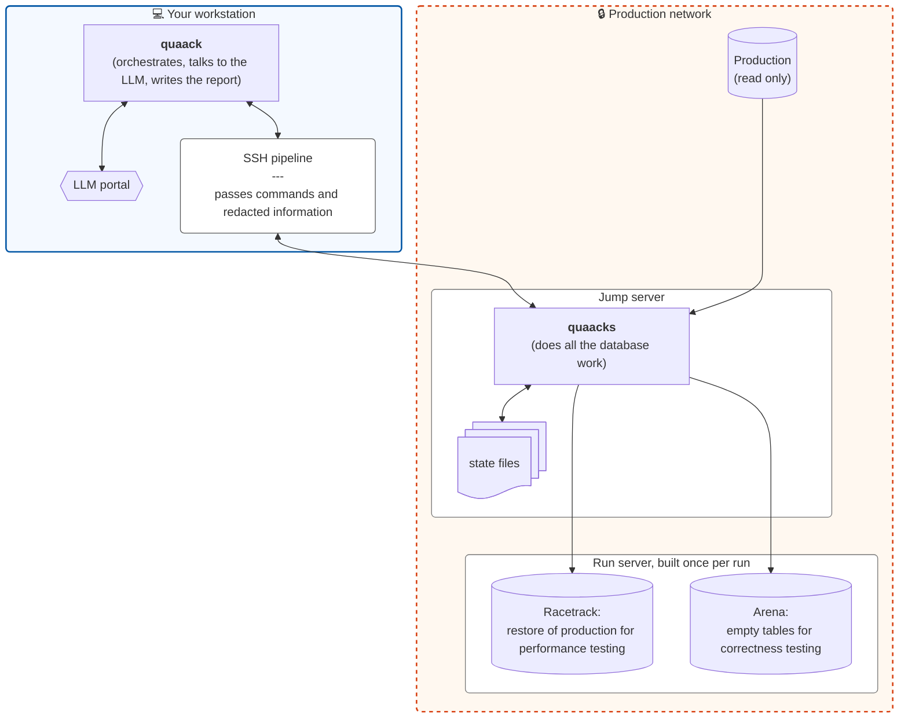

<p align="center">
  
</p>

# QUAACK

QUAACK is a pipeline that optimizes one Postgres query. You provide it the query and some information about the environment it ran in. QUAACK gives you back an HTML report: the indexes and rewrites that make it faster, which have been proven on a full-size copy of real data on real hardware, ranked by how much work those changes saved. And in the sad case when nothing helps, the report says why.

QUAACK has mechanical rules that propose both indexes and rewrites of the query, which need no LLM. Additionally, it uses an LLM to come up with crazy ideas that *just might work*. Of course, the LLM never sees your data. In fact, your data never leaves your production environment.

> **Status.** QUAACK is at version 1 and ready for its first real runs. A rough edge you'll hit right away:
>
> - QUAACK handles ordinary `SELECT` queries on plain tables. It refuses anything else. See [What QUAACK won't do](#what-quaack-wont-do).

**Contents:**
[Why QUAACK?](#why-quaack)
[How it works](#how-it-works)
[What you need](#what-you-need)
[One-time setup](#one-time-setup)
[Tuning a query](#tuning-a-query-a-walkthrough)
[More examples](#more-examples)
[Reading the report](#reading-the-report)
[When it fails](#when-a-run-fails)
[What QUAACK won't do](#what-quaack-wont-do)

## Why QUAACK?

When a query is slow, you usually do some combination of these things:

- **Use your brain.** Unlock that professional pride and try to be better than Postgres' online optimizer by applying your superior intellect (and/or contextual knowledge).
- **Ask an index advisor.** (Dexter, pganalyze's Index Advisor, or HypoPG by hand). It suggests indexes, based on what the planner *estimates* they'd cost.
- **Paste the query into an LLM chat.** You get clever rewrites, but you've just sent your query, possibly with its real constants, to a third party. And even then, that LLM doesn't have a good sense for the data distribution of your environment. *And* you don't have any reason to believe the query is actually *correct*.
- **Use an equivalence checker like QED.** You give it two queries, and it tries to *prove* they always return the same results. That's great, but it doesn't come up with the rewrite, nor does it say anything about speed.

QUAACK does all of that, **and** it checks its work. A few things set QUAACK apart:

**It measures, it doesn't estimate.** QUAACK builds the indexes and runs the queries on a restored copy of your real production data. It looks at blocks read, and counts a plan that reads more than 5% fewer blocks as a win over the status quo. It intentionally uses real data over synthetic data, as synthetic data can take a long time to build and provide a false optimization target.

**It tries to break every rewrite.** A faster query that returns different rows is useless. QUAACK builds small test tables aimed at each part of your `WHERE` clause, and asks the LLM for test data that would prove any rewrite candidate to be wrong. Then it compares the results on real production data too. This is testing, not proof, so it's weaker than QED's guarantee, but on the other hand, you don't have to supply the rewrite, and QED's conservative rules might discount perfectly fine rewrites.

**It doesn't overfit to one value.** A query that's slow for `account_id = 17` might be fine for most accounts. QUAACK utilizes PostgreSQL planner stats to test every rewrite candidate with three sets of literal values: the slow ones from your plan, a worst case, and a typical case. A candidate has to win on the slow values, and can't be worse on the others.

**QUAACK was written with PII safety in mind.** Your literals, your rows, and the values in your statistics stay inside the production network. The LLM sees table and column names, types, indexes, plans with the values taken out, and summary numbers like "71% of rows share one value". The code enforces this. It isn't a convention people have to remember.

**It says so when nothing helps.** If no candidate wins, a details report explains which rewrites were disproved, which indexes the planner ignored, and which ones you already have.

## How it works.

QUAACK comes in two halves, because PII is important.



- **`quaack`**, on your laptop, runs each step in order and makes every LLM call. It never holds a production value.
- **`quaacks`** (the "s" is for "server"), on the jump server, does everything that touches a database. It has no memory between calls. It keeps its working state files in `~/.quaack/runs/<run ID>/` on the jump server, and everything it prints passes through one filter that only lets out things on an allowlist.
- **The racetrack** is a full restore of production. QUAACK measures there, because only real data has production's real layout on disk.
- **The arena** is an empty copy of the schema for correctness testing. QUAACK loads small test tables into it, always inside a transaction that it rolls back.

### QUAACK's pipeline

1. **Collect.** Read the schema, planner statistics, and settings from production (read only). Take the literal values out of the query and the plan, so that the LLM only sees `$1`, `$2`, and so on. Make a note of which columns look like personal data, so that even their statistics stay back.
2. **Check the copy.** Plan the query on the racetrack. If the plan doesn't match production's, stop. Tuning against a copy that behaves differently is a waste of time.
3. **Propose indexes.** Two rule-based generators read the query and the plan. Then an LLM makes its own suggestions, which might include things the mechanical generators don't know how to work with: partial indexes, expression indexes, BRIN, and operator classes. Each idea is tried with HypoPG, as a hypothetical index, which is free. Ideas the planner won't use are dropped. The LLM sees how its ideas did, and gets one chance to fix things that didn't pan out.
4. **Propose rewrites.** First, QUAACK's own rewrite rules read the query. Each rule is a change that can't alter the result, given facts the schema states, such as a key being unique, and that Postgres's planner doesn't always make for itself. A rule only fires when the schema proves those facts. Each rule has a page in [docs/transforms](docs/transforms), with an example of the rewrite it makes. Then the LLM suggests rewrites, and remarks what each suggestion assumes, such as "this column is never NULL". QUAACK checks those claims against the schema, for the rules' rewrites and the LLM's alike. You can add your own rewrites from your big brain too. Each rewrite gets its own index search, since a rewrite may want different indexes.
5. **Try to break the rewrites.** Build test data in the arena aimed at every condition in the query: rows that just match, rows that just miss, NULLs, duplicates, orphans, and empty tables. Then ask the LLM up to three times for data that would provide different answers from the original query and the rewrite candidate. Any difference kills the rewrite.
6. **Measure.** Build the surviving indexes for real on the racetrack, hidden from the planner except when being measured. Run the original and every query candidate with each of the three value sets, three times each, and count the blocks they hit.
7. **Recheck for accuracy on real data.** Run the winners once more, this time comparing the actual rows returned against the original query on full production data. The previous accuracy checks were against small sets of carefully chosen synthetic data.
8. **Report.** Rank the winners, explain them, and show where every idea dropped out.
9. **Clean up.** Delete the run's files on the jump server, and destroy the run server if you've told QUAACK how.

### What to expect.

- **A run takes minutes to hours.** Most of that is building real indexes and running your slow query many times on the racetrack. A query that takes a minute will be run dozens of times.

  Depending upon your environment, restoring and analyzing production data might add more hours to this time.
- **"Faster" means fewer blocks read, not fewer milliseconds.** Blocks are stable and comparable. Timing isn't. Fewer blocks almost always means faster, and it always means less pressure on the cache.
- **Rewrites are tested hard, not proven.** QUAACK checks each rewrite several different ways, but a test can still miss a case. Read a winning rewrite before you ship it. The report lists any condition in your query that the tests never managed to exercise.
- **A partial index only helps if your app sends a constant.** If a winning index has a `WHERE` clause, check that your app writes that value into the SQL. If the app sends it as a bind parameter, a generic plan can't use the partial index.
- **QUAACK never changes production.** It reads production inside read-only transactions. Everything it builds, it builds on the run server. Applying a fix is up to you.

## What you need

**On your laptop:**

- A checkout of this repo and Ruby 3.4. On a Mac with Homebrew, `ruby@3.4` is keg-only, so put it first on `PATH`: `export PATH=/opt/homebrew/opt/ruby@3.4/bin:$PATH`.
- Access to an LLM: Claude through the Anthropic API (an API key, or a login with the `ant` command-line tool), Claude on AWS Bedrock (your AWS credentials), or any OpenAI-compatible API, such as OpenAI, Groq, Gemini, OpenRouter, or a local Ollama. See [Give the driver access to an LLM](#3-give-the-driver-access-to-an-llm).
- ssh access to the production jump server, without a password prompt (i.e. use keys or an agent).

**On the jump server:**

- Ruby 3.4, `gem`, `gcc`, and `make` in your `$PATH`. `quaack deploy` will compile the pg_query gem there.
- `pg_dump`, at least as new as production's Postgres.
- A libpq setup that connects to production and to the run server as you: `~/.pgpass`, a service in `~/.pg_service.conf`, or `PG*` environment variables. QUAACK stores no passwords. Production's port comes from that setup too, unless you give `quaack start --port`, for a production server that doesn't listen where your setup points. QUAACK runs over a non-interactive ssh session, which may not load the shell rc file that sets your `PG*` variables, so check it the way QUAACK sees it: `ssh <jump server> 'psql -h <production server> -c "select 1"'` should just work.
- A POSIX login shell (bash, sh, or zsh).

**Production:** Postgres 17 or later.

**A run server,** one per run, that you build:

- The same Postgres major version and extensions as production, plus [HypoPG](https://github.com/HypoPG/hypopg) built and available for `CREATE EXTENSION`.
- A **racetrack database** restored from a production backup that shows the query performing the same way.
- The same planner and locale settings as production. QUAACK checks every one and refuses a mismatch.
- A superuser login for you, autovacuum off, and nothing else connected.
- A name for the **arena database.** QUAACK will create it, drop it, and recreate it on a rerun, but you need to provide the name. It refuses to touch an existing database of that name that it didn't create.

## One-time setup.

### 1. Install the driver on your laptop.

```sh
git clone https://github.com/benchub/quaack.git
cd quaack
bundle install
bundle exec quaack --version
```

Run `quaack` from the checkout with `bundle exec`. The rest of this README just writes `quaack`.

### 2. Tell the driver how to find your jump server.

Create `~/.quaack/driver.json`:

```json
{
  "jump_command": "echo jump1.prod.example.com",
  "llm": {
    "provider": "anthropic",
    "model": "claude-opus-5-5"
  }
}
```

`jump_command` is a shell command that prints the ssh host of the jump server for a production server. `{server}` in the command becomes the server name you pass to `quaack start`. With one jump server, a plain `echo` is enough. With several, map the server to a host:

```json
{ "jump_command": "case {server} in eu-*) echo jump-eu ;; *) echo jump-us ;; esac" }
```

The driver runs every call as `ssh -T -o BatchMode=yes -o ServerAliveInterval=30 -o ServerAliveCountMax=4 -o ConnectTimeout=30 -- <host> quaacks ...`. BatchMode means ssh never prompts: if your login has expired, the call fails instead of waiting for a password. The keepalives end a session whose network went away after about two minutes, and ConnectTimeout gives up on a host that doesn't answer after 30 seconds. Everything else comes from your `~/.ssh/config`. If you use `ControlMaster`, a master connection can go stale during a long quiet call, such as a 20-minute `rewrite-test`, and the next call through its socket then fails at once. A plain `ssh <host>` goes through that same socket, so it fails the same way, and the keepalive options above don't reach a master that's already running. If calls start failing with `ssh_failed`, close the master with `ssh -O exit <host>`, test without it with `ssh -o ControlMaster=no -o ControlPath=none <host> true`, or set `ControlPersist` to a shorter time.

The driver kills any enclave call that runs longer than an hour. A big schema can need longer, mostly for `index-build`. To raise the limit, set `enclave_timeout_seconds` in `~/.quaack/driver.json` to a positive number of seconds, such as `"enclave_timeout_seconds": 14400` for four hours. `quaack start`, `quaack setup`, and `quaack run` use it. For one run, `quaack run --enclave-timeout-seconds <n>` overrides it, with a plain number of seconds such as `5400` or `90.5`. A call that hits the limit fails with `timeout: the enclave call timed out after 1h00m00s; raise enclave_timeout_seconds ...`. `quaack deploy` keeps its own limits.

### 3. Give the driver access to an LLM.

The driver makes every LLM call from your laptop. By default it asks Claude, and finds Anthropic credentials the way Anthropic's own tools do, taking the first of these that's set:

1. An API key in `ANTHROPIC_API_KEY`.
2. A bearer token in `ANTHROPIC_AUTH_TOKEN`.
3. A profile, such as the one `ant auth login` saves under `~/.config/anthropic`. `ANTHROPIC_PROFILE` picks a profile other than the active one.

If you're already logged in with `ant`, there's nothing to do. With none of them, `quaack run` fails with `llm_auth` before it touches the jump server. So does an empty `ANTHROPIC_API_KEY`. An empty `ANTHROPIC_AUTH_TOKEN` fails too when `ANTHROPIC_API_KEY` is unset. The first of the two that's set hides everything after it, even when it's empty. Unset the empty one instead.

To change the model, the provider, or where the key comes from, add an `llm` block to `~/.quaack/driver.json`. Every key is optional:

```json
{
  "jump_command": "echo jump1.prod.example.com",
  "llm": {
    "provider": "anthropic",
    "model": "claude-opus-5-5",
    "base_url": "https://llm-gateway.example.com",
    "api_key_env": "QUAACK_ANTHROPIC_KEY"
  }
}
```

| Key | What it does | Default |
| --- | --- | --- |
| `provider` | Which API to call: `anthropic`, `openai_compatible` for OpenAI, Groq, Gemini, OpenRouter, Ollama, and any other server that speaks OpenAI's Chat Completions API, `bedrock` for Claude on AWS Bedrock, or `copilot_cli` for a local Copilot CLI command. | `anthropic` |
| `model` | The model to ask. Required for `openai_compatible` and `bedrock`. | `claude-opus-5-5` for `anthropic`; `claude-opus-5.5` for `copilot_cli` |
| `base_url` | Where to send requests, such as a gateway, or which OpenAI-compatible provider. An `http` or `https` URL. Not for `copilot_cli`. | The provider's own, or `ANTHROPIC_BASE_URL` for `anthropic`. `openai_compatible` ignores `OPENAI_BASE_URL`. |
| `api_key_env` | The name of an environment variable that holds the key. When it's set, the driver uses only that variable, and fails with `llm_auth` if it's empty. Only for `anthropic` and `openai_compatible`. | The lookup above for `anthropic`, `OPENAI_API_KEY` for `openai_compatible` |
| `aws_region` | For `bedrock` only: the AWS region to call, such as `us-east-1`. | `AWS_REGION`, `AWS_DEFAULT_REGION`, or your AWS profile's region |
| `aws_profile` | For `bedrock` only: the AWS profile, in `~/.aws`, whose credentials to use. | The AWS SDK's usual lookup |
| `command_template` | For `copilot_cli` only: an argv array, run without a shell, with `{prompt_file}` and `{model}` placeholders. `{prompt_dir}` is also available. | A locked-down `copilot` prompt-mode command |
| `timeout_seconds` | For `copilot_cli` only: a positive number of seconds for each command run. | `600` |

Never put a key itself in the file. These environment variables override the file for one run: `QUAACK_MODEL` for `model`, `QUAACK_LLM_PROVIDER` for `provider`, and `QUAACK_LLM_BASE_URL` for `base_url`. An empty one counts as unset. A bad value, in the file or a variable, makes `quaack run` exit with 64 and a message that names the offending key or variable.

If `driver.json` itself is bad, `quaack start` and `quaack run` say which file and why, such as `bad_driver_config: /Users/me/.quaack/driver.json: no jump_command` or `bad_driver_config: /Users/me/.quaack/driver.json: not valid JSON (line 3, column 5)`.

#### OpenAI-compatible providers.

With `"provider": "openai_compatible"`, the driver talks to OpenAI's Chat Completions API, through the official `openai` gem, at `base_url`. It sends the key from the variable `api_key_env` names, or from `OPENAI_API_KEY` when it names none, as a bearer token. If that variable is unset or empty, `quaack run` fails with `llm_auth` before it makes any call. Give a `model` too: there's no default.

Check your provider's docs: these were current when written, but nobody has checked them against each provider since.

| Provider | `base_url` | `api_key_env` | `model`, for example |
| --- | --- | --- | --- |
| OpenAI | leave it out | leave it out (`OPENAI_API_KEY`) | `gpt-4.1` |
| Groq | `https://api.groq.com/openai/v1` | `GROQ_API_KEY` | `llama-3.3-70b-versatile` |
| Google Gemini | `https://generativelanguage.googleapis.com/v1beta/openai` | `GEMINI_API_KEY` | `gemini-2.5-pro` |
| OpenRouter | `https://openrouter.ai/api/v1` | `OPENROUTER_API_KEY` | `anthropic/claude-opus-4.1` |
| Ollama, on your laptop | `http://localhost:11434/v1` | `OLLAMA_API_KEY` | `qwen2.5-coder:32b` |

For example, for Groq:

```json
{
  "jump_command": "echo jump1.prod.example.com",
  "llm": {
    "provider": "openai_compatible",
    "base_url": "https://api.groq.com/openai/v1",
    "api_key_env": "GROQ_API_KEY",
    "model": "llama-3.3-70b-versatile"
  }
}
```

then `export GROQ_API_KEY=...` before `quaack run`. Give the API root as `base_url`, not the full endpoint: the driver adds `/chat/completions` itself, so a `base_url` that ends in it is a usage error. Ollama needs no key, but the driver still wants one, so set the variable to anything, such as `export OLLAMA_API_KEY=ollama`.

The models are examples. Use one your account can call, and **make it a strong model**: QUAACK asks for careful SQL work, and a small model is mostly a waste of time and tokens.

**Reasoning models need headroom.** A reasoning model, such as OpenAI's `gpt-5` or `o3`, or Gemini 2.5, spends its token limit on thinking as well as on the reply. QUAACK asks for at most 4000 or 8000 tokens a reply, so a long think can use them all up and leave no reply, and the run stops with `llm_bad_response: the reply stopped for length`. That's why the table's OpenAI example is `gpt-4.1`, which doesn't reason. If you use a reasoning model and see that error, pick a model that reasons less, or not at all.

**Structured output.** At several steps, QUAACK asks for JSON in a fixed shape, and checks every reply. A reply in the wrong shape gets one more try. If the model gets it wrong twice, the run stops with `llm_bad_response`. Strong models rarely do.

> **Your other OpenAI settings stay with OpenAI.** The `openai` gem reads `OPENAI_ORG_ID`, `OPENAI_PROJECT_ID`, and `OPENAI_CUSTOM_HEADERS`. The driver sends what they hold only when `base_url` is OpenAI's own (`api.openai.com`), never to Groq, Gemini, or any other provider. It ignores `OPENAI_BASE_URL`: only `base_url`, or `QUAACK_LLM_BASE_URL`, says where requests go.

#### AWS Bedrock.

With `"provider": "bedrock"`, the driver asks Claude on AWS Bedrock, through the `anthropic` gem's Bedrock client, which calls Bedrock's InvokeModel API and signs each request with your AWS credentials. QUAACK stores no credentials. It finds them the way the AWS CLI and SDKs do:

1. A Bedrock API key in `AWS_BEARER_TOKEN_BEDROCK`, if it's set. It's sent as a bearer token, and nothing below is looked at.
2. The profile `aws_profile` names, from `~/.aws/config` and `~/.aws/credentials`: static keys, SSO (run `aws sso login` first), an assumed role, or a `credential_process`.
3. Otherwise the AWS SDK's own chain: `AWS_ACCESS_KEY_ID` and `AWS_SECRET_ACCESS_KEY` (with `AWS_SESSION_TOKEN` for temporary ones), the profile `AWS_PROFILE` names or the default one, then a container or EC2 instance role.

Finding none, a profile that can't be loaded, or an empty `AWS_BEARER_TOKEN_BEDROCK` makes `quaack run` fail with `llm_auth` before it touches the jump server. So does a Bedrock API key with `aws_profile` set, since they name different credentials: it's a usage error, exit 64. The credentials are read once, when the run starts, so an SSO session that expires partway through fails that run with `llm_auth`. Log in again, and start a new run.

Give a `model`, since there's no default: Bedrock's model IDs vary by region and by inference profile. Use the ID the Bedrock console shows for your region, such as `anthropic.claude-opus-5-5`, or a cross-region inference profile such as `us.anthropic.claude-opus-5-5`. With no region anywhere, `quaack run` exits with 64. `base_url` is for a private endpoint, and a Bedrock API key needs no region when there's a `base_url`.

```json
{
  "jump_command": "echo jump1.prod.example.com",
  "llm": {
    "provider": "bedrock",
    "model": "us.anthropic.claude-opus-5-5",
    "aws_region": "us-east-1",
    "aws_profile": "bedrock"
  }
}
```

Your AWS identity needs `bedrock:InvokeModel` on the model, and your account needs access to the model in that region. If AWS refuses either, the run fails with `llm_auth`.

#### GitHub Copilot CLI.

With `"provider": "copilot_cli"`, the driver runs a local command once for each LLM ask and reads the answer from stdout. The default command runs `copilot` from `PATH` in prompt mode with `--model`, `-p`, and `-s`, and writes the QUAACK prompt to a private 0600 file in an otherwise empty temporary current directory. That directory is removed after the ask.

The default command locks Copilot down with `--disable-builtin-mcps`, `--no-ask-user`, `--no-custom-instructions`, `--disallow-temp-dir`, `--available-tools=view`, `--allow-tool=read({prompt_dir})`, and denials for shell, write, and URL tools. The prompt file is inside `{prompt_dir}`, which is also the command's current directory, so Copilot can still read that file through the explicit `read({prompt_dir})` allowance. The child process also unsets `COPILOT_CUSTOM_INSTRUCTIONS_DIRS`.

> **Danger: global Copilot instructions can break QUAACK replies.** QUAACK often needs bare JSON. Global custom instructions can change the reply's format, such as pushing prose or code fences around the JSON. That will usually end the run with `llm_bad_response`, and could be worse if it changes the model's behavior in a subtler way. The default command passes `--no-custom-instructions`, and the Copilot CLI command reference says that flag disables `AGENTS.md` and related files and always takes priority. The docs do **not** explicitly say whether it covers user-level `~/.copilot/copilot-instructions.md` and `~/.copilot/instructions/**`, so the flag may or may not be enough. Keep global instructions out of the way for QUAACK, or run a canary that proves they don't reach this provider before relying on it for production runs.

```json
{
  "jump_command": "echo jump1.prod.example.com",
  "llm": {
    "provider": "copilot_cli",
    "timeout_seconds": 900
  }
}
```

To use another wrapper, set `command_template` as an argv array. It must include `{prompt_file}` and `{model}`:

```json
{
  "llm": {
    "provider": "copilot_cli",
    "command_template": ["/usr/local/bin/copilot", "--model={model}", "-s", "-p", "Please follow my prompt in {prompt_file}"],
    "timeout_seconds": 600
  }
}
```

The CLI cannot enforce JSON schemas itself, so QUAACK includes the schema in the prompt file and checks the answer. A missing command, timeout, or non-zero exit is `llm_unavailable`; a distinctive not-logged-in message is `llm_auth`; empty stdout is `llm_bad_response`.


### 4. Install the enclave script on the jump server.

```sh
quaack deploy --host jump1.prod.example.com
# quaack deploy: building quaack-protocol-0.1.0.gem
# quaack deploy: building quaacks-0.1.0.gem
# quaack deploy: copying quaack-protocol-0.1.0.gem to jump1.prod.example.com
# quaack deploy: copying quaacks-0.1.0.gem to jump1.prod.example.com
# quaack deploy: running gem install on jump1.prod.example.com. It builds pg_query from source, which can take a few minutes.
# quaack deploy: checking quaacks on jump1.prod.example.com
# quaack deploy: installed quaacks 0.1.0 on jump1.prod.example.com
```

This builds the `quaacks` gems from your checkout, copies them over ssh, and installs them into your own gem directory on the jump server. It doesn't use sudo to install them for everybody. **Never run QUAACK from a git checkout on the jump server, because the repo's bundle includes the LLM half. To keep from leaking data, `quaacks` refuses to run if it finds that half beside it.**

The driver runs `quaacks` over non-interactive ssh, so your user gem `bin` directory must be in your `$PATH` for non-interactive shells. On the jump server, `ruby -e 'puts Gem.user_dir'` prints the gem directory: `~/.gem/ruby/3.4.0` if you have a `~/.gem`, and otherwise `~/.local/share/gem/ruby/3.4.0`. Add its `/bin` to `PATH` in `~/.bashrc`, above any line that returns early for non-interactive shells, or in `~/.zshenv`.

If `quaacks` isn't on that `PATH`, `quaack deploy` looks into why, without changing anything on the jump server, and tells you what to change. For bash, that looks like this:

```
quaack deploy failed: installed quaacks 0.1.0 on jump1.prod.example.com, but quaacks isn't installed on jump1.prod.example.com, or isn't on PATH for non-interactive ssh there.
jump1.prod.example.com's login shell is bash, and /home/you/.local/share/gem/ruby/3.4.0/bin, where quaacks is, isn't on PATH for non-interactive ssh. Add this line to ~/.bashrc on jump1.prod.example.com, above any line that returns early for non-interactive shells:
  export PATH="/home/you/.local/share/gem/ruby/3.4.0/bin:$PATH"
Check with: ssh jump1.prod.example.com quaacks --version
```

It also tells you if `ruby` itself isn't on that `PATH`, if another `quaacks` or another Ruby comes first, or if your login shell is fish or csh, which QUAACK doesn't support. Then check from your laptop:

```sh
ssh jump1.prod.example.com quaacks --version
```
#### Upgrading
Re-run `quaack deploy` whenever you update your checkout. `quaack start`, `quaack setup`, and `quaack run` refuse to talk to an out-of-date `quaacks`, and tell you to deploy.

### 5. Configure the jump server (optional, but recommended).

`~/.quaack/config.json` on the jump server holds anything the enclave needs to know. Every key is optional.

```json
{
  "memory_command": "aws rds describe-db-instances --db-instance-identifier {host} --query 'DBInstances[0].DBInstanceClass' --output text | ./instance-class-to-bytes",
  "run_server_command": "/opt/dba/make-quaack-run-server {server} {run}",
  "destroy_command": "/opt/dba/destroy-quaack-run-server {run}",
  "pii_columns": ["*.users.email", "*.users.*name", "billing.*.card_*"],
  "cardinality_threshold": 50
}
```

| Key | What it does | Without it |
| --- | --- | --- |
| `memory_command` | Prints production's instance memory, such as `64GB`. `{host}` is production's host. | Memory is recorded as unknown. |
| `run_server_command` | Builds or finds the run server, and prints `{"host": ..., "port": ..., "racetrack_db": ..., "arena_db": ...}`. `{server}` is the production server name and `{run}` the run ID. It gets an hour. | You pass the run server as flags to `quaack setup` or `quaack run`. |
| `destroy_command` | Destroys the run server at the end of a run. It must succeed if the server is already gone. | QUAACK reminds you to destroy it yourself. |
| `pii_columns` | `schema.table.column` patterns for columns that hold personal data. `*` matches within one part. Case is ignored. | Only the automatic rule applies: any text column with 50 or more distinct values counts as personal data. |
| `cardinality_threshold` | Moves that line of 50. | 50. |

Personal-data columns never have their common values or how often those values appear sent to the LLM. Only columns with fewer distinct values than the threshold, like `status` or `country`, ever have their values sent.

## Tuning a query: a walkthrough.

Say this query is slow on `prod-db-1`:

```sql
SELECT id, kind, created_at
FROM public.events
WHERE account_id = 17
  AND created_at >= '2025-06-01 00:00:00+00'
  AND created_at < '2025-06-08 00:00:00+00'
ORDER BY created_at, id;
```

`events` has 500,000 rows, and only `account_id` has an index. The index finds the account's 500 events, then a filter throws away all but about 10 of them.

### Step 1. Save the query and its plan on the jump server.

Both files hold real values, so they stay on the jump server. ssh in and save the query as `~/slow/events.sql`. Then capture its plan from production:

```sh
ssh jump1.prod.example.com
mkdir -p ~/slow && cd ~/slow
# save the query as events.sql, then:
( echo 'EXPLAIN (ANALYZE, BUFFERS, SETTINGS, FORMAT JSON)'; cat events.sql ) \
  | psql -h prod-db-1 -XAtq -o events-plan.json
```

`EXPLAIN ANALYZE` really runs the query, so this takes as long as the query does. Capture the plan with the same settings the app uses. If the app sets `work_mem` or `search_path`, set them in the same session first. `SETTINGS` records them, and QUAACK uses them.

### Step 2. Start the run from your laptop.

```sh
quaack start --server prod-db-1 --query slow/events.sql --plan slow/events-plan.json
# 20260928T201702Z-3f9a1c2e
```

If production doesn't listen on the port your libpq setup on the jump server gives (`PGPORT`, a service, or the default 5432), add `--port`:

```sh
quaack start --server prod-db-1 --port 6432 --query slow/events.sql --plan slow/events-plan.json
```

The run keeps the port, and every connection to production uses it: inventory, qualify, volatility, statistics, and `pg_dump`. Everything else, the user, the database, and the password, still comes from your libpq setup. `--port` is production's port only. The run server's port is `quaack setup --port`. A port that isn't a whole number from 1 to 65535 is a usage error, before ssh.

The paths are on the jump server. A relative path starts from your home directory there, so `slow/events.sql` means the jump server's `~/slow/events.sql`. A quoted leading `~/`, as in `--query '~/slow/events.sql'`, is expanded by `quaacks` on the jump server; `~otheruser` is not special. If your laptop's shell expands `~` first and gives QUAACK a path under your laptop home, `quaack start` refuses before ssh and asks for a jump-server path. QUAACK checks both files, starts a run, and prints the **run ID**. Every later command takes it. If the jump server can't read the file, QUAACK says whether it was missing, a final symlink, not a regular file, or permission denied, without printing the path.

QUAACK runs every candidate as if `now()` and `current_date` were the moment the production plan ran. By default, that's the moment you ran `quaack start`. If your query uses them and you captured the plan earlier, pass the time it ran with `--captured-at`:

```sh
quaack start --server prod-db-1 --query slow/events.sql --plan slow/events-plan.json \
  --captured-at 2026-10-01T09:30:00-04:00
```

It's an ISO-8601 time with a zone, such as `2026-10-01T09:30:00Z` or `2026-10-01T09:30:00-04:00`, with optional fractional seconds. It can't be earlier than 1970 or more than one day ahead of the jump server's clock. `quaacks intake` checks it on the jump server, and refuses anything else as `bad_captured_at`.

### Step 3. Set up the run (optional).

`quaack run` sets the run up first if it hasn't been, so you can skip to step 4. Or set it up on its own, from your laptop, to see it through before the LLM steps start:

```sh
# With run_server_command in your config:
quaack setup --run 20260928T201702Z-3f9a1c2e
# ...or, name the run server yourself:
quaack setup --run 20260928T201702Z-3f9a1c2e --host runsrv-7.prod.example.com --port 5432 \
  --racetrack-db racetrack --arena-db quaack_arena
# 20260928T201702Z-3f9a1c2e set up
```

`quaack run` takes the same four run-server flags. Any you leave out come from `run_server_command`. They only matter the first time: once the run server has been checked, setup skips that step, flags and all.

`--host` and `--port` are the run server's, not production's. Production's host is the `--server` you gave `quaack start`, and its port is `quaack start --port`'s, or else your libpq setup's. For either server, the user and password, and for production the database too, come from your libpq setup on the jump server, in the non-interactive ssh session QUAACK runs in. If setup fails with `production_connection_failed`, the message names the production server it tried, and its port, if you gave `quaack start --port`. For a run started by a driver before 0.1.6, which didn't record the server in `~/.quaack/runs/` on your laptop, it says "the production server you gave quaack start" instead. Since that driver didn't record the port either, though it still had `quaacks` connect with any `quaack start --port` you gave, the message says the port is the one you gave `quaack start --port`, or your libpq setup's if you gave none, and its test command says `<server>` and asks you to add `-p <n>` if you gave `quaack start --port`. If it fails with `run_server_connection_failed`, the message says where the run server's host, port, and databases come from, but doesn't name them. Either way, it says where the rest of the connection comes from, and gives the `ssh ... psql` command to test it with. It never includes libpq's own message, which can name the user or the database.

Setup runs these eleven `quaacks` commands on the jump server, in this order, over ssh. It shows a line on stderr as each starts and ends, such as `quaack: [3/11] Finding the tables the query reads (qualify)`, and skips each one the run already has, so after a failure you fix the problem and run the same command again. A failure prints `quaack setup failed: <rule>` and keeps the run.

| Command | What it does |
| --- | --- |
| `inventory` | Reads production's version, extensions, settings, and locale. |
| `run-server` | Checks that the run server matches production: version, extensions, settings, locale, superuser, and quiet. |
| `qualify` | Adds the schema to every table name, and refuses views, partitioned tables, and the like. |
| `schema-dump` | Dumps the schema of the tables the query touches. |
| `statistics` | Reads planner statistics and existing indexes for the query's tables. |
| `volatility` | Refuses the query if it calls a function with side effects, such as `random()`. |
| `classify` | Decides which columns hold personal data, and which statistics may go to the LLM. |
| `redact` | Swaps every literal for `$1`, `$2`, and so on. |
| `literals` | Picks the worst-case and typical values to test with, alongside the slow ones. |
| `clock-anchor` | Pins `now()` and friends to the time the plan was captured. |
| `racetrack-setup` | Installs HypoPG and QUAACK's clock function on the racetrack. |

### Step 4. Run it.

Back on your laptop, with access to an LLM set up (see [setup step 3](#3-give-the-driver-access-to-an-llm)):

```sh
quaack run --run 20260928T201702Z-3f9a1c2e --keep
# ./quaack-20260928T201702Z-3f9a1c2e.html
# 20260928T201702Z-3f9a1c2e done
```

It prints the report's path, then `<run ID> done`. Open the HTML file in a browser. If the run finishes but its teardown fails, it still prints the report's path, but not `done`, and exits 1. On stderr, teardown's own line says what failed and how to finish the cleanup, and the last line names the rule and says to tear the run down as that line says, since the run itself finished. See [step 5](#step-5-clean-up).

While it runs, it shows its progress on stderr: a line as each step starts and ends, such as `quaack: [6/18] Asking the LLM for rewrites of the query (llm-rewrites)` and `quaack: [6/18] Got 3 rewrites from the LLM, 3 kept in 51s (llm-rewrites)`, a line for each step a resumed run skips, and a line for each LLM ask and retry. Work on the jump server that a step does between LLM asks gets its own line under that step, such as `quaack: [9/18] Rewrite Silver Fox: Loading the LLM's rows and comparing results (counterexamples)`, so a slow or failed call there isn't mistaken for the LLM. A step that works on each rewrite in turn starts its lines for a rewrite with the rewrite's name, such as `quaack: [7/18] Rewrite Silver Fox: Ranking the index ideas (rewrite-index-rank)`. When `quaack run` does setup first, setup's eleven steps come first in the count, so the total is eleven more. On a terminal, the latest of these lines carries the running step's time so far, counting up in place, and the line before keeps its final reading. There, a step that has nothing to say as it ends, such as setup's `quaack: [1/29] Reading production's version, settings, and extensions (inventory) 2s`, prints no closing `Done in 2s` line, since its last line already shows its time. Nor does a step whose closing line would only say it's done, such as `Ranked the index ideas in 5s (index-rank)`, though one that says more, such as `Got 3 rewrites from the LLM, 3 kept in 51s (llm-rewrites)`, still prints. An LLM ask gets no line of its own when it would just repeat its step's line, or its rewrite's sub-step's. A step that fails still prints `Failed after` its time. Piped to a file, the lines carry no clock, every line prints, and only each step's closing line gives its time. The lines carry only step names, counts, and timings. If stderr goes away while QUAACK runs, such as when it's piped to a program that exits, QUAACK stops writing to stderr and carries on to the end of the run.

`--keep` skips the cleanup at the end, so you can re-run or look around, and QUAACK prints the teardown command to use later. It's a good idea on your first few runs. Without it, QUAACK deletes the run's files when the run ends, whether it succeeded or failed, and destroys the run server if you set `destroy_command`. The exception is a run that fails as `ssh_failed`: with ssh down, QUAACK can't reach the jump server, so it skips the cleanup and prints the teardown command to run later. Until you run it, the run's files remain on the jump server and the run server stays up, both with their copies of production data.

For this query, the report's top answer is one index:

```sql
CREATE INDEX ON public.events (account_id, created_at) INCLUDE (kind);
```

It cuts the slow values from about 509 blocks to single digits, and it's no worse for the other values. See [Reading the report](#reading-the-report) for how that looks.

### Step 5. Clean up.

If you used `--keep`, or the run failed as `ssh_failed` or failed to tear itself down, tear the run down when you're done. QUAACK printed how. Usually that's a command like this one:

```sh
ssh jump1.prod.example.com quaacks teardown --run 20260928T201702Z-3f9a1c2e
```

That deletes the run's files on the jump server, and runs `destroy_command` if you set one. Otherwise, destroy the run server yourself. If teardown failed as `bad_run`, `bad_store_base`, or `teardown_failed`, QUAACK says instead to check or remove `~/.quaack/runs/<ID>` on the jump server by hand, since `quaacks teardown` wouldn't or couldn't delete it. After `teardown_failed`, `destroy_command`, if you set one, has already destroyed the run server. After `bad_store_base` it doesn't run, so destroy the run server yourself, as you would without `destroy_command`. After `bad_run` it may or may not have run: teardown checks the run's directory again after `destroy_command`, just before the delete, so a directory that went bad during the command gives `bad_run` too. Destroy the run server yourself to be sure; `destroy_command` is safe to run again on a server that's already gone. If teardown failed as `destroy_command_not_run`, it couldn't read which run server the run used, so `destroy_command` didn't run, and QUAACK says to destroy the run server yourself, then check or remove `~/.quaack/runs/<ID>` by hand. Every copy of production data from the run lives in one of those two places.

## More examples.

### Put the report somewhere else.

```sh
quaack run --run $RUN --out ~/reports/events-slow-week.html
```

### Test your own rewrite.

You may already have an idea. Write it with the same `$1`, `$2` placeholders QUAACK uses, since your laptop never sees the real values. To see the redacted query and learn which number is which, ask the jump server:

```sh
ssh jump1.prod.example.com quaacks rewrite-payload --run $RUN \
  | jq -r 'select(.type == "rewrite_payload") | .query'
# SELECT id, kind, created_at FROM public.events WHERE account_id = $1
#   AND created_at >= $2 AND created_at < $3 ORDER BY created_at, id
```

That output holds shapes only, so it's safe on your laptop. Put one or more rewrites in a file, each ending in `;`:

```sql
-- my-rewrites.sql
SELECT id, kind, created_at
FROM public.events
WHERE account_id = $1
  AND created_at >= $2 AND created_at < $3
ORDER BY created_at, id
LIMIT 1000;

WITH mine AS MATERIALIZED (
  SELECT id, kind, created_at FROM public.events WHERE account_id = $1
)
SELECT id, kind, created_at
FROM mine
WHERE created_at >= $2 AND created_at < $3
ORDER BY created_at, id;
```

```sh
quaack run --run $RUN --rewrites my-rewrites.sql --keep
```

Your rewrites go through the same tests as the LLM's. Above, the first rewrite adds a `LIMIT` the original doesn't have, so QUAACK will prove it wrong. The second returns the same rows, but still reads all 500 of the account's rows, so it won't beat the new index and won't be ranked. There's one difference: if the LLM thinks your rewrite relies on something the schema doesn't guarantee, you get a warning in the report instead of a rejection, since you may know something the schema doesn't.

QUAACK reads and parses the file before it contacts the jump server, so a typo fails straight away.

### Resume after a failure.

With `--keep`, a failed run leaves its work behind. Fix the problem and run the same command again. QUAACK skips every step whose output it already has.

```sh
quaack run --run $RUN --keep
# quaack run failed: run_server_connection_failed: couldn't connect to the run server. ...
# ... fix the network ...
quaack run --run $RUN --keep
```

QUAACK never retries a call to the jump server by itself. A call that died over ssh can't be told apart from one the jump server killed before it answered, and not every step is safe to run twice. When ssh fails, it says so, and you resume once ssh works again.

### Use a different model.

The driver uses `claude-opus-5-5` by default. Set `model` in the `llm` block of `~/.quaack/driver.json` (see [setup step 3](#3-give-the-driver-access-to-an-llm)) to change it for good, or `QUAACK_MODEL` for one run:

```sh
QUAACK_MODEL=claude-sonnet-5-5 quaack run --run $RUN
```

### Two runs at once.

Each run has its own ID, its own files, and its own run server, so separate queries don't get in each other's way. Start each with `quaack start`, and run each with its own ID.

## Reading the report.

The report is one HTML file. It's plain HTML and CSS: no scripts, and nothing loaded from the network, so you can open it anywhere or attach it to a ticket. It has these sections, in order. The examples below are shortened, and their numbers are illustrative, from the walkthrough's query.

The report says things in words. It never shows QUAACK's internal labels, such as `original:top:1`, or its step numbers. Where a run didn't count something, the report says **not recorded**. That never means zero.

### The verdict.

> QUAACK found something better than your query as it is: your query with a new index on public.events (account_id, created_at) INCLUDE (kind). It read 4 blocks on the slow values, against 509 for your query as it is (99% fewer).

Or, when nothing helped:

> Nothing QUAACK tried beat your query as it is. It built and measured 2 indexes and kept 1 rewrite. The sections below say what became of each.

It also says here if any measurement runs timed out, and if your query itself timed out on some set of values.

### The queries.

Your query comes first, then every rewrite QUAACK kept, each laid out over several lines. Each query's SQL starts collapsed, so you can scan the rewrites and what became of them, and click a rewrite's line to open it. The report needs no JavaScript for this. Each rewrite has a name of its own for the run, such as Rewrite Silver Fox, so you can tell them apart. The run's ID picks the names, so a rewrite keeps its name when you resume the run, and the progress lines on stderr use the same names.

```sql
SELECT id, kind, created_at
FROM public.events
WHERE
  account_id = $1
  AND created_at >= $2
  AND created_at < $3
ORDER BY created_at, id
```

Each `$1`, `$2`, and so on stands for a value from your query. Put your real values or bind parameters back in the same spots. QUAACK lays the SQL out again for reading, so spacing, brackets, and the case of keywords can differ from what you wrote.

Next to each rewrite's name, on the line you click, are two lines:

- **Where it came from:** `made by QUAACK's own rewrite rule key_in_self_join` for one of QUAACK's own rules (two rules applied in a row are both named, in order), `suggested by the LLM`, or `your own rewrite`. Each rule's name links to its page in [docs/transforms](docs/transforms), which says what the rule does and shows an example. Every rewrite goes through the same tests, whatever its source.
- **What became of it,** as a sentence. For example:
  - "It beat your query and is ranked below."
  - "Postgres plans it exactly as it plans your query, so it can't run any differently. QUAACK didn't test it further."
  - "It returned different results from your query on made-up test data (NULLs), so it's wrong." The brackets name the kind of test data: empty tables, rows that just match and just miss, NULLs, duplicate join keys, rows with no join partner, extreme values, or groups of one, many, and none.
  - "It returned different results from your query on test data the LLM wrote to break it (round 2), so it's wrong."
  - "A test on made-up data (empty tables) ended without comparing results, because the order of your query's rows can't be checked, so QUAACK dropped it. That says nothing about whether it's right."
  - "It passed the tests on made-up data, but returned different results from your query on the real data, so it's wrong."
  - "It passed every test, but didn't read enough fewer blocks than your query."

  Only a rewrite that returned different results is called wrong. One that was dropped because a test failed, timed out, or never ran is not.

A rewrite may also list **conditions from your query that QUAACK's made-up rows never made both true and false**, such as `o.status = $1`. A rewrite that changed such a condition could still have passed those tests. The report marks each one the LLM's test data, written afterwards to break the rewrite, did check, and collapses the list when it checked them all. Read the rewrites with unchecked conditions extra carefully.

### Ranking.

| # | Candidate | Blocks read, slow values | Blocks read, all values | Size of its new indexes |
| --- | --- | ---: | ---: | ---: |
| | Your query as it is (the baseline, not ranked) | 509 | 5,635 | none |
| 1 | Your query with a new index on public.events (account_id, created_at) INCLUDE (kind) | 4 | 20 | 14.8 MB |
| 2 | Your query with a new index on public.events (account_id, created_at) | 19 | 83 | 11.5 MB |
| 3 | Rewrite Silver Fox with no new indexes | 31 | 140 | 0 kB |

The first row, with no rank, is your query as it is, so you can see how far each candidate improves on it. Where a number for it wasn't recorded, the cell says "not recorded", and where your query timed out, "timed out". The winner is the first ranked row. Each **candidate** is your query, or a rewrite, run with a set of new indexes, and the report names it that way.

- **Blocks read, slow values:** blocks read with the values from your slow plan. This is the number you most want down.
- **Blocks read, all values:** blocks read, added up over the slow, worst-case, and typical values.
- **Size of its new indexes:** disk space for the candidate's new indexes. When two candidates tie on blocks, the smaller one wins.

Only candidates that pass the **minimax rule** are ranked. A candidate must be *better* on the slow values, meaning more than 5% fewer blocks, and *no worse* on every other value set, meaning no more than 5% more blocks.

**Measured, and not ranked** lists every other candidate QUAACK measured. It starts collapsed, behind a line such as "Show the 4 things QUAACK tried that didn't pan out". Open it for a table with a row per candidate: what it was, who proposed its rewrite, and why it didn't make the cut, with the numbers behind it:

| What it was | Who proposed it | Why it didn't make the cut |
| --- | --- | --- |
| Your query with a new index on public.events (kind) | not recorded | Read 498 blocks on the slow values, against 509 for your query as it is, which isn't more than 5% fewer. |
| Rewrite Silver Fox with a new index on public.events (account_id) | Suggested by the LLM | Beat your query as it is, but three other candidates did better. |

Who proposed it means who proposed the rewrite. QUAACK doesn't record who thought of each index, so for your query with new indexes it says not recorded.

A candidate can also be left out because it tied with one whose indexes take less space, because three others did better, because its measurement timed out, or because the rewrite was dropped on the real data.

When nothing beat your query, there's no ranking table, and this table is the whole section.

Each ranked candidate then gets its own table:

| Values | Blocks read | Your query as it is | Already in memory | Read from disk | Against your query | Note |
| --- | ---: | ---: | ---: | ---: | --- | --- |
| slow | 4 | 509 | 4 | 0 | 99% fewer blocks | |
| worst case | 12 | 5,120 | 9 | 3 | over 99% fewer blocks | |
| typical | 4 | 6 | 4 | 0 | 33% fewer blocks | |

- **Values:** `slow` is the values from your plan. `worst case` uses the most common values from the statistics, which match the most rows. `typical` uses middle-of-the-road values.
- **Blocks read** is the total, next to what **your query as it is** read on the same values. **Already in memory** and **Read from disk** split the candidate's total. Blocks matter most. The split shows whether a win saves disk reads or just saves work in memory.
- **Against your query** compares the two block counts in the row: how many percent fewer or more blocks the candidate read, such as "52% fewer blocks", "same" when they're equal, "under 1% more blocks" or "over 99% fewer blocks" when rounding would hide a difference. When your query read no blocks, there's no percentage, so it says how many more the candidate read. Where either number is missing or timed out, it says better, no worse, or worse instead, or "not recorded" when there's no verdict either.
- **Note** says `unstable` if the block count moved between the three runs. That usually means the plan changed between runs, so be wary of that row.

### Why the winner reads fewer blocks.

> Rewrite Silver Fox with no new indexes read 31 blocks on the slow values, against 509 for your query as it is (94% fewer).
>
> A step marked “differs”, and shaded, is one the other plan doesn't have in the same place.
>
> How Postgres runs your query now:

| Step | Table | Index | Estimated rows | Actual rows | Share of the table |
|---|---|---|--:|--:|--:|
| Sort **DIFFERS** | | | 10 | 10 | |
| &nbsp;&nbsp;&nbsp;-> Index Scan **DIFFERS** | public.events | events_account_id_idx | 480 | 500 | 0.1% |

> How it runs rewrite Silver Fox with no new indexes:

| Step | Table | Index | Estimated rows | Actual rows | Share of the table |
|---|---|---|--:|--:|--:|
| Index Only Scan **DIFFERS** | public.events | events_account_created_idx | 10 | 10 | under 0.1% |

This part is generated from the measurements and plans, not written by the LLM. Each plan is a table of its steps, in the style of explain.depesz.com, with each step indented under the one it feeds. The steps one plan has and the other doesn't are shaded and marked "differs". The payload doesn't say how many blocks each step read, so the table doesn't either. A report from an older run, whose plans don't say how deep each step is, shows the steps unindented. The second plan is shown only for a rewrite. When the winner is your own query with new indexes, the report says its plan is not recorded. It's left out when nothing beat your query.

### Why nothing beat your query.

This section appears only when no candidate won. It has:

- **The rewrites:** each one's source and what became of it, in the same sentences as under the queries.
- **Indexes the planner wouldn't use:** a table of each index QUAACK thought of and the planner never chose, even when trying it cost nothing, with the queries it was tried for (yours, or a rewrite) and why not.
- **Indexes QUAACK thought of that you already have:** each one, the queries it was tried for, your index that covers it, and that index's size. If QUAACK's best idea is an index you already have, the query isn't slow for lack of an index.

"Nothing helps" is a real answer. It often means the query is already as good as its indexes allow, and the fix is in the app: fetch less, or cache it.

### Proposed indexes.

| Index | Built size | Your index that already covers it | Your indexes it would make redundant |
| --- | ---: | --- | --- |
| `CREATE INDEX ON public.events USING btree (account_id, created_at) INCLUDE (kind)` | 14.8 MB | none | events_account_id_idx (9.1 MB) |

Only the ranked candidates' indexes are proposed. A second table, **Other indexes QUAACK built and measured,** lists the ones it built that no ranked candidate uses. When nothing beat your query, nothing is proposed, and the section is one table called **Indexes QUAACK built and measured.**

Sizes use the unit that fits: kB, MB, or GB. The **built size** is real: QUAACK built the index on the racetrack. The last two columns name your existing indexes, each with its size: one that already covers the new index, and the ones the new index would make redundant, which you could drop after checking that nothing else needs them.

To ship an index, build it on production yourself, usually with `CREATE INDEX CONCURRENTLY`, and give it a name.

### Who proposed what.

Two tables say where each idea came from and what became of it. Each has a row per source and a column per outcome.

**Rewrites:**

| Source | Proposed | Not kept | Same plan as the original | Wrong results | Not better | Ranked | Stopped for another reason |
| --- | ---: | ---: | ---: | ---: | ---: | ---: | ---: |
| QUAACK's own rules | 2 | 1 | 0 | 0 | 0 | 1 | 0 |
| The LLM | 3 | 0 | 1 | 1 | 0 | 0 | 1 |
| You | 1 | 0 | 0 | 0 | 1 | 0 | 0 |

A rewrite **not kept** is one QUAACK dropped before it was stored: it was over the limit (five from the LLM, ten from QUAACK's rules), assumed something QUAACK can't check or your data doesn't hold, failed the checks on what goes in, didn't plan, returned different columns, or couldn't have its clock pinned, or, for one of QUAACK's own, repeated another. **Stopped for another reason** counts the rewrites whose tests failed or timed out without comparing anything, the ones that beat your query and still weren't ranked, and the ones the run never finished. None of those was shown to be wrong.

**Indexes** has a row for each of QUAACK's two index generators (one reads the query's text, one reads its plan), one for the LLM, and one for all sources together. Its columns are proposed, already existed, planner ignored, built and measured, not better, and ranked. An index counts as **not better** only if no candidate that ran with it beat your query. A built index whose candidate beat your query and still wasn't ranked, because it tied with a smaller one or three others did better, or whose candidate timed out, is counted only under built and measured. So the last two columns needn't add up to it.

Proposed, already existed, and planner ignored count the ideas of each search, for your query and for each rewrite, so an idea that came up in two searches counts twice. Built and measured, not better, and ranked count each index QUAACK built once. QUAACK counts how many indexes each source proposed, and, for the LLM's, how many already existed and how many the planner ignored; for the two generators those two cells say not recorded. For each index it built, QUAACK knows every source that proposed it, so an index that more than one source proposed, such as an LLM idea that repeats a generator's, counts in each of their rows. The rows by source can then add up to more than all sources together, which counts each index once, and a note under the table says so.

### Burndown.

The last section shows how much work QUAACK did and where ideas dropped out. It has a table for index ideas for your query and one for rewrites. Above each table is a funnel: a band per stage, narrowing as ideas drop out, labeled with the stage, how many came in and went on, and why the rest dropped. Hover over a band for its whole row. A stage that adds ideas, such as the LLM's rewrites, widens instead. A stage the run didn't count is a grey, striped band that says not recorded, never zero. The table under it has the exact numbers. Each row is a stage, named for what it does, such as "Removing duplicates and indexes you already have" or "Testing on made-up edge-case data". For each stage, it shows how many ideas came in, how many were added and from where, how many were dropped and why, how many were set aside, and how many went on. A stage the run didn't count says not recorded.

In the index table, the LLM's rows count every index it wrote, including the ones QUAACK's checks refused, and the second round's row says why it was skipped when it was. "Trying indexes together" counts the combinations of indexes tried, and drops the ones that left an index unused or weren't the best.

The rewrite table's first row, "Rewrites from QUAACK's own rules", shows how many rewrites each rule made, and how many were dropped as the same as another, as over the limit of ten, or for failing QUAACK's checks. The testing rows tell a rewrite proved wrong from one never tested, and say why it wasn't, such as "never tested, because a statement timed out", and the LLM's test data rows tell "wrong in round 2" from "failed to run in round 2", which proves nothing.

After the tables come the **LLM calls**, by what each was for, such as "Index suggestions for the original query: 2 calls", and the **other work**: plans tried with an index that wasn't built, indexes really built, measurement runs, and loads of made-up test data.

Read it when the result surprises you. If the LLM proposed five rewrites and all five failed the checks, the problem is different than if all five returned wrong results on NULLs.

### QUAACK bug: a rule made a wrong rewrite.

You should never see this section. It appears at the very top of the report, above the verdict, when a test proved one of the rules' own rewrites wrong, such as "Rewrite Dreamy Wren, made by QUAACK's own rewrite rule key_in_self_join, returned different results on made-up test data." QUAACK's rules are meant to be sound, so that's a bug in the rule, not a finding about your query. The tests did their job: the rewrite was dropped, and the rest of the report still holds. Please report it, with the names of the rules.

Only a test that found different results counts. A rule's rewrite that timed out in the final check on production data isn't listed here: a timeout means the rewrite was too slow there, not that it's wrong. A rewrite that was only dropped for planning the same way as the original isn't listed here either. That happens when Postgres already makes the rule's change by itself, and it says nothing about whether the rule is right.

## When a run fails.

QUAACK prints `quaack start failed: <rule>`, `quaack setup failed: <rule>`, or `quaack run failed: <rule>`, and exits with status 1. When an LLM call fails, `quaack run` adds the provider's error after the rule, as in `quaack run failed: llm_bad_request: <detail>`. The detail comes from the LLM provider, outside the privacy line. A usage mistake, such as an unknown run ID, an unreadable rewrites file, a bad `llm` block in `~/.quaack/driver.json`, or an argument that isn't valid UTF-8, exits with 64. The last names the flag the argument goes with, if any, never the argument. Messages name a **rule**, never a value or password, and a host only when it's one you gave the driver yourself, such as the jump host or the production server in a connection failure's note. That's deliberate: error messages cross the privacy line too.

Common rules:

| Rule | What it means | What to do |
| --- | --- | --- |
| `unsupported_construct` | The query uses SQL QUAACK doesn't handle yet. | See [What QUAACK won't do](#what-quaack-wont-do). |
| `view_relation`, `inheritance_parent`, and other `..._relation` rules | The query reads something other than a plain table. | Not supported in v1. |
| `ambiguous_user_schema` | The plan's `search_path` has `"$user"`, and a schema named for a role, yours included, has a table, type, collation, function, or operator of a name the query uses without its schema, where it could change what the name resolves to. QUAACK can't tell whether the application's `"$user"` meant that schema, so the name could resolve to a schema the application never saw. A common case is repmgr, which makes a `repmgr` role and schema with tables `events` and `nodes`, so with the default path a query on an unqualified `events` or `nodes` table is refused. | Capture the plan again after `SET search_path` to the schemas the application uses, written out without `"$user"` (for example `SET search_path = public`). See [step 1](#step-1-save-the-query-and-its-plan-on-the-jump-server). |
| `volatile_function` | The query calls a function with side effects, such as `random()` or `nextval()`. | Not supported. Results couldn't be compared. |
| `plan_gate_mismatch_likely_stale_statistics` | The racetrack plans the query differently from production. | Usually the restore is older than production's latest `ANALYZE`. Restore a newer backup, then start a new run. |
| `run_server_guc_mismatch`, `run_server_...` | The run server doesn't match production, or isn't quiet. | Fix the run server's settings, or stop whatever else is connected. |
| `production_connection_failed` | `quaacks` couldn't connect to production. The message names the production server it tried, the `--server` you gave `quaack start`, and its `--port` if you gave one. It says the user, database, and password, and the port if you gave none, come from your libpq setup on the jump server: `PG*` environment variables, `~/.pg_service.conf` with `PGSERVICE`, and `~/.pgpass`. A non-interactive ssh session may not load the shell rc file that sets them. If a driver before 0.1.6 started the run, it recorded neither the server nor the port, so the message says "the production server you gave quaack start" instead, says the port is your `quaack start --port`, or your libpq setup's if you gave none, and its test command says `<server>`, with `-p <n>` for you to add if you gave `--port`. | Test it the way QUAACK connects, with the command the message gives: `ssh <jump server> 'psql -h <server> -c "select 1"'`, with `-p <n>` if you gave `quaack start --port` (for a run that older driver started, add `-p` yourself). If production listens on another port than your setup gives, start a new run with `quaack start --port <n>`. Otherwise fix your setup, then do what the message says. |
| `run_server_connection_failed` | `quaacks` couldn't connect to the run server. Its host, port, and databases are the `--host`, `--port`, `--racetrack-db`, and `--arena-db` you gave `quaack setup` or `quaack run`, or your `run_server_command`'s for any you didn't. The user and password come from your libpq setup on the jump server, as for production. | Test it: `ssh <jump server> 'psql -h <host> -p <port> -d <racetrack db> -c "select 1"'`. Fix the setup or the network, then do what the message says. |
| `pg_dump_too_old` | The jump server's `pg_dump` is older than production. | Install a newer client. |
| `llm_auth` | The driver found no Anthropic credentials, the variable `api_key_env` names (or `OPENAI_API_KEY`, for `openai_compatible`) is unset or empty, a profile couldn't be read, the AWS credential chain found nothing (for `bedrock`), or the API refused the credentials. | Set the key's variable, or for Anthropic run `ant auth login`. For Bedrock, check your AWS credentials, for example with `aws sts get-caller-identity`, or run `aws sso login`. See [setup step 3](#3-give-the-driver-access-to-an-llm). |
| `ssh_failed` | A call to the jump server failed, and so did a plain `ssh <host> true` right after it. The message says how to go on: resume with `quaack run --run <ID>` or `quaack setup --run <ID>`, or run `quaack start` again. `quaack run` doesn't try to tear the run down then, since ssh is down: it keeps the run, and prints the teardown command for later. The run's files remain on the jump server, and the run server stays up, both with their copies of production data, until you run that command. If the run itself had finished and only its teardown failed, QUAACK prints the report's path, and the message says to tear the run down as the line before it says, instead of resuming. | Check your ssh login (for example, renew an expired certificate or SSO session) and the network, then resume. See the `ControlMaster` note in [setup step 2](#2-tell-the-driver-how-to-find-your-jump-server). Add `--keep` when you resume, so a second failure keeps the run's work. |
| `incomplete` | `quaacks` stopped without saying why. The message names the subcommand and how it ended, such as `quaacks counterexample-payload ended with exit 255`. Exit 255 means the ssh session failed or ended, or the jump server killed `quaacks`. The message ends with how to go on: resume with `quaack run --run <ID>` when the run is still there (you gave `--keep`, or its teardown failed), or start a new run with `quaack start` when `quaack run` tore it down. If the run itself finished and only its teardown call ended this way, QUAACK prints the report's path, and the message says to tear the run down as the line before it says, instead of resuming. | Check your ssh login, the network, and the jump server's kernel log (for the OOM killer) and sshd log, then do what the message says. Add `--keep` to your next run, so a second failure keeps its work. |
| `destroy_command_not_run` | Teardown couldn't read which run server the run used, so it didn't run your `destroy_command`. The run server may still be up, and the run's files are still on the jump server. | Destroy the run server yourself, then remove `~/.quaack/runs/<ID>` on the jump server, as the message says. See [step 5](#step-5-clean-up). |
| `driver_error` | The driver itself, not `quaacks`, hit an error while tearing the run down, such as a bug in QUAACK. The message names only the rule, never the error, and gives the teardown command to run on the jump server. The run's files and the run server may still be there. If the run itself had finished, QUAACK prints the report's path, and the message says to tear the run down as the line before it says. If the run had failed, the line after it shows the run's own error. | Run `quaacks teardown --run <ID>` on the jump server, as the message says. It's safe to run even if teardown got partway. See [step 5](#step-5-clean-up). |
| `no_driver_config`, `jump_command_failed` | The driver can't find your jump server. | Check `~/.quaack/driver.json`. |
| `bad_config` | `~/.quaack/config.json` on the jump server isn't valid, or is a symlink. | Fix it. |
| `run_from_older_version` | An older version of QUAACK started this run, and its store means something else to this version. | Start a new run with `quaack start`. `quaack teardown` still works on the old run. |
| A version mismatch message | `quaacks` on the jump server doesn't match your checkout. | Run `quaack deploy --host <jump server>`. |

### A step is slow.

If one `quaacks` step keeps a core busy for minutes, profile it on the jump server. Find the step's command line with `ps`, stop `quaack run` on your laptop, and run the step again by hand with `QUAACKS_PROFILE` set to a file path:

```sh
QUAACKS_PROFILE=$HOME/quaacks-profile.txt quaacks rewrite-test --search rewrite_3 --run <run ID>
```

The step runs as usual and prints the same output. When it ends, `quaacks` writes the profile, readable only by you. It's a header with the sample count, then one line per sampled `path:lineno`: how many samples that line was running in (self), how many it was anywhere on the stack in (total), and the location, busiest first. It holds code locations only, never a value from your data, so you can send it to whoever maintains QUAACK. It uses only Ruby's standard library, since tools like rbspy can't attach to Ubuntu's packaged Ruby.

The sampler is a Ruby thread. It samples every 10 ms while the step waits on Postgres, but only about 7 times a second while the step is busy in Ruby. Samples lean toward waits, but over a run of minutes they still show where the CPU goes.

## What QUAACK won't do.

In version 1, QUAACK refuses these, rather than give an answer it can't back up:

- **Anything but a `SELECT`.** No `INSERT`, `UPDATE`, `DELETE`, `SELECT ... INTO`, or `FOR UPDATE`.
- **Anything but plain tables.** No views, materialized views, partitioned tables, foreign tables, or tables with inheritance children.
- **Functions with side effects,** anywhere in the query.
- **Less common SQL:** `GROUPING SETS`, `ROLLUP`, `CUBE`, `TABLESAMPLE`, `SIMILAR TO`, `JSON_TABLE` and the SQL/JSON functions, XML functions, `CYCLE` and `SEARCH` on recursive CTEs, and a few others. Joins, subqueries, CTEs, `UNION`, `CASE`, aggregates, window functions, `IN`, `ANY`, `LIKE`, `BETWEEN`, and `IS NULL` all work.
- **Production older than Postgres 17.**
- **Queries that already use `$1`-style parameters.** Capture the query with its real values.

Some limits are in the design itself:

- **One query per run.** QUAACK doesn't weigh what an index costs every other query, beyond reporting its size and what it makes redundant.
- **It doesn't apply anything.** You decide what ships, and build it yourself.
- **The schema counts as shape.** QUAACK sends table and column definitions to the LLM. It assumes your schema's `CHECK` constraints, defaults, and comments don't hold personal data. If yours do, don't use QUAACK on that schema yet.
- **The racetrack must be a real restore.** QUAACK never generates data for measurement, because made-up data doesn't have production's layout on disk.

## Going deeper.

- [DESIGN.md](DESIGN.md) is the full design: every step, every rule, and exactly what may cross the privacy line.
- [BACKLOG.md](BACKLOG.md) is the work that's left. [BACKLOG-COMPLETE.md](BACKLOG-COMPLETE.md) is the work that's done.
- [e2e/](e2e/README.md) holds 100 real-world slow queries, with what QUAACK should find for each, proven against Postgres.
- [CLAUDE.md](CLAUDE.md) covers development: Ruby 3.4, Docker for tests, and `bundle exec rake` as the one check.
